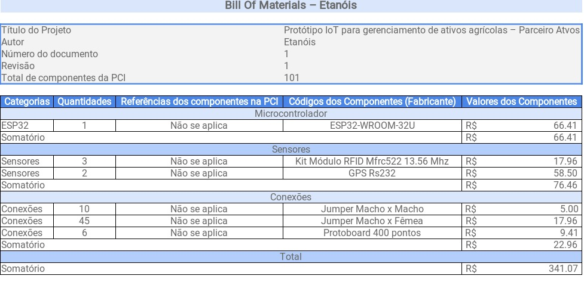
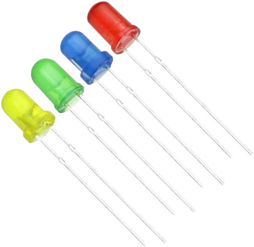

# Documentação IoTDoc - Módulo 4 - Inteli

## Etanóis

## Integrantes: 
- <a href="https://www.linkedin.com/in/eduardosbarreto/">Eduardo Santos Barreto</a>
- <a href="https://www.linkedin.com/in/gustavo-gouveia-583185271/">Gustavo Gouveia</a>
- <a href="https://www.linkedin.com/in/isabelle-santos-507067204/">Isabelle da Silva Santos</a> 
- <a href="https://www.linkedin.com/in/rafaelarojas/">Rafaela Cristina Rojas Lemos</a> 
- <a href="https://www.linkedin.com/in/rafael-coutinho2004/">Rafael Cauã Coutinho</a>
- <a href="https://www.linkedin.com/in/raul-rezende-szpak-642079186/">Raul Rezende Szpak</a> 

## Sumário

[1. Introdução](#title1)
  - [1.1. Objetivos](#subtitle1)
  - [1.2. Proposta da solução](#subtitle2)
  - [1.3. Justificativa](#subtitle3)

[2. Metodologia](#title2)

[3. Desenvolvimento e Resultados](#title3)
- [Documentação IoTDoc - Módulo 4 - Inteli](#documentação-iotdoc---módulo-4---inteli)
  - [Etanóis](#etanóis)
  - [Integrantes:](#integrantes)
  - [Sumário](#sumário)
- [1. Introdução (sprint 1)](#1-introdução-sprint-1)
  - [1.1 Objetivos](#11-objetivos)
  - [1.2 Proposta da solução](#12-proposta-da-solução)
  - [1.3 Justificativa](#13-justificativa)
- [2. Metodologia](#2-metodologia-sprint-3)
- [3. Desenvolvimento e Resultados](#3-desenvolvimento-e-resultados)
  - [3.1. Domínio de Fundamentos de Negócio](#31-domínio-de-fundamentos-de-negócio)
    - [3.1.1. Contexto da Indústria](#311-contexto-da-indústria)
    - [3.1.2. Análise SWOT](#312-análise-swot)
    - [3.1.3. Descrição da Solução a ser Desenvolvida](#313-descrição-da-solução-a-ser-desenvolvida-sprint-1)
      - [3.1.3.1 Qual é o problema a ser resolvido](#3131-qual-é-o-problema-a-ser-resolvido)
      - [3.1.3.2 Qual a solução proposta (visão de negócios)](#3132-qual-a-solução-proposta-visão-de-negócios)
      - [3.1.3.3 Como a solução proposta deverá ser utilizada](#3133-como-a-solução-proposta-deverá-ser-utilizada)
      - [3.1.3.4 Quais os benefícios trazidos pela solução proposta](#3134-quais-os-benefícios-trazidos-pela-solução-proposta)
      - [3.1.3.5 Qual será o critério de sucesso e qual medida será utilizada para o avaliar](#3135-qual-será-o-critério-de-sucesso-e-qual-medida-será-utilizada-para-o-avaliar)
    - [3.1.4. Value Proposition Canvas](#314-value-proposition-canvas-sprint-1)
    - [3.1.5. Matriz de Riscos](#315-matriz-de-riscos-sprint-1)
      - [3.1.5.1 Matriz de Ameaças](#3151-matriz-de-ameaças)
      - [3.1.5.2 Matriz de Oportunidades](#3152-matriz-de-oportunidades)
    - [3.1.6. Política de Privacidade de acordo com a LGPD](#316-política-de-privacidade-de-acordo-com-a-lgpd-sprint-1)
      - [Definições para os fins desta Política de Privacidade:](#definições-para-os-fins-desta-política-de-privacidade)
      - [Uso de Dados Pessoais](#uso-de-dados-pessoais)
      - [Não fornecimento de Dados Pessoais](#não-fornecimento-de-dados-pessoais)
      - [Dados coletados](#dados-coletados)
      - [No contato, nós podemos coletar:](#no-contato-nós-podemos-coletar)
      - [Na navegação geral no Sistema, nós poderemos coletar:](#na-navegação-geral-no-sistema-nós-poderemos-coletar)
      - [Compartilhamento de Dados Pessoais com terceiros](#compartilhamento-de-dados-pessoais-com-terceiros)
        - [Nós poderemos compartilhar seus Dados Pessoais:](#nós-poderemos-compartilhar-seus-dados-pessoais)
        - [Transferências internacionais de Dados](#transferências-internacionais-de-dados)
        - [Forma de coleta automática de Dados Pessoais](#forma-de-coleta-automática-de-dados-pessoais)
      - [Segurança dos Dados Pessoais](#segurança-dos-dados-pessoais)
        - [Buscamos adotar as medidas técnicas e organizacionais previstas pelas Leis de Proteção de Dados adequadas para proteção dos Dados Pessoais na nossa organização.](#buscamos-adotar-as-medidas-técnicas-e-organizacionais-previstas-pelas-leis-de-proteção-de-dados-adequadas-para-proteção-dos-dados-pessoais-na-nossa-organização)
        - [Links de hipertexto para outros sites e redes sociais](#links-de-hipertexto-para-outros-sites-e-redes-sociais)
        - [Atualizações desta Política de Privacidade](#atualizações-desta-política-de-privacidade)
        - [Pessoa responsável do tratamento dos Dados Pessoais](#pessoa-responsável-do-tratamento-dos-dados-pessoais)
      - [3.1.6.1 Informações gerais sobre a empresa / organização](#3161-informações-gerais-sobre-a-empresa--organização)
      - [3.1.6.2 Informações sobre o tratamento de dados](#3162-informações-sobre-o-tratamento-de-dados)
      - [3.1.6.3 Quais são os dados coletados](#3163-quais-são-os-dados-coletados)
      - [3.1.6.4 Onde os dados são coletados](#3164-onde-os-dados-são-coletados)
      - [3.1.6.5 Para quais finalidades os dados serão utilizadas](#3165-para-quais-finalidades-os-dados-serão-utilizadas)
      - [3.1.6.6 Onde os dados ficam armazenados](#3166-onde-os-dados-ficam-armazenados)
      - [3.1.6.7 Qual o período de armazenamento dos dados (retenção)](#3167-qual-o-período-de-armazenamento-dos-dados-retenção)
      - [3.1.6.8 Uso de cookies e/ou tecnologias semelhantes](#3168-uso-de-cookies-eou-tecnologias-semelhantes)
      - [3.1.6.9 Com quem esses dados são compartilhados (parceiros, fornecedores, subcontratados)](#3169-com-quem-esses-dados-são-compartilhados-parceiros-fornecedores-subcontratados)
      - [3.1.6.10 Informações sobre medidas de segurança adotadas pela empresa](#31610-informações-sobre-medidas-de-segurança-adotadas-pela-empresa)
      - [3.1.6.11 Orientações sobre como a empresa/organização atende aos direitos dos usuários](#31611-orientações-sobre-como-a-empresaorganização-atende-aos-direitos-dos-usuários)
      - [3.1.6.12 Informações sobre como o titular de dados pode solicitar e exercer os seus direitos](#31612-informações-sobre-como-o-titular-de-dados-pode-solicitar-e-exercer-os-seus-direitos)
      - [3.1.6.13 Informações de contato do Data Protection Officer (DPO) ou encarregado de proteção de dados da organização](#31613-informações-de-contato-do-data-protection-officer-dpo-ou-encarregado-de-proteção-de-dados-da-organização)
    - [3.1.7. _Bill of Material_ (BOM)](#317-bill-of-material-bom-sprint-1)
  - [3.2. Domínio de Fundamentos de Experiência de Usuário](#32-domínio-de-fundamentos-de-experiência-de-usuário)
    - [3.2.1. Personas (sprint 1)](#321-personas-sprint-1)
      - [3.2.1.1 Persona 1 - Lucas Silva](#3211-persona-1---lucas-silva)
      - [3.2.1.2 Persona 2 - Pedro Mendes](#3212-persona-2---pedro-mendes)
      - [3.2.1.3 Persona 3 - Caio Menezes](#3213-persona-3---caio-menezes)
    - [3.2.2. Jornadas do Usuário e Storyboard](#322-jornadas-do-usuário-e-storyboard-sprint-1)
      - [3.2.2.1 Mapa de Jornada do Usuário](#3221-mapa-de-jornada-do-usuário)
        - [3.2.2.1.1 Jornada de usuário - Lucas Silva](#32211-jornada-de-usuário---lucas-silva)
        - [3.2.2.1.2 Jornada de usuário - Pedro Mendes](#32212-jornada-de-usuário---pedro-mendes)
      - [3.2.2.2 *Storyboard*](#3222-storyboard)
        - [3.2.2.2.1 *Storyboard* - Lucas Silva](#32221-storyboard---lucas-silva)
        - [3.2.2.2.2 *Storyboard* - Pedro Mendes](#32222-storyboard---pedro-mendes)
    - [3.2.3. *User Stories*](#323-user-stories-sprint-1)
      - [3.2.3.2. User Stories - Pedro Mendes](#3232-user-stories---pedro-mendes)
    - [3.2.4. Protótipo de interface com o usuário](#324-protótipo-de-interface-com-o-usuário)
      - [ 3.2.4.1. Desenho esquemático da soluçao](#-3241-desenho-esquemático-da-soluçao)
      - [ 3.2.4.2. Wireframe](#-3242-wireframe)
      - [ 3.2.4.3 Mapeamento do fluxo principal de utilização de cada usuário](#-3243-mapeamento-do-fluxo-principal-de-utilização-de-cada-usuário)
  - [3.3. Solução Técnica](#33-solução-técnica)
    - [3.3.1. Requisitos Funcionais](#331-requisitos-funcionais-sprint-1)
        - [3.3.1.1 Acesso a plataforma web](#3311-acesso-a-plataforma-web)
        - [3.3.1.2 Cadastrar peças](#3312-cadastrar-peças)
        - [3.3.1.3 Coletar dados e comunicar-se com o servidor periodicamente via protocolo HTTP](#3313-coletar-dados-e-comunicar-se-com-o-servidor-periodicamente-via-protocolo-http)
        - [3.3.1.4 Deve ser capaz de identificar peças faltantes:](#3314-deve-ser-capaz-de-identificar-peças-faltantes)
        - [3.3.1.6 Acompanhar “status” de determinada peça](#3316-acompanhar-status-de-determinada-peça)
        - [Acompanhar “status” de determinada peça](#acompanhar-status-de-determinada-peça)
    - [3.3.2. Requisitos Não Funcionais](#332-requisitos-não-funcionais)
    - [3.3.3. Arquitetura da Solução](#333-arquitetura-da-solução)
        - [Descrição dos itens do diagrama da solução](#descrição-dos-itens-do-diagrama-da-solução)
    - [3.3.3.1 Fluxograma da solução](#3331-fluxograma-da-solução)
      - [3.3.3.2 Arquitetura do sistema web](#3332-arquitetura-do-sistema-web)
        - [Arquitetura de API:](#arquitetura-de-api)
          - [HTTP Requests e Consultas SQL no Projeto:](#http-requests-e-consultas-sql-no-projeto)
        - [Documentação de rotas](#documentação-de-rotas)
          - [Alocações](#alocações)
          - [Itens](#itens)
          - [Manutenções](#manutenções)
          - [Modelos de Dados](#modelos-de-dados)
        - [Banco de dados](#banco-de-dados)
          - [Tabelas e Relações do Banco de Dados](#tabelas-e-relações-do-banco-de-dados)
          - [Tabela: Users](#tabela-users)
          - [Tabela: Sectors](#tabela-sectors)
          - [Tabela: Items](#tabela-items)
          - [Tabela: Vehicles](#tabela-vehicles)
          - [Tabela: Allocations](#tabela-allocations)
          - [Tabela: Maintenances](#tabela-maintenances)
          - [Tabela: Transports](#tabela-transports)
          - [Relacionamentos](#relacionamentos)
        - [Tabelas e Suas Funções](#tabelas-e-suas-funções)
    - [3.3.4. Arquitetura do Protótipo](#334-arquitetura-do-protótipo)
    - [3.3.4.1. Fluxograma do protótipo](#3341-fluxograma-do-protótipo)
    - [3.3.4.2. Fluxograma do sistema](#3342-fluxograma-do-sistema)
    - [3.3.4.3. Tabela de componentes](#3343-tabela-de-componentes)
    - [3.3.5. Arquitetura Refinada da Solução](#335-arquitetura-refinada-da-solução-sprint-5)
  - [3.4. Resultados](#34-resultados)
    - [3.4.1.Protótipo Inicial do Projeto usando o Simulador _Wokwi_](#341protótipo-inicial-do-projeto-usando-o-simulador-wokwi-sprint-1)
      - [3.4.1.1 Descrição do Protótipo](#3411-descrição-do-protótipo)
      - [3.4.1.2 Registro de testes](#3412-registro-de-testes)
      - [3.4.1.2 Observações](#3412-observações)
      - [3.4.1.3 Demonstração](#3413-demonstração)
    - [3.4.2. Protótipo Físico do Projeto (_offline_)](#342-protótipo-físico-do-projeto-offline-sprint-2)
      - [3.4.2.1 Descrição do Protótipo](#3421-descrição-do-protótipo)
      - [3.4.2.2 Registro de Testes](#3422-registro-de-testes)
      - [3.4.2.3 Estado Atual e Observações](#3423-estado-atual-e-observações)
    - [3.4.3. Protótipo do Projeto com HTTP e SPI](#343-protótipo-do-projeto-com-http-e-spi)
    - [3.4.4. Protótipo Físico do Projeto (online)](#344-protótipo-físico-do-projeto-online-sprint-4)
    - [3.4.5. Protótipo Final do Projeto](#345-protótipo-final-do-projeto-sprint-5)
  - [4. Possibilidades de Descarte](#4-possibilidades-de-descarte)
  - [5. Conclusões e Recomendações](#5-conclusões-e-recomendações)
  - [6. Referências](#6-referências)

[4. Possibilidades de Descarte](#title4)

[5. Conclusões e Recomendações](#title5)

[6. Referências](#title6)

 

# 1. Introdução

&nbsp;&nbsp;&nbsp;&nbsp;Nesta seção, apresentaremos de forma concisa a empresa parceira deste projeto, a Atvos. A Atvos é uma importante empresa que atua no setor de produção e comercialização de etanol, açúcar VHP e energia elétrica a partir da cana-de-açúcar e de sua biomassa. Seu compromisso é com a criação de um futuro mais benéfico para a sociedade e o meio ambiente, contribuindo para o desenvolvimento e a prosperidade das comunidades onde opera.

&nbsp;&nbsp;&nbsp;&nbsp;Fundada em 2007, a Atvos se consolidou como a segunda maior produtora de etanol do Brasil, além de ser uma das principais emissoras de Créditos de Descarbonização (CBIOs) do país. A empresa opera com um forte enfoque na sustentabilidade, visando a redução de impactos ambientais e a promoção de energias limpas.

&nbsp;&nbsp;&nbsp;&nbsp;A capacidade produtiva da Atvos é impressionante, tendo a capacidade de abastecer aproximadamente 60 milhões de carros compactos com etanol, produzindo açúcar suficiente para adoçar 20 milhões de festas de aniversário, e gerando energia elétrica para iluminar cidades, salvando vidas e contribuindo para o progresso e o bem-estar de mais de 15 milhões de pessoas. [14]

&nbsp;&nbsp;&nbsp;&nbsp;Este projeto visa abordar questões específicas relacionadas à área de Almoxarifado e Manutenção Automotiva da Atvos, com o desenvolvimento de um sistema de monitoramento baseado em IoT. O objetivo é solucionar desafios que envolvem o controle de estoque, o retorno de peças e insumos, e prevenção de desvios e roubos. Em resumo, o projeto busca criar uma solução tecnológica para rastrear a localização e o status de equipamentos, peças e insumos, melhorando o controle e eficiência operacional da empresa. [2] 

&nbsp;&nbsp;&nbsp;&nbsp;Nas próximas seções, exploraremos em maior detalhe os problemas enfrentados e a solução proposta por nós, da equipe Etanóis, bem como os benefícios esperados para a Atvos com a implementação do sistema de monitoramento baseado em IoT.

## 1.1 Objetivos

Os objetivos gerais do nosso parceiro de negócios, a Atvos, refletem sua missão e compromisso com a sociedade e o meio ambiente, bem como com a eficiência em suas operações. Os objetivos gerais incluem:

1. **Produção Sustentável:** Continuar a produzir etanol, açúcar VHP e energia elétrica a partir da cana-de-açúcar de maneira sustentável, buscando reduzir impactos ambientais e adotando práticas responsáveis.

2. **Desenvolvimento das Comunidades:** Contribuir para o desenvolvimento e prosperidade das comunidades onde a empresa está presente, criando empregos e oportunidades.

3. **Liderança no Setor:** Manter a posição como uma das principais produtoras de etanol do Brasil e um dos principais emissores de Créditos de Descarbonização (CBIOs) do país.

4. **Eficiência Operacional:** Buscar eficiência em suas operações, otimizando processos e recursos para garantir a produtividade e a rentabilidade.

5. **Impacto Positivo no Bem-Estar:** Continuar a fornecer produtos essenciais, como etanol, açúcar e energia elétrica, para mais de 15 milhões de pessoas, contribuindo para seu bem-estar.

No contexto específico deste projeto, os objetivos se concentram na área de Almoxarifado e Manutenção Automotiva:

1. **Controle de Estoque:** Estabelecer um controle efetivo de estoque, garantindo que peças, insumos e equipamentos sejam rastreados e gerenciados de maneira eficiente.

2. **Retorno de Peças:** Assegurar o retorno das peças substituídas ao almoxarifado, permitindo um ciclo de uso eficaz dos recursos.

3. **Prevenção de Desvios e Roubos:** Reduzir a ocorrência de desvios e roubos de peças e insumos por meio de um sistema de monitoramento e alertas.

4. **Eliminação de Processos Manuais:** Automatizar processos e eliminar a digitação manual nos almoxarifados.

5. **Abertura e Fechamento de Ordens de Serviço:** Possibilitar a abertura e fechamento de Ordens de Serviço digitalmente ou exportar dados para facilitar a integração com outros sistemas.

&nbsp;&nbsp;&nbsp;&nbsp;Ao atingir esses objetivos, a Atvos busca melhorar significativamente a rastreabilidade, a eficiência operacional e a prevenção de perdas, contribuindo para sua missão e compromisso com a sustentabilidade. [1]

##  1.2 Proposta da solução

&nbsp;&nbsp;&nbsp;&nbsp;&nbsp;&nbsp;&nbsp;&nbsp;A proposta da solução da equipe Etanóis consiste em criar um sistema de monitoramento baseado em IoT (Internet das Coisas) para rastrear a localização e o status de equipamentos rodantes, peças e insumos na Atvos. Essa solução visa abordar os problemas identificados e atender aos objetivos estabelecidos:

1. **Rastreamento em Campo:** Implementar um sistema de rastreamento de insumos, materiais e equipamentos no campo, permitindo o monitoramento em tempo real de sua localização e status.

2. **Controle nos Almoxarifados:** Desenvolver um conceito de escaneamento de equipamentos e peças "valiosas" na entrada e/ou saída dos almoxarifados, garantindo um registro eletrônico preciso.

3. **Processo de Logística Revisado:** Revisar o processo de logística para que os equipamentos "trocados" no campo sejam retornados ao almoxarifado para controle e eventual descarte.

4. **Eliminação de Processos Manuais:** Eliminar a digitação manual nos almoxarifados, tornando o processo mais eficiente e confiável.

5. **Abertura e Fechamento Digital de Ordens de Serviço:** Possibilitar a abertura e fechamento digital de Ordens de Serviço, ou exportar dados em formatos compatíveis para facilitar a integração com outros sistemas.

&nbsp;&nbsp;&nbsp;&nbsp;A solução incluirá uma plataforma de gerenciamento baseada na nuvem para armazenar e processar dados, _tags_ de rastreamento em peças e insumos, dispositivos de rastreamento IoT nos equipamentos rodantes, sensores de detecção e gateways IoT nas áreas de operação.

&nbsp;&nbsp;&nbsp;&nbsp;Ao adotar essa solução, a equipe Etanóis pretende melhorar a rastreabilidade, prevenir desvios e roubos, aumentar a eficiência operacional, criar um histórico para tomada de decisões estratégicas e, em última análise, atingir seus objetivos de produção sustentável e eficiência no setor de Almoxarifado e Manutenção Automotiva.

## 1.3 Justificativa

&nbsp;&nbsp;&nbsp;&nbsp;A proposta da equipe Etanóis para a solução do problema apresentado pela Atvos, envolvendo o desenvolvimento de um sistema de monitoramento baseado em IoT, destaca-se pela sua capacidade de abordar de maneira abrangente os desafios enfrentados pela empresa no gerenciamento de equipamentos e insumos agrícolas. Essa abordagem se baseia na seguinte justificativa:

- **Solução Abrangente:** A solução proposta visa abordar várias frentes dos desafios identificados. Ao combinar rastreamento em campo, controle nos almoxarifados, revisão do processo de logística e eliminação de processos manuais, a equipe Etanóis aborda as necessidades de rastreabilidade, segurança e eficiência operacional da Atvos em um único sistema.

- **Rastreamento em Tempo Real:** A capacidade de rastrear equipamentos e insumos em tempo real oferece visibilidade completa da operação. Isso permite a tomada de decisões informadas, otimização de rotas e ações proativas em situações de mau funcionamento.

- **Prevenção de Desvios e Roubos:** A implementação de sensores de detecção e alertas em caso de movimentações não autorizadas contribui significativamente para a prevenção de desvios e roubos, reduzindo as perdas e custos associados.

- **Eficiência Operacional:** Ao fornecer informações detalhadas sobre a localização e status dos ativos, a solução permite que a equipe tome decisões mais informadas. Isso inclui otimização de rotas de entrega, planejamento de manutenção preventiva e gerenciamento de estoques com base em dados em tempo real.

- **Histórico para Tomada de Decisões:** Os dados históricos coletados e as análises geradas pela plataforma servirão como uma base sólida para a tomada de decisões estratégicas. Isso significa que a Atvos poderá identificar tendências, gargalos e oportunidades para melhorar ainda mais suas operações.

- **Sustentabilidade e Eficiência:** A solução contribui para a busca da Atvos por práticas mais sustentáveis, evitando desperdícios e reduzindo a pegada de carbono por meio da eficiência operacional e do controle de estoque. [7]

- **Diferenciação Competitiva:** Ao adotar uma abordagem inovadora com a Internet das Coisas, a Atvos estará em uma posição competitiva mais forte no mercado, demonstrando seu compromisso com a excelência operacional e a eficiência.

- **Integração com Outros Sistemas:** A possibilidade de exportar dados em formatos compatíveis simplifica a integração com sistemas existentes da Atvos, proporcionando uma solução escalável.

&nbsp;&nbsp;&nbsp;&nbsp;Em suma, a proposta da equipe Etanóis representa uma resposta completa para os desafios da Atvos, alavancando tecnologia de ponta para melhorar a eficiência, reduzir perdas, melhorar a sustentabilidade e fortalecer a posição da empresa no setor agrícola.

# 2. Metodologia 

&nbsp;&nbsp;&nbsp;&nbsp;A Metodologia RM-ODP (*Reference Model for Open Distributed Processing*) é um conjunto de diretrizes e conceitos concebidos para orientar o desenvolvimento de sistemas distribuídos e abertos. Essa metodologia proporciona uma abordagem estruturada e abrangente para a concepção, análise, projeto e implementação de arquiteturas distribuídas complexas. [3]

&nbsp;&nbsp;&nbsp;&nbsp;A RM-ODP se baseia em uma referência teórica que visa fornecer uma estrutura unificada para a compreensão e o desenvolvimento de sistemas distribuídos abertos. Algumas características essenciais da RM-ODP incluem:

- **Visão Integrada**: A metodologia promove uma visão integrada ao considerar diferentes perspectivas, chamadas de visões, que abordam aspectos específicos do sistema, como informação, computação, engenharia e organização. Essa abordagem holística facilita a compreensão global do sistema.

- **Abstração Hierárquica**: A RM-ODP utiliza uma abordagem hierárquica na modelagem, permitindo a representação de sistemas complexos em níveis diferentes de detalhe. Isso facilita a gestão da complexidade e a identificação clara de componentes e interações.

- **Independência de Implementação**: Um dos princípios fundamentais da RM-ODP é a promoção da independência de implementação. Isso significa que as decisões de *design* e implementação não devem afetar as outras partes do sistema, permitindo flexibilidade e manutenção da integridade do sistema distribuído.

- **Padrões de Interoperabilidade**: A metodologia preconiza a definição de padrões de interoperabilidade, garantindo que diferentes partes de um sistema distribuído possam interagir eficientemente. Isso é crucial para a integração de componentes desenvolvidos de forma independente.

- **Estrutura Modular**: A RM-ODP favorece uma abordagem modular na concepção de sistemas, facilitando a criação, modificação e substituição de componentes individuais sem impactar o sistema como um todo.

- **Facilidade de Manutenção e Evolução**: A metodologia visa criar sistemas distribuídos que sejam facilmente mantidos e evoluídos ao longo do tempo. A estrutura modular, a independência de implementação e a hierarquia abstrata contribuem para essa capacidade.

- **Adaptabilidade e Escalabilidade**: A RM-ODP é projetada para sistemas que precisam ser adaptáveis a mudanças e escaláveis para lidar com diferentes níveis de demanda. Essa flexibilidade é essencial para ambientes dinâmicos e em constante evolução.

&nbsp;&nbsp;&nbsp;&nbsp;Em síntese, a Metodologia RM-ODP oferece uma estrutura conceitual robusta para o desenvolvimento de sistemas distribuídos, fornecendo uma abordagem unificada que promove clareza, modularidade, independência e interoperabilidade. Sua aplicação proporciona uma base sólida para o desenvolvimento de arquiteturas distribuídas complexas e abertas. [4]

&nbsp;&nbsp;&nbsp;&nbsp;A aplicação da Metodologia RM-ODP no desenvolvimento do projeto Etanóis foi conduzida através de uma abordagem estruturada e integrada, alinhada aos princípios e diretrizes fundamentais desta metodologia. Abaixo, descrevo como cada uma das cinco principais etapas do projeto foi influenciada pelos conceitos e princípios da RM-ODP: 

**Identificação do Problema:**

&nbsp;&nbsp;&nbsp;&nbsp;Aplicação da RM-ODP: A identificação do problema foi orientada pela visão integrada da RM-ODP, que considera diferentes perspectivas (informação, computação, engenharia e organização). Isso permitiu uma compreensão holística dos desafios a serem enfrentados no monitoramento de ativos na Atvos.

**Mapeamento dos Requisitos Funcionais:**

&nbsp;&nbsp;&nbsp;&nbsp;Aplicação da RM-ODP: Durante o mapeamento dos requisitos funcionais, a abstração hierárquica da RM-ODP foi incorporada para representar os diferentes níveis de detalhe dos requisitos. Isso facilitou a compreensão e gestão da complexidade funcional do sistema.

**Mapeamento dos Requisitos Não Funcionais:**

&nbsp;&nbsp;&nbsp;&nbsp;Aplicação da RM-ODP: A RM-ODP contribuiu para a definição dos requisitos não funcionais, promovendo a independência de implementação. Essa característica permitiu que decisões de *design* e implementação fossem tomadas sem afetar outras partes do sistema, garantindo flexibilidade e integridade.

**Arquitetura da Solução:**

&nbsp;&nbsp;&nbsp;&nbsp;Aplicação da RM-ODP: A etapa de arquitetura da solução foi fortemente influenciada pela estrutura modular preconizada pela RM-ODP. A hierarquia abstrata e a definição de objetos de implementação foram aplicadas para criar uma arquitetura distribuída coesa e adaptável. 

**Tecnologias da Arquitetura:**

&nbsp;&nbsp;&nbsp;&nbsp;Aplicação da RM-ODP: Ao selecionar as tecnologias para a arquitetura, a RM-ODP influenciou a escolha de padrões de interoperabilidade. Isso assegurou que diferentes componentes do sistema pudessem interagir eficientemente, promovendo a integração de elementos desenvolvidos de forma independente. 

&nbsp;&nbsp;&nbsp;&nbsp;Dessa forma, a aplicação dessa metodologia foi essencial para orientar o desenvolvimento do projeto Etanóis, garantindo uma abordagem unificada e estruturada desde a identificação do problema até a definição da arquitetura e escolha das tecnologias. A visão integrada, a abstração hierárquica, a independência de implementação e outros princípios da RM-ODP contribuíram para a criação de um sistema distribuído robusto e adaptável às necessidades da Atvos.

&nbsp;&nbsp;&nbsp;&nbsp;No caso do projeto do grupo Etanóis, utilizamos 5 principais etapas:

- Identificação do problema, [descrito no tópico 3.1.3.1.](#subtitle8) 
- Mapeamento dos requisitos Funcionais, [descrito no tópico 3.3.1.](#subtitle53) 
- Mapeamento dos requisitos não funcionais, [descrito no tópico 3.3.2.](#subtitle59)
- Arquitetura da solução, [descrito no tópico 3.3.](#subtitle52) 
- Tecnologias da arquitetura, [descrito no tópico 3.3.4.](#subtitle61) 

# 3. Desenvolvimento e Resultados 

## 3.1. Domínio de Fundamentos de Negócio

&nbsp;&nbsp;&nbsp;&nbsp;A seção presente, que se concentra no Domínio de Fundamentos de Negócio, é um elemento crucial para o desenvolvimento do projeto. Este segmento abrange uma ampla gama de aspectos estratégicos e analíticos, oferecendo uma visão aprofundada do contexto da indústria, estratégias de desenvolvimento, e medidas essenciais para mitigar riscos. A jornada inicia-se com uma análise abrangente do cenário industrial, seguida pela identificação de forças, fraquezas, oportunidades e ameaças através da análise SWOT. À medida que avançamos, adentramos na descrição detalhada da solução a ser desenvolvida, contemplando desde a definição clara do problema até a proposta de valor e os critérios de sucesso. Além disso, a exploração da política de privacidade, conforme estabelecido pela LGPD, oferece um alicerce ético e legal para o tratamento de dados, enquanto a análise de riscos proporciona uma visão proativa das potenciais ameaças no ambiente de negócios. Este tópico culmina na apresentação da *Bill of Material* (BOM), delineando os componentes essenciais para a implementação bem-sucedida da solução proposta. Em conjunto, esses elementos formam a espinha dorsal para a formulação e execução do projeto e entendimento do parceiro.  

### 3.1.1. Contexto da Indústria 

&nbsp;&nbsp;&nbsp;&nbsp;A Atvos, anteriormente conhecida como Odebrecht Agroindustrial, desempenha um papel proeminente no setor sucroenergético, que tem experimentado um impulso significativo desde o início do século, impulsionado, em grande parte, por políticas públicas voltadas para o consumo e produção desses insumos. 

&nbsp;&nbsp;&nbsp;&nbsp;Este setor, caracterizado por sua intensidade de capital, enfrenta desafios substanciais quando se trata de expansão e construção de novas usinas, dada a natureza custosa desses empreendimentos. Além disso, os participantes estão sujeitos a exposição a riscos elevados devido à volatilidade e imprevisibilidade da inflação no contexto brasileiro, a menos que optem por estratégias como Joint Ventures para mitigar tais riscos. [1]

&nbsp;&nbsp;&nbsp;&nbsp;A cadeia de valor do setor sucroenergético é intrincada e envolve diversas etapas, desde a lavagem da cana até a destilação, resultando em produtos diversificados, como eletricidade, açúcar, créditos de carbono, álcool anidro e hidratado. [10]

&nbsp;&nbsp;&nbsp;&nbsp;Em particular, na safra de 2022, a Atvos processou impressionantes 26.7 milhões de toneladas de cana-de-açúcar. Deste total, 16.5 milhões foram provenientes de produção própria, destacando a magnitude das operações internas da empresa, enquanto 10,2 milhões foram adquiridos de fornecedores submetidos a um rigoroso processo de homologação. [5]

&nbsp;&nbsp;&nbsp;&nbsp;Para analisar a dinâmica competitiva desse setor, adotou-se o *framework* das 5 Forças de Porter. Este modelo oferece *insights* sobre os concorrentes atuais e potenciais que enfrenta a empresa, a presença de produtos substitutos no mercado, bem como o poder de negociação que a Atvos detém em relação aos seus fornecedores e clientes. A análise das 5 Forças de Porter permite mapear o mercado para fortalecer o planejamento e a tomada de decisão de uma empresa para entrar no mercado, realizar um projeto estrategicamente ou avaliar suas condições atuais em relação ao setor como um todo. Ela é baseada em fatos e análises sistemáticas do mercado, com ênfase nos fatores referentes à competitividade. Todas as 5 Forças de Porter são capazes de afetar a lucratividade de um negócio de acordo com o nível de poder que possuem no setor. Elas são: Concorrentes, Fornecedores, Clientes, Novos Entrantes e Substitutos. Abaixo, detalhamos cada uma em relação à Atvos: 

Figura 1 - 5 Forças de Porter

Fonte: Material produzido pelos autores (2023)

- **Concorrentes atuais**:

&nbsp;&nbsp;&nbsp;&nbsp;A Raízen, Tereos, BP Bunge, São Martinho e Atvos figuram como os principais expoentes no setor sucroenergético em termos de volume de moagem. Essas empresas destacam-se na disputa pelo *market share* por meio de estratégias expansionistas fundamentadas em verticalizações, visando à otimização dos custos operacionais. Além disso, buscam consolidar alianças estratégicas, exemplificado pela bem-sucedida joint venture entre BP e Bunge, resultando na criação da BP Bunge. Em um curtíssimo intervalo de dois anos, essa parceria ascendeu ao posto de segunda maior processadora de cana-de-açúcar no Brasil. [27]

- **Concorrentes potenciais**:

&nbsp;&nbsp;&nbsp;&nbsp;Empresas de grande porte e capital intensivo, como Petrobrás, Klabin, Amaggi e Cosan, embora não sejam concorrentes diretas no momento, podem se tornar competidoras em algum segmento específico, seja no setor agroindustrial ou energético. A possibilidade de parcerias estratégicas ou expansão de negócios abre a porta para potenciais ganhos de participação de mercado, representando uma ameaça latente para a Atvos. Além disso, a formação de Joint Ventures (associação econômica entre duas ou mais empresas, de ramos iguais ou diferentes, que decidem reunir seus recursos para realizar uma tarefa específica) por essas empresas também configura uma ameaça, exigindo uma análise mais aprofundada sobre como a Atvos pode reagir a essas dinâmicas de mercado.

&nbsp;&nbsp;&nbsp;&nbsp;No setor de produção e venda de energia, a Atvos enfrenta a perspectiva de concorrência no recém-regulado Mercado Livre. Este ambiente possibilita a negociação direta de energia entre as partes, estabelecendo valores e prazos específicos. É crucial que a Atvos esteja atenta a esses concorrentes potenciais, desenvolvendo estratégias proativas para garantir sua posição no mercado. Reações possíveis incluem o aprimoramento da eficiência operacional, a busca por inovações tecnológicas e a construção de relacionamentos sólidos com clientes para fortalecer sua posição competitiva diante das ameaças identificadas.

&nbsp;&nbsp;&nbsp;&nbsp;Ademas, empresas que operam em setores de energias renováveis, como solar ou eólica, podem se expandir para a produção de biocombustíveis. Se essas empresas conseguirem desenvolver tecnologias mais eficientes e sustentáveis, podem representar uma ameaça à Atvos no mercado de biocombustíveis. Um exemplo de corporação que realiza tal ação é a Grupo BBF, que atua no agronegócio sustentável desde o cultivo, produção de biocombustíveis, biotecnologia e geração  de energia renovável.

&nbsp;&nbsp;&nbsp;&nbsp;Para contornar tal situação, a Atvos pode investir em pesquisa e desenvolvimento para melhorar a eficiência de seus processos de produção de biocombustíveis, focar em práticas sustentáveis e diversificar seus produtos para se manter competitiva. [28]

- **Produtos substitutos**:

&nbsp;&nbsp;&nbsp;&nbsp;No que tange possíveis produtos substitutos, tem-se:

  - **Etanol anidro**: Mistura na gasolina, durante o processo de octanagem. A gasolina não seria um produto substituto nesse caso, mas sim complementar. Produtos substitutos nesse caso seriam representados como outras modalidades de fornecer energia para o carro, como células de hidrogênio, de lítio, ou até mesmo solar. As ameaças nesse caso, são representadas ou pelo rápido avanço dessas tecnologias, e para se prevenir, a Atvos deve estar sempre atualizada em relação a seus investimentos em inovação. [13]
    - **Ameaças**: Rápido avanço de tecnologias concorrentes, como células de hidrogênio, células de lítio e energia solar.
    - **Possíveis reações**: Investir em pesquisa e desenvolvimento para acompanhar e adotar novas tecnologias emergentes, além de estabelecer parcerias estratégicas com empresas que lideram em tecnologias inovadoras, todavia, como o principal fator da Atvos é quase que completamente se autosustentar, a melhor reação nesse cenário deve ser a pesquisa e adoção por tecnologias como de energia solar. 

  - **Etanol hidrogenado (Álcool)**: Pode ser substituído tanto por essas modalidades diferentes de fornecimento de bateria, como a própria gasolina. A principal ameaça dessa frente, é a forte oscilação do preço do etanol, consequência de instabilidades políticas internacionais, que impactam diretamente no preço dos fertilizantes para produção de cana de açúcar, quanto na atratividade da gasolina.
    - **Ameaças**: Oscilação do preço do etanol devido a instabilidades políticas internacionais, e a atratividade da gasolina como concorrente.
    - **Possíveis reações**: Monitorar o mercado internacional e ajustar estratégias em resposta a mudanças nas condições políticas, diversificar fontes de matéria-prima para reduzir a dependência de instabilidades específicas e desenvolver estratégias de marketing para destacar os benefícios ambientais e econômicos do etanol em relação à gasolina.

  - **Energia**: No mercado livre de energia, para não perder *market share*, e se manterem competitivas, produtos substitutos podem ser vindos de outras fontes de energia com custos de operação mais baratos, e por conta disso, conseguirem preços mais atrativos para os clientes. (Uma vez que os contratos são personalizáveis e particulares).
    - **Ameaças**: Competição de fontes de energia mais baratas no mercado livre.
    - **Possíveis reações**: Investir em eficiência operacional para reduzir custos de produção, explorar fontes de energia mais sustentáveis e com custos operacionais mais baixos e oferecer contratos personalizados e flexíveis para manter clientes no mercado livre de energia.

  - **Açucar VHP**: O açúcar produzido pela Atvos é vendido para tradings que por sua vez vendem para mercados internacionais. Nesse caso, não é possível identificar produtos substitutos do açúcar, somente outras produtoras.
    - **Ameaças**:ã Concorrência de outras produtoras do produto.
    - **Possíveis reações**: Focar em diferenciais de qualidade e sustentabilidade para manter a competitividade, buscar novos mercados ou parcerias estratégicas para expandir a presença internacional e investir em tecnologias de produção mais eficientes para reduzir custos e aumentar a margem de lucro.

- **Fornecedores**:

&nbsp;&nbsp;&nbsp;&nbsp;A Atvos, empresa dedicada ao setor sucroenergético, detém um sólido poder de barganha em suas relações com os fornecedores, fundamentado em rigorosos critérios de seleção. Com um contingente de 45 fornecedores, responsáveis pelo fornecimento substancial de 10.2 milhões de toneladas de cana-de-açúcar destinadas à produção, a empresa estabelece uma barreira de entrada elevada para novos participantes, reforçando sua posição de negociação. []

&nbsp;&nbsp;&nbsp;&nbsp;A imposição de requisitos específicos para os fornecedores demonstra a busca constante da Atvos por parcerias estratégicas e confiáveis. Essa abordagem não apenas resguarda a qualidade da matéria-prima, mas também confere à empresa uma posição de destaque, moldando o mercado em que atua.

&nbsp;&nbsp;&nbsp;&nbsp;A dependência de um número relativamente pequeno de fornecedores é mitigada pela diversificação estratégica, abrindo espaço para uma gestão de riscos mais eficaz. A presença de múltiplos parceiros oferece à Atvos flexibilidade diante de possíveis desafios, sejam eles relacionados a condições climáticas, logísticas ou outras variáveis.

&nbsp;&nbsp;&nbsp;&nbsp;A oscilação significativa nos preços dos fertilizantes representa um desafio constante para a Atvos. Para lidar com essa volatilidade, a empresa adota uma abordagem inovadora ao utilizar alternativas como a Torta de Filtro e a Vinhaça, proporcionando não apenas uma estratégia financeira sólida, mas também alinhando-se com práticas sustentáveis.

&nbsp;&nbsp;&nbsp;&nbsp;Diante da instabilidade nos preços dos fertilizantes, a Atvos pode adotar diferentes estratégias. A negociação de contratos de longo prazo com fornecedores ou a busca por fontes alternativas de fertilizantes são medidas que visam a estabilidade e a previsibilidade dos custos.

&nbsp;&nbsp;&nbsp;&nbsp;A Atvos pode, ainda, investir em pesquisas e desenvolvimento para a criação de tecnologias próprias na produção de fertilizantes ou na melhoria do processo de extração da cana-de-açúcar. Essa abordagem não apenas reduziria a dependência dos fornecedores, mas também fortaleceria a posição da Atvos como uma líder inovadora no setor.

&nbsp;&nbsp;&nbsp;&nbsp;A alta dependência de fornecedores específicos pode expor a Atvos a riscos operacionais, especialmente em situações de crise ou mudanças abruptas no mercado. Além disso, a volatilidade nos preços dos fertilizantes representa uma ameaça constante aos resultados financeiros da empresa, exigindo uma gestão estratégica cuidadosa. [5]

- **Clientes**:

&nbsp;&nbsp;&nbsp;&nbsp;A dinâmica de negociação com os clientes assume um papel central na operação da Atvos, especialmente no contexto dos setores de etanol e açúcar. No que tange ao etanol, identificamos um marcante poder de barganha por parte dos clientes. Nesse cenário desafiador, a Atvos adota uma abordagem estratégica ao priorizar contratos de fornecimento a longo prazo. Essa escolha não é apenas uma resposta ao poder de barganha, mas uma estratégia proativa para mitigar os riscos associados à volatilidade de preços. Ao estabelecer parcerias de longo prazo, a empresa busca criar um ambiente operacional mais previsível e, por conseguinte, mais eficiente.

&nbsp;&nbsp;&nbsp;&nbsp;Entretanto, a complexidade do jogo de negociação se desenha de forma diferente quando observamos o açúcar. Aqui, o poder de negociação varia em sintonia com a demanda e os distintos momentos da safra. Um desafio adicional surge no panorama logístico, onde a carência de espaços adequados para armazenar grãos e açúcar se destaca como uma realidade. Em cenários de demanda imprevista, como situações emergenciais que exigem armazenagem adicional, as usinas podem ver seu poder de negociação com as tradings diminuir.

&nbsp;&nbsp;&nbsp;&nbsp;A vulnerabilidade logística figura como uma ameaça significativa, com a limitação de espaços para armazenamento apresentando potencial impacto na capacidade de resposta às demandas emergenciais. Para enfrentar essa ameaça, a Atvos pode direcionar investimentos significativos para fortalecer sua infraestrutura logística. A implementação de sistemas de gerenciamento de armazenagem mais eficientes e ágeis seria crucial para lidar com picos imprevistos na demanda, garantindo uma resposta mais rápida e eficaz.

&nbsp;&nbsp;&nbsp;&nbsp;A flutuação na demanda de açúcar representa outro desafio, afetando o poder de negociação da Atvos em momentos críticos da safra. Para mitigar esse risco, a empresa poderia adotar estratégias de gestão de produção mais flexíveis, permitindo uma adaptação ágil a mudanças imprevistas na demanda. Além disso, a flexibilidade nos contratos de fornecimento pode ser incorporada para oferecer à Atvos a capacidade de ajustar suas operações de acordo com as dinâmicas de mercado.

&nbsp;&nbsp;&nbsp;&nbsp;Os riscos associados à volatilidade nos preços do etanol também não podem ser subestimados. Para lidar com essa ameaça, a Atvos pode explorar a utilização de instrumentos financeiros, como contratos de hedge, para mitigar os impactos adversos da flutuação de preços no mercado de etanol. Essa abordagem oferece uma camada adicional de segurança, permitindo à empresa manter uma posição mais estável em face das oscilações de mercado.

&nbsp;&nbsp;&nbsp;&nbsp;A dependência excessiva de um único cliente é sempre uma preocupação estratégica. Para minimizar esse risco, a Atvos pode buscar diversificar sua base de clientes e estabelecer parcerias estratégicas. Essa abordagem não apenas distribui o risco de forma mais equitativa, mas também amplia as oportunidades de crescimento, garantindo uma posição mais robusta no mercado. [1]

### 3.1.2. Análise SWOT 	

&nbsp;&nbsp;&nbsp;&nbsp;A Análise SWOT desempenha um papel crucial na avaliação abrangente da posição de uma empresa no mercado. Essa abordagem meticulosa envolve a análise de fatores relacionados tanto ao ambiente interno quanto ao externo do negócio, permitindo uma compreensão holística dos elementos sob controle direto da empresa e daqueles que não estão.

&nbsp;&nbsp;&nbsp;&nbsp;Ao focar no ambiente interno, são minuciosamente examinados os *Strengths* (Forças), representando as características que conferem uma vantagem diferenciada em relação aos concorrentes, exercendo influência positiva. Simultaneamente, são identificadas as *Weaknesses* (Fraquezas), elementos que, por não constituírem pontos fortes da empresa, podem proporcionar alguma vantagem aos competidores, exercendo influência negativa.

&nbsp;&nbsp;&nbsp;&nbsp;No âmbito externo, concentramos nossa análise nas *Opportunities* (Oportunidades), que dizem respeito às possibilidades de alcançar melhores resultados, maior lucratividade ou crescimento impulsionado por conjunturas externas favoráveis. Paralelamente, são identificadas as *Threats* (Ameaças), relacionadas a cenários externos desfavoráveis que representam riscos para o desenvolvimento ou a permanência da empresa no mercado. [9]

&nbsp;&nbsp;&nbsp;&nbsp;A seguir, tem-se a análise SWOT realizada da empresa Atvos:

Figura 2 - Matriz SWOT

Fonte: Material produzido pelos autores (2023)

- **Forças**:

&nbsp;&nbsp;&nbsp;&nbsp;A Atvos apresenta uma notável força em sua margem operacional, destacando-se pelo faturamento expressivo na safra de 2022, atingindo a marca de 6.87 bilhões de reais. O EBITDA de 2.2 bilhões de reais, representando 32%, ressalta a eficiência e rentabilidade da empresa quando comparada a outras do mesmo setor e de capital aberto. Esse desempenho positivo é resultado de uma gestão eficaz ao longo dos anos, consolidando uma vantagem competitiva significativa. [5]

&nbsp;&nbsp;&nbsp;&nbsp;Além disso, a verticalização das operações da Atvos, que inclui o fornecimento interno de energia para a produção, destaca-se como outra força estratégica. Essa integração vertical contribui para a eficiência operacional, reduzindo dependências externas e fortalecendo a posição da empresa no mercado.

&nbsp;&nbsp;&nbsp;&nbsp;Outro ponto crucial é a liderança da Atvos nos mercados emergentes, como o de crédito de carbono. Sua posição de destaque nesse cenário coloca a empresa como potencial principal player de compensações, abrindo portas para oportunidades lucrativas e alinhadas com as tendências sustentáveis. [7]

- **Fraquezas**:

&nbsp;&nbsp;&nbsp;&nbsp;Uma das fraquezas identificadas na operação da Atvos é a depreciação no maquinário agrícola. Esse fator pode impactar os custos operacionais e exigir investimentos adicionais na atualização e manutenção dos equipamentos, sendo um desafio a ser enfrentado para garantir a eficiência a longo prazo.

&nbsp;&nbsp;&nbsp;&nbsp;O setor de cana-de-açúcar, sendo intensivo em capital, apresenta outra fraqueza significativa. A expansão de usinas torna-se uma empreitada onerosa, exigindo investimentos substanciais. Gerir esse desafio financeiro é crucial para sustentar o crescimento e a competitividade da empresa.

&nbsp;&nbsp;&nbsp;&nbsp;Outro aspecto a ser considerado é a inserção tardia da cana de açúcar no segmento de transgênicos. Essa defasagem pode impactar a eficiência da produção e a capacidade de resposta às demandas do mercado, sendo uma área que requer atenção para manter a relevância no setor.

- **Ameaças**:

&nbsp;&nbsp;&nbsp;&nbsp;Os conflitos geopolíticos, como os confrontos entre Rússia-Ucrânia e Hamas-Israel, emergem como ameaças diretas para a Atvos. A escalada desses eventos aumenta os custos de produção de fertilizantes, essenciais para o cultivo de cana-de-açúcar. Essa pressão nos custos operacionais representa um desafio a ser gerenciado para preservar a rentabilidade.

&nbsp;&nbsp;&nbsp;&nbsp;Ademais, os mesmos conflitos contribuem para a elevação dos preços da gasolina, impactando negativamente a demanda por etanol. Essa interdependência com o mercado de combustíveis fósseis expõe a empresa a volatilidades externas que podem afetar seu desempenho financeiro.

- **Oportunidades**:

&nbsp;&nbsp;&nbsp;&nbsp;A expansão de energias renováveis surge como uma oportunidade estratégica para a Atvos. O crescente interesse global em fontes de energia limpa, incluindo biocombustíveis, pode abrir novos mercados e permitir que a empresa diversifique suas operações, respondendo à crescente demanda por alternativas mais sustentáveis.

&nbsp;&nbsp;&nbsp;&nbsp;Incentivos governamentais para energias renováveis representam um ambiente favorável para a Atvos. Regulamentações e políticas de estímulo por parte dos governos podem incentivar investimentos significativos no desenvolvimento de soluções sustentáveis, proporcionando à empresa uma vantagem competitiva.

&nbsp;&nbsp;&nbsp;&nbsp;A crescente conscientização sobre mudanças climáticas oferece à Atvos a oportunidade de capitalizar na demanda por práticas agrícolas mais sustentáveis. Adaptar-se a essas preocupações e promover métodos que reduzam os impactos ambientais pode não apenas atender a essa demanda, mas também reforçar a imagem da empresa como um ator comprometido com a responsabilidade ambiental. [7]

### 3.1.3. Descrição da Solução a ser Desenvolvida

&nbsp;&nbsp;&nbsp;&nbsp;A seguir apresentaremos uma visão detalhada da solução proposta, delineando o problema a ser resolvido, a visão de negócios por trás da solução, como ela será utilizada, os benefícios que trará e os critérios de sucesso para avaliação. Esta seção é fundamental para compreender o escopo e o impacto da solução inovadora desenvolvida pela equipe Etanóis para a Atvos.

#### 3.1.3.1 Qual é o problema a ser resolvido

&nbsp;&nbsp;&nbsp;&nbsp;O problema a ser resolvido é o desafio enfrentado pela Atvos na área de Almoxarifado e Manutenção Automotiva. A empresa lida com a produção de etanol, açúcar VHP e energia elétrica a partir da cana-de-açúcar, e gerenciar equipamentos, peças e insumos de forma eficiente é essencial. Os problemas específicos incluem controle de estoque ineficiente, retorno inadequado de peças, desvios e roubos, além de processos manuais demorados. A falta de rastreabilidade e eficiência operacional impacta a produtividade e a sustentabilidade da empresa. [8]

#### 3.1.3.2 Qual a solução proposta (visão de negócios)

&nbsp;&nbsp;&nbsp;&nbsp;A solução proposta pela equipe Etanóis é a criação de um sistema de monitoramento baseado em IoT (Internet das Coisas) para rastrear a localização e o status de equipamentos rodantes, peças e insumos na Atvos. A visão de negócios da solução é abordar os desafios identificados da seguinte forma:

**Rastreamento em Campo:** Implementar um sistema de rastreamento de insumos, materiais e equipamentos no campo, permitindo o monitoramento em tempo real de sua localização e status.

**Controle nos Almoxarifados:** Desenvolver um conceito de escaneamento de equipamentos e peças "valiosas" na entrada e/ou saída dos almoxarifados, garantindo um registro eletrônico preciso.

**Processo de Logística Revisado:** Revisar o processo de logística para que os equipamentos "trocados" no campo sejam retornados ao almoxarifado para controle e eventual descarte.

**Eliminação de Processos Manuais:** Eliminar a digitação manual nos almoxarifados, tornando o processo mais eficiente e confiável.

**Abertura e Fechamento Digital de Ordens de Serviço:** Possibilitar a abertura e fechamento digital de Ordens de Serviço, ou exportar dados em formatos compatíveis para facilitar a integração com outros sistemas.

&nbsp;&nbsp;&nbsp;&nbsp;Essa solução incluirá uma plataforma de gerenciamento baseada na nuvem para armazenar e processar dados, tags de rastreamento em peças e insumos, dispositivos de rastreamento IoT nos equipamentos rodantes, sensores de detecção e gateways IoT nas áreas de operação.

#### 3.1.3.3 Como a solução proposta deverá ser utilizada

&nbsp;&nbsp;&nbsp;&nbsp;A solução proposta será utilizada pela Atvos para melhorar o gerenciamento de seus ativos, peças e insumos na área de Almoxarifado e Manutenção Automotiva. Os principais casos de uso incluem:

* Rastreamento em tempo real de equipamentos e insumos no campo, fornecendo visibilidade completa das operações.
* Registro eletrônico preciso na entrada e saída dos almoxarifados.
* Revisão do processo de logística, garantindo que os equipamentos substituídos sejam controlados e, se necessário, descartados.
* Eliminação de processos manuais nos almoxarifados para maior eficiência.
* Abertura e fechamento digital de Ordens de Serviço, facilitando a integração com outros sistemas.

&nbsp;&nbsp;&nbsp;&nbsp;A solução será usada por funcionários da Atvos envolvidos na gestão de estoques, manutenção de equipamentos e operações de almoxarifado.

#### 3.1.3.4 Quais os benefícios trazidos pela solução proposta

&nbsp;&nbsp;&nbsp;&nbsp;A solução proposta pela equipe Etanóis trará vários benefícios para a Atvos, incluindo:

* Melhor rastreabilidade de equipamentos, peças e insumos.
* Redução significativa de desvios e roubos.
* Aumento da eficiência operacional.
* Eliminação de processos manuais demorados.
* Facilitação da abertura e fechamento digital de Ordens de Serviço.
* Dados históricos para tomada de decisões estratégicas.
* Contribuição para a sustentabilidade ao evitar desperdícios e reduzir a pegada de carbono.
* Fortalecimento da posição competitiva da Atvos no mercado.

#### 3.1.3.5 Qual será o critério de sucesso e qual medida será utilizada para o avaliar

&nbsp;&nbsp;&nbsp;&nbsp;O critério de sucesso para avaliar a eficácia da solução será baseado nos seguintes indicadores:

1. **Rastreabilidade aprimorada:** A medida de sucesso será a capacidade de rastrear equipamentos, peças e insumos com precisão em tempo real. Isso será avaliado por meio de relatórios periódicos de rastreamento.

2. **Redução de desvios e roubos:** O sucesso será medido pela diminuição de ocorrências de desvios e roubos. Os relatórios de incidentes registrados antes e depois da implementação da solução serão usados para essa avaliação.

3. **Eficiência operacional melhorada:** A eficiência operacional será avaliada com base na otimização de processos, como estoque, logística e manutenção. A economia de tempo e recursos será um indicador chave.

4. **Eliminação de processos manuais:** O sucesso será medido pela redução do trabalho manual nos almoxarifados e áreas relacionadas. A automação de tarefas será monitorada e avaliada.

5. **Abertura e fechamento digital de Ordens de Serviço facilitados:** O critério de sucesso será a capacidade de abrir e fechar Ordens de Serviço digitalmente de forma eficaz e a integração bem-sucedida com outros sistemas.

6. **Sustentabilidade e eficiência aprimoradas:** Os benefícios relacionados à sustentabilidade, como a redução de desperdícios e da pegada de carbono, serão monitorados e avaliados. [7]

7. **Diferenciação competitiva:** A medida de sucesso incluirá a posição da Atvos no mercado em comparação com concorrentes diretos e indiretos.

8. **Integração com outros sistemas:** O sucesso será avaliado com base na facilidade e eficiência da integração da solução com sistemas existentes da Atvos.

&nbsp;&nbsp;&nbsp;&nbsp;Os indicadores acima serão acompanhados regularmente para garantir que a solução esteja cumprindo seus objetivos e proporcionando os benefícios esperados.
	
### 3.1.4. Value Proposition Canvas 

&nbsp;&nbsp;&nbsp;&nbsp;O *Value Proposition Canvas*, ou Canvas de Proposta de Valor, é uma ferramenta de gerenciamento estratégico utilizada para desenvolver e visualizar a proposta de valor de um produto ou serviço. Criado por Alexander Osterwalder e Yves Pigneur como parte da metodologia *Business Model Canvas*, o *Value Proposition Canvas* concentra-se especificamente na relação entre um produto ou serviço e seus clientes. O Canvas de Proposta de Valor é composto por dois blocos principais:

- Segmento de Cliente (*Customer Segment*): Este bloco identifica os diferentes grupos de clientes para os quais a proposta de valor é direcionada. Os segmentos de clientes podem ser definidos com base em características demográficas, comportamentais, geográficas ou outras.

- Proposta de Valor (*Value Proposition*): Neste bloco, você descreve os benefícios e valores específicos que seu produto ou serviço oferece aos clientes. Isso inclui os problemas que seu produto resolve, os benefícios que proporciona e as características únicas que o diferenciam da concorrência.

O Canvas de Proposta de Valor ajuda as empresas a alinhar suas ofertas com as necessidades e desejos dos clientes, garantindo que o produto ou serviço forneça um valor significativo. Ao preencher o canvas, as organizações podem visualizar claramente como suas propostas de valor atendem aos requisitos dos clientes-alvo e ajustar estrategicamente seus produtos ou serviços para melhor atender às expectativas do mercado.

&nbsp;&nbsp;&nbsp;&nbsp;Este documento apresenta uma análise dos componentes-chave do "*Value Proposition Canvas*", ressaltando sua importância na criação de uma proposta de valor sólida. A análise é dividida em seis tópicos essenciais, sendo eles: "Aliviam as Dores (*Pain Relievers*)," "Segmento de Cliente (*Customer Segment*)," "Dores (*Pains*)," "Tarefas do Cliente (*Customer Jobs*)," "Ganhos (*Gains*)," e "Criadores de Ganho (*Gain Creators*)."

- **Aliviam as Dores ("*Pain Relievers*"):** Este componente destaca como o produto ou serviço oferecido pode aliviar os problemas e preocupações enfrentados pelos clientes, tornando-se um elemento fundamental na criação de uma proposta de valor atraente.

- **Segmento de Cliente ("*Customer Segment*"):** A análise do Segmento de Cliente identifica claramente os grupos de público-alvo para os quais o produto ou serviço é destinado. Isso é fundamental para direcionar estrategicamente os esforços de "*marketing*" e atender às necessidades específicas de cada grupo de clientes.

- **Dores ("*Pains*"):** As Dores representam os desafios, problemas e frustrações cotidianas dos clientes. Compreender essas dores é crucial para a criação de soluções eficazes que atendam às necessidades dos clientes e solucionem seus problemas.

- **Tarefas do Cliente ("*Customer Jobs*"):** Este componente se concentra nas tarefas que os clientes precisam realizar e como o produto ou serviço pode otimizá-las, economizando tempo e esforço.

- **Ganhos ("*Gains*"):** Os Ganhos representam os benefícios, metas e resultados positivos que os clientes buscam alcançar. O foco nesse tópico ajuda a destacar o valor que o produto ou serviço oferece e a criar uma proposta de valor atraente.

- **Criadores de Ganho ("*Gain Creators*"):** Esta seção descreve como o produto ou serviço cria benefícios e ganhos para os clientes, enfatizando como ele atende aos objetivos desejados.

Essa ferramenta é particularmente útil em processos de inovação, desenvolvimento de novos produtos ou serviços, e na análise contínua do valor percebido pelos clientes em relação às ofertas da empresa. A seguir, tem-se o Cnavas de Proposta de Valor do prsente projeto:

Figura 3 - Canvas de Proposta de Valor

Fonte: Material produzido pelos autores (2023)

### 3.1.5. Matriz de Riscos 
  
&nbsp;&nbsp;&nbsp;&nbsp;A matriz de risco é uma ferramenta estratégica essencial no gerenciamento de projetos, proporcionando uma representação visual que articula a probabilidade de ocorrência de determinadas situações em relação aos potenciais impactos que essas situações podem gerar. Essa abordagem gráfica possibilita uma análise abrangente dos riscos associados a um projeto específico, permitindo uma tomada de decisão informada e proativa.

&nbsp;&nbsp;&nbsp;&nbsp;Ao considerar a probabilidade de ocorrência, a matriz de risco avalia a frequência com que eventos indesejados podem se materializar. Essa avaliação é representada em uma escala que varia de baixa probabilidade a alta probabilidade, oferecendo uma visão clara da possibilidade de enfrentar desafios ou oportunidades ao longo do desenvolvimento do projeto.

&nbsp;&nbsp;&nbsp;&nbsp;Por outro lado, a dimensão do impacto na matriz de risco refere-se às consequências que podem surgir se um determinado evento ocorrer. Essas consequências podem ser tanto positivas quanto negativas, destacando a dualidade inerente aos riscos. O impacto é geralmente categorizado em uma escala que vai desde insignificante até catastrófico, proporcionando uma compreensão aprofundada das implicações associadas a cada situação de risco.

&nbsp;&nbsp;&nbsp;&nbsp;A análise conjunta da probabilidade e do impacto cria quadrantes distintos na matriz de risco, categorizando os eventos em termos de sua criticidade. Os eventos com alta probabilidade e alto impacto geralmente ocupam o quadrante de "risco significativo", exigindo uma atenção especial no planejamento de estratégias de mitigação. Por outro lado, eventos com baixa probabilidade e baixo impacto podem ser classificados como "risco mínimo", permitindo uma gestão mais leve e focalizada.

&nbsp;&nbsp;&nbsp;&nbsp;No contexto específico de nosso projeto, a matriz de risco destaca a interseção entre a incerteza e as oportunidades, proporcionando uma base sólida para a elaboração de estratégias de gestão de riscos. Ao visualizar e compreender os possíveis desdobramentos do projeto, podemos antecipar, planejar e responder de maneira eficaz, maximizando as chances de sucesso. Em última análise, a matriz de risco é uma ferramenta valiosa que capacita as equipes de projeto a navegarem pelas complexidades inerentes ao ambiente de trabalho, garantindo uma abordagem resiliente e adaptável diante das incertezas do caminho à frente.

&nbsp;&nbsp;&nbsp;&nbsp;Sendo assim, a seguir tem-se a matriz de risco referente ao presente projeto:

Figura 4 - Matriz de Risco

Fonte: Material produzido pelos autores (2023)

#### 3.1.5.1 Matriz de Ameaças

&nbsp;&nbsp;&nbsp;&nbsp;Uma matriz de ameaças, dentro do contexto de uma matriz de risco, é uma ferramenta que se concentra especificamente na identificação, avaliação e gestão dos elementos que representam potenciais ameaças a um projeto, organização ou atividade. Enquanto a matriz de risco abrange tanto oportunidades quanto ameaças, a matriz de ameaças se dedica exclusivamente a avaliar os riscos negativos.

&nbsp;&nbsp;&nbsp;&nbsp;Essa abordagem visa fornecer uma visão mais aprofundada e detalhada das potenciais adversidades que podem impactar adversamente o sucesso de um projeto. A matriz de ameaças complementa a análise de risco geral ao destacar áreas específicas de preocupação, permitindo uma alocação mais eficaz de recursos para a mitigação e gestão dessas ameaças.

&nbsp;&nbsp;&nbsp;&nbsp;A seguir, tem-se a matriz de ameaças do projeto, bem como planos de ação que podem ser feitos caso uma das ameaças venha a ocorrer:

Figura 5 - Matriz de Ameaças

Fonte: Material produzido pelos autores (2023)

- **Queda de internet**: Ao realizar uma visita no escritório da Atvos, foi possivel notar que a queda de internet e sinal e de certa forma constante, sendo assim, a probabilidade de ocorrência é alta, todavia, o impacto é moderado visto que a solução guarda as informações mesmo com falta de conectividade.
  - **Plano de ação**: Como já mencionado, o plano de ação é inserir na solução a possibilidade de guardar informações mesmo sem sinal de internet, podendo receber todas as informações após a estabilidade de sinal.

- **Conexão instável do Hardware com o sistema**: Indica que o sistema não está integrado corretamente com o hardware do projeto, o impacto é alto visto que ambos compõem a solução.
  - **Plano de ação**: Realizar testes da integração em diversos ambientes e cenários.

- **Vazamento de dados**: O vazamento de dados do projeto não é uma preocupação, visto que os dados utilizados no desenvolvimento do projeto são fictícios e a empresa que será responsável pela sua própria segurança.
  - **Plano de ação**: Realizar uma proteção de dados mínima do projeto.

- **Desagradável experiência de usuário**: A probabilidade de tal evento ocorrer não é alta, visto que, os integrantes da equipe entraram em contato com o sistema que a Atvos possui nos dias de hoje, podendo analisar os elementos que são utilizados no dia-a-dia pelas personas, todavia, não deixa de ser uma preocupação visto a complexidade da solução.
  - **Plano de ação**: Realizar testes de usuário e trazer elementos que os usuários já estejam familiarizados de acordo com o sistema já existente da empresa.

- **Sistema não emitir alertas precisos**: Alertas necessários não serem emitidos ou emissão de alertas desnecessária.
  - **Plano de ação**: Realizar diversos testes em ambientes e contextos variados

- **Alteração do escopo tardiamente**: A alteração do escopo é de probabilidade baixa, visto que há constante contato com o parceiro para validação do que está sendo realizado no projeto, e o impacto é baixo pois, se necessário realizar alguma alteração, ela será mínima.
  - **Plano de ação**: Entrar em contato constante com o parceiro, mostrar tudo que está sendo desenvolvido e tirar possíveis dúvidas, caso seja necessário mudanças, fazer negociações do que é possível ou não ser mudado.

- **Alto custo para aplicar a solução**: Como estudado desde o começo do projeto, a solução visa fundamentalmente ser uma solução de baixo custo, seu impacto é moderado, visto que a empresa pretende escalar a solução, todavia apenas para ativos de alto valor (pneus, motores, baterias, etc.).
  - **Plano de ação**: Estudar as possíveis formas de solucionar o problema e escolher a solução que além de efetiva, tenha um baixo custo de aplicado em larga escala.

- **Solução não atender as necessidades do parceiro**: Tal ameaça é de baixa probabilidade visto que estamos em constante contato com o parceiro, realizando sempre as validações necessárias, entretanto, o impacto é alto visto que a utilidade do projeto pode não ser valida caso não atenda as dores e necessidades do parceiro.
  - **Plano de ação**: Realizar constantes validações do que está sendo feito e mapear/definir as dores do parceiro.

#### 3.1.5.2 Matriz de Oportunidades 

&nbsp;&nbsp;&nbsp;&nbsp;A matriz de oportunidades, integrada a uma matriz de risco, é uma ferramenta que visa identificar, avaliar e otimizar os elementos que representam potenciais oportunidades benéficas para um projeto, organização ou atividade. Enquanto a matriz de risco avalia tanto ameaças quanto oportunidades, a matriz de oportunidades concentra-se exclusivamente em aspectos positivos que podem impactar favoravelmente o sucesso do empreendimento.

&nbsp;&nbsp;&nbsp;&nbsp;Essa abordagem permite uma análise mais detalhada e específica das possíveis vantagens e benefícios que podem surgir ao longo do desenvolvimento de um projeto. A matriz de oportunidades complementa a gestão de riscos ao destacar áreas específicas que podem ser exploradas para melhorar o desempenho, alcançar metas e maximizar o retorno sobre o investimento.

&nbsp;&nbsp;&nbsp;&nbsp;Assim como na matriz de risco tradicional, a matriz de oportunidades é geralmente estruturada com base em dois eixos principais: a probabilidade de ocorrência e o impacto. A probabilidade representa a chance de uma oportunidade se concretizar, enquanto o impacto avalia a extensão dos benefícios potenciais caso a oportunidade seja aproveitada.

&nbsp;&nbsp;&nbsp;&nbsp;Ao visualizar as oportunidades de forma sistemática, as equipes de gerenciamento podem identificar áreas específicas que oferecem potencial para melhoria ou crescimento. Isso possibilita o desenvolvimento de estratégias focadas em maximizar as chances de aproveitar ao máximo as oportunidades identificadas.

&nbsp;&nbsp;&nbsp;&nbsp;Sendo assim, a seguir tem-se a matriz de oportunidades do presente projeto, bem como os planos de ação que podem ser realizados para alcançar essas oportunidades:

Figura 6 - Matriz de Oportunidades

Fonte: Material produzido pelos autores (2023)

- **Eliminar papéis no almoxarifado**: A probabilidade de eliminar papéis e realizações manuais do almoxarifado é alta visto as funcionalidades que nosso sistema abrange.
  - **Plano de ação**: Realizar todo os sistemas com funcionalidades iguais ou melhores do que realizar de forma manual.

- **Reconhecimento positivo da solução pelos funcionários da atvos**: A probabilidade de tal evento ocorrer é alta visto é alta visto a constante validação e aprovação da solução pelo parceiro durante o final das *sprints*.
  - **Plano de ação**: Mostrar toda a solução e impacto positivo que ela irá proporcionar para os funcionários e a empresa. 

- **Cliente aplicar a solução em seu sistema**: O impacto é alto tanto para a empresa, para a equipe do projeto e para o Inteli, visto a natureza do projeto.
  - **Plano de ação**: Entender de forma clara as necessidades do parceiro para realizar uma solução eficiente, além de evidencias os impactos positivos de aplicar tal solução no ciclo da empresa.

- **Aumento significativo na rastreabilidade de recursos**: Visto que o principal objetivo da nossa solução é a rastreabilidade de ativos a possibilidade de ocorrência é relevante, todavia não é classificada como alta visto a relação com a possível ameaça de falta de conexão.
  - **Plano de ação**: Realizar um sistema de rastreio efetivo e bem conectado com a plataforma.

- **Oferecer decisões mais informadas sobre otimização de rotas**: Nosso sistema ser capaz de informar onde os ativos estão localizados.
  - **Plano de ação**: Realizar a otimização de rotas através de transferências de responsabilidades dentro da empresa através das ordens de serviço, saída e entrada de itens do almoxarifado, além da chegada do item ao seu destino.

- **Redução significativa dos furtos/roubos de ativos**: É de alto impacto visto que o objetivo principal do parceiro com o projeto é evitar que os ativos não tenham um destino ou que sejam furtados durante algum percurso.
  - **Plano de ação**: Realizar um sistema eficiente com constante fiscalização e rastreabilidade de ativos considerados de alto valor.

- **Oferta de estágio/trabalho para membro do grupo**: O parceiro oferecer vagas de estágio para integrantes que se destacarem no desenvolvimento do projeto.
  - **Plano de ação**: Realizar uma boa entrega final e realizar constante *Networking* quando entrar em contato com o parceiro.

- **Aumento significativo do lucro**: O lucro pode aumentar mas talvez não diretamente e significativamente, todavia é uma possibilidade, sabendo-se que o principal objetivo do projeto é evitar furtos/roubos de ativos considerados de alto custo para a empresa.
  - **Plano de ação**: Realizar um sistema capaz de reduzir significativamente os roubos e furtos de ativos que ocorrem.

- **Aumento de produtividade proatividade**: Como o sistema será capaz de localizar em tempo real itens, o processo de encontrar um item para a manutenção, por exemplo, será feito de forma mais rápida e efetiva, visto que toda a rastreabilidade estará integrada.
  - **Plano de ação**: Integrar toda a rastreabilidade e sistema, para os colaboradores conseguirem rastrear rapidamente onde os ativos estão.

### 3.1.6. Política de Privacidade de acordo com a LGPD 

&nbsp;&nbsp;&nbsp;&nbsp;A ATVOS AGROINDUSTRIAL PARTICIPAÇÕES S.A., pessoa jurídica de direito privado, com sede na Rua Dr. Fernandes Coelho, 85, 2º andar, Edifício Pantheon – Pinheiros CEP: 05423-040 - São Paulo/SP, inscrita no CNPJ/MF sob o nº 08.842.690/0001-38 leva a sua privacidade a sério e zela pela segurança e proteção de dados de todos os seus clientes, parceiros, fornecedores e usuários da solução ETA e qualquer outro site, Sistema, aplicativo operado pela ATVOS. [16]

&nbsp;&nbsp;&nbsp;&nbsp;Esta Política de Privacidade (“Política de Privacidade”) destina-se a informá-lo sobre o modo como nós utilizamos e divulgamos informações coletadas em suas visitas ao nosso sistema e em mensagens que trocamos com você (“Comunicações”).

&nbsp;&nbsp;&nbsp;&nbsp;AO ACESSAR O SISTEMA, ENVIAR COMUNICAÇÕES OU FORNECER QUALQUER TIPO DE DADO PESSOAL, VOCÊ DECLARA ESTAR CIENTE E DE ACORDO COM ESTA POLÍTICA DE PRIVACIDADE, A QUAL DESCREVE AS FINALIDADES E FORMAS DE TRATAMENTO DE SEUS DADOS PESSOAIS QUE VOCÊ DISPONIBILIZAR NO SISTEMA 

&nbsp;&nbsp;&nbsp;&nbsp;Esta Política de Privacidade fornece uma visão geral de nossas práticas de privacidade e das escolhas que você pode fazer, bem como direitos que você pode exercer em relação aos Dados Pessoais tratados por nós. Se você tiver alguma dúvida sobre o uso de Dados Pessoais, entre em contato com privacidade@atvos.com.

&nbsp;&nbsp;&nbsp;&nbsp;Além disso, a Política de Privacidade não se aplica a quaisquer aplicativos, produtos, serviços, site ou recursos de mídia social de terceiros que possam ser oferecidos ou acessados por meio do sistema. O acesso a esses links fará com que você deixe o sistema e possa resultar na coleta ou compartilhamento de informações sobre você por terceiros. Nós não controlamos, endossamos ou fazemos quaisquer representações sobre esses sites de terceiros ou suas práticas de privacidade, que podem ser diferentes das nossas. Recomendamos que você revise a política de privacidade de qualquer site com o qual você interaja antes de permitir a coleta e o uso de seus Dados Pessoais. [24]

&nbsp;&nbsp;&nbsp;&nbsp;Caso você nos envie Dados Pessoais referentes a outras pessoas físicas, você declara ter a competência para fazê-lo e declara ter obtido o consentimento necessário para autorizar o uso de tais informações nos termos desta Política de Privacidade.

#### Definições para os fins desta Política de Privacidade:

* “Dados Pessoais” significa qualquer informação que, direta ou indiretamente, identifique ou possa identificar uma pessoa natural, como por exemplo, nome, CPF, data de nascimento, endereço IP, dentre outros;
* “Dados Pessoais Sensíveis” significa qualquer informação que revele, em relação a uma pessoa natural, origem racial ou étnica, convicção religiosa, opinião política, filiação a sindicato ou a organização de caráter religioso, filosófico ou político, dado referente à saúde ou à vida sexual, dado genético ou biométrico;
* “Tratamento de Dados Pessoais” significa qualquer operação efetuada no âmbito dos Dados Pessoais, por meio de meios automáticos ou não, tal como a recolha, gravação, organização, estruturação, armazenamento, adaptação ou alteração, recuperação, consulta, utilização, divulgação por transmissão, disseminação ou, alternativamente, disponibilização, harmonização ou associação, restrição, eliminação ou destruição. Também é considerado Tratamento de Dados Pessoais qualquer outra operação prevista nos termos da legislação aplicável;
* “Leis de Proteção de Dados” significa todas as disposições legais que regulam o Tratamento de Dados Pessoais, incluindo, porém sem se limitar, a Lei nº 13.709/18, Lei Geral de Proteção de Dados Pessoais (“LGPD”).

#### Uso de Dados Pessoais

Coletamos e usamos Dados Pessoais para gerenciar seu relacionamento conosco e melhor atendê-lo quando você estiver consumindo produtos e/ou serviços no Sistema, personalizando e melhorando sua experiência. Exemplos de como usamos os dados incluem:

* Viabilizar que você consuma produtos e/ou serviços no sistema;
* Para confirmar ou corrigir as informações que temos sobre você;
* Para enviar informações que acreditamos ser do seu * interesse;
* Para personalizar sua experiência de uso do sistema;
* Para personalizar o envio de publicidades para você, baseada em seu interesse em nosso sistema; 

* Para estabelecer comunicação por meio do número de telefone e/ou endereço de "e-mail" fornecido. Podemos contatá-lo pessoalmente, por mensagem de voz, utilizando equipamentos de discagem automática, por mensagens de texto ("SMS"), via "e-mail", ou por qualquer outra modalidade de comunicação compatível com seu dispositivo, respeitando sempre os termos legais e para fins comerciais razoáveis.

&nbsp;&nbsp;&nbsp;&nbsp;Além disso, os Dados Pessoais fornecidos também podem ser utilizados na forma que julgarmos necessária ou adequada: (a) nos termos das Leis de Proteção de Dados; (b) para atender exigências de processo judicial; (c) para cumprir decisão judicial, decisão regulatória ou decisão de autoridades competentes, incluindo autoridades fora do país de residência; (d) para proteger nossas operações; (e) para proteger direitos, privacidade, segurança nossos, seus ou de terceiros; (f) para detectar e prevenir fraude; (g) permitir-nos usar as ações disponíveis ou limitar danos que venhamos a sofrer; (h) de outros modos permitidos por lei.

&nbsp;&nbsp;&nbsp;&nbsp;O NOSSO SISTEMA NÃO SE DESTINA A PESSOAS COM MENOS DE 18 (DEZOITO) ANOS E PEDIMOS QUE TAIS PESSOAS NÃO NOS FORNEÇA QUALQUER DADO PESSOAL

#### Não fornecimento de Dados Pessoais

&nbsp;&nbsp;&nbsp;&nbsp;Você não é obrigado a compartilhar os Dados Pessoais que solicitamos, no entanto, se você optar por não os compartilhar, em alguns casos, não poderemos fornecer a você acesso completo ao sistema, alguns recursos especializados ou ser capaz de prestar a assistência necessária ou, ainda, viabilizar a entrega do produto ou prestar o serviço contratado por você.

#### Dados coletados

&nbsp;&nbsp;&nbsp;&nbsp;O público em geral poderá navegar no sistema sem necessidade de qualquer cadastro e envio de Dados Pessoais. No entanto, algumas das funcionalidades do Sistema poderão depender de cadastro e envio de Dados Pessoais como concluir a compra/contratação do serviço e/ou a viabilizar a entrega do produto/prestação do serviço por nós.

#### No contato, nós podemos coletar:

* Dados de contato: Nome, sobrenome, número de telefone, cidade, Estado e endereço de e-mail; 
* Informações que você envia: Informações que você envia via formulário (dúvidas, reclamações, sugestões, críticas, elogios etc.).

#### Na navegação geral no Sistema, nós poderemos coletar:

* Dados de localização: Dados de geolocalização quando você acessa a Sistema;
* Preferências: Informações sobre suas preferências e interesses em relação aos produtos/serviços (quando você nos diz o que eles são ou quando os deduzimos do que sabemos sobre você);
* Dados de navegação no Sistema. Informações sobre suas visitas e atividades no Sistema, incluindo o conteúdo (e quaisquer anúncios) com os quais você visualiza e interage, informações sobre o navegador e o dispositivo que você está usando, seu endereço "IP", sua localização, o endereço do site a partir do qual você chegou. Algumas dessas informações são coletadas usando nossas Ferramentas de Coleta Automática de Dados, que incluem "cookies", "web beacons" e "links" da "web" incorporados.
* Dados anônimos ou agregados. Respostas anônimas para pesquisas ou informações anônimas e agregadas sobre como o Sistema é usufruído. Durante nossas operações, em certos casos, aplicamos um processo de desidentificação ou pseudo minimização aos seus dados para que seja razoavelmente improvável que você identifique você através do uso desses dados com a tecnologia disponível; 
* Outras informações que podemos coletar. Outras informações que não revelem especificamente a sua identidade ou que não são diretamente relacionadas a um indivíduo, tais como informações sobre navegador e dispositivo; dados de uso do Sistema; e informações coletadas por meio de cookies, pixel tags e outras tecnologias.

&nbsp;&nbsp;&nbsp;&nbsp;Ao menos que você informe em algum formulário livre preenchido por você, nós não coletamos Dados Pessoais Sensíveis.

#### Compartilhamento de Dados Pessoais com terceiros

#####  Nós poderemos compartilhar seus Dados Pessoais:

* Com a(s) empresa(s) parceira(s) que você selecionar ou optar em enviar os seus dados, dúvidas, perguntas etc., bem como com provedores de serviços ou parceiros para gerenciar ou suportar certos aspectos de nossas operações comerciais em nosso nome. Esses provedores de serviços ou parceiros podem estar localizados nos Estados Unidos, na Argentina, no Brasil ou em outros locais globais, incluindo servidores para homologação e produção, e prestadores de serviços de hospedagem e armazenamento de dados, gerenciamento de fraudes, suporte ao cliente, vendas em nosso nome, atendimento de pedidos, personalização de conteúdo, atividades de publicidade e marketing (incluindo publicidade digital e personalizada) e serviços de TI, por exemplo;
* Com terceiros, com o objetivo de nos ajudar a gerenciar a Sistema; 
* Com terceiros, caso ocorra qualquer reorganização, fusão, venda, joint venture, cessão, transmissão ou transferência de toda ou parte da nossa empresa, ativo ou capital (incluindo os relativos à falência ou processos semelhantes).

##### Transferências internacionais de Dados

&nbsp;&nbsp;&nbsp;&nbsp;Dados Pessoais e informações de outras naturezas coletadas por nós podem ser transferidos ou acessados por entidades pertencentes ao grupo corporativo das empresas parceiras em todo o mundo de acordo com esta Política de Privacidade.

##### Forma de coleta automática de Dados Pessoais

&nbsp;&nbsp;&nbsp;&nbsp;Quando você visita a [NOME_DA_SOLUCAO], ela pode armazenar ou recuperar informações em seu navegador, seja na forma de cookies e de outras tecnologias semelhantes. Essas informações podem ser sobre você, suas preferências ou seu dispositivo e são usadas principalmente para que o Sistema funcione como você espera. As informações geralmente não o identificam diretamente, mas podem oferecer uma experiência na internet mais personalizada.

&nbsp;&nbsp;&nbsp;&nbsp;De acordo com esta Política de Privacidade, nós e nossos prestadores de serviços terceirizados podemos coletar seus Dados Pessoais de diversas formas, incluindo, entre outros:

* Por meio do navegador ou do dispositivo: Algumas informações são coletadas pela maior parte dos navegadores ou automaticamente por meio de dispositivos de acesso à internet, como o tipo de computador, resolução da tela, nome e versão do sistema operacional, modelo e fabricante do dispositivo, idioma, tipo e versão do navegador de Internet que está utilizando. Podemos utilizar essas informações para assegurar que o Sistema funcione adequadamente.
* Uso de cookies: Os cookies permitem a coleta de informações tais como o tipo de navegador, o tempo despendido no Sistema, as páginas visitadas, as preferências de idioma, e outros dados de tráfego anônimos. Nós e nossos prestadores de serviços podemos utilizar essas informações para, dentre outros, personalizar sua experiência ao utilizar o Sistema, assim como para direcionar publicidade para você, de acordo com os seus interesses. Também coletamos informações estatísticas sobre o uso do Sistema para aprimoramento contínuo do nosso *design* e funcionalidade.

  * Caso não deseje que suas informações sejam coletadas por meio de cookies, você pode configurar os cookies no menu "opções" ou "preferências" do seu browser. Nos links abaixo você encontra mais detalhes sobre como ajustar as preferências de cookies dos navegadores de internet mais populares:
  * * Google Chrome
  * * Mozilla Firefox
  * * Safari
  * * Internet Explorer
  * * Microsoft Edge
  * * Opera

&nbsp;&nbsp;&nbsp;&nbsp;Caso deseje saber um pouco mais sobre os cookies de publicidade e remarketing, que servem para direcionarmos publicidade em função dos interesses de cada usuário e do número de visitas que realizou em nosso site e suas buscas na internet, acesse:
  * * Facebook
  * * Google
  * * Bing

&nbsp;&nbsp;&nbsp;&nbsp;Uso de "pixel tags" e outras tecnologias similares: "Pixel tags" (também conhecidos como "Web beacons" e "GIFs" invisíveis) podem ser utilizados para rastrear ações de usuários da Sistema (incluindo destinatários de "e-mails"), medir o sucesso das nossas campanhas de "marketing" e coletar dados estatísticos sobre o uso da Sistema e taxas de resposta. Em caso de ter ativa a personalização de anúncios em ferramentas como Facebook, Google ou Bing, a informação pode ser usada para mostrar anúncios em seus serviços. No caso de você não desejar ser rastreado pode pedir para cada um dos serviços:

* Facebook
* Google
* Bing

&nbsp;&nbsp;&nbsp;&nbsp;Podemos contratar empresas de publicidade comportamental, para obter relatórios sobre os anúncios do Sistema em toda a internet. Para isso, essas empresas utilizam cookies, pixel tags e outras tecnologias para coletar informações sobre a sua utilização, ou sobre a utilização de outros usuários, do nosso Sistema e de sites de terceiros. Nós não somos responsáveis por pixel tags, cookies e outras tecnologias similares utilizadas por terceiros. Você pode configurar suas preferências no menu do seu browser. Esteja ciente de que se você mudar de computador ou navegador, ou usar vários computadores ou navegadores, você precisará repetir este processo para cada computador e cada navegador.
Direitos do Usuário

&nbsp;&nbsp;&nbsp;&nbsp;Você pode, a qualquer momento, requerer: (i) confirmação de que seus Dados Pessoais estão sendo tratados; (ii) acesso aos seus Dados Pessoais; (iii) correções a dados incompletos, inexatos ou desatualizados; (iv) anonimização, bloqueio ou eliminação de dados desnecessários, excessivos ou tratados em desconformidade com o disposto em lei; (v) portabilidade de Dados Pessoais a outro prestador de serviços, contanto que isso não afete nossos segredos industriais e comerciais; (vi) eliminação de Dados Pessoais tratados com seu consentimento, na medida do permitido em lei; (vii) informações sobre as entidades às quais seus Dados Pessoais tenham sido compartilhados; (viii) informações sobre a possibilidade de não fornecer o consentimento e sobre as consequências da negativa; e (ix) revogação do consentimento. Os seus pedidos serão tratados com especial cuidado de forma a que possamos assegurar a eficácia dos seus direitos. Poderá lhe ser pedido que faça prova da sua identidade de modo a assegurar que a partilha dos Dados Pessoais é apenas feita com o seu titular.
Você deverá ter em mente que, em certos casos (por exemplo, devido a requisitos legais), o seu pedido poderá não ser imediatamente satisfeito, além de que nós poderemos não conseguir atendê-lo por conta de cumprimento de obrigações legais.

#### Segurança dos Dados Pessoais

##### Buscamos adotar as medidas técnicas e organizacionais previstas pelas Leis de Proteção de Dados adequadas para proteção dos Dados Pessoais na nossa organização. 

&nbsp;&nbsp;&nbsp;&nbsp;Infelizmente, nenhuma transmissão ou sistema de armazenamento de dados tem a garantia de serem 100% seguros. Caso tenha motivos para acreditar que sua interação conosco tenha deixado de ser segura (por exemplo, caso acredite que a segurança de qualquer uma de suas contas foi comprometida), favor nos notificar imediatamente.

##### Links de hipertexto para outros sites e redes sociais

&nbsp;&nbsp;&nbsp;&nbsp;O Sistema poderá, de tempos a tempos, conter links de hipertexto que redireciona você para sites das redes dos nossos parceiros, anunciantes, fornecedores etc. Se você clicar em um desses links para qualquer um desses sites, lembramos que cada site possui as suas próprias práticas de privacidade e que não somos responsáveis por essas políticas. Consulte as referidas políticas antes de enviar quaisquer Dados Pessoais para esses sites.

&nbsp;&nbsp;&nbsp;&nbsp;Não nos responsabilizamos pelas políticas e práticas de coleta, uso e divulgação (incluindo práticas de proteção de dados) de outras organizações, tais como Facebook, Apple, Google, Microsoft, ou de qualquer outro desenvolvedor de software ou provedor de aplicativo, sistema de mídia social, sistema operacional, prestador de serviços de internet sem fio ou fabricante de dispositivos, incluindo todos os Dados Pessoais que divulgar para outras organizações por meio dos aplicativos, relacionadas a tais aplicativos, ou publicadas em nossas páginas em mídias sociais. Recomendamos que você se informe sobre a política de privacidade de cada site visitado ou de cada prestador de serviço utilizado.

##### Atualizações desta Política de Privacidade

&nbsp;&nbsp;&nbsp;&nbsp;Se modificarmos nossa Política de Privacidade, publicaremos o novo texto no Sistema, com a data de revisão atualizada. Podemos alterar esta Política de Privacidade a qualquer momento. Caso haja alteração significativa nos termos desta Política de Privacidade, podemos informá-lo por meio das informações de contato que tivermos em nosso banco de dados ou por meio de notificação em nosso Sistema.

&nbsp;&nbsp;&nbsp;&nbsp;Recordamos que nós temos como compromisso não tratar os seus Dados Pessoais de forma incompatível com os objetivos descritos acima, exceto se de outra forma requerido por lei ou ordem judicial.
Sua utilização do Sistema após as alterações significa que aceitou as Políticas de Privacidade revisadas. Caso, após a leitura da versão revisada, você não esteja de acordo com seus termos, favor encerrar o acesso ao Sistema.

##### Pessoa responsável do tratamento dos Dados Pessoais

&nbsp;&nbsp;&nbsp;&nbsp;Caso pretenda exercer qualquer um dos direitos previstos nesta Política de Privacidade e/ou nas Leis de Proteção de Dados, ou resolver quaisquer dúvidas relacionadas ao Tratamento de seus Dados Pessoais, favor contatar-nos através do e-mail privacidade@atvos.com.

### 3.1.7. _Bill of Material_ (BOM) 

&nbsp;&nbsp;&nbsp;&nbsp;Nesta seção, apresentamos a _Bill of Material_ (BOM) para o projeto. A BOM desempenha um papel fundamental em qualquer projeto, fornecendo uma lista detalhada de todos os componentes e materiais necessários para a construção ou montagem de um produto. Ela é essencial para o planejamento, orçamento, aquisição de materiais, montagem, manutenção e reparo do projeto.

Figura 7 - BOM

Fonte: Material produzido pelos autores (2023)

&nbsp;&nbsp;&nbsp;&nbsp;A seguir, detalhamos os componentes-chave presentes na BOM:

- **Microcontrolador - ESP32**

    &nbsp;&nbsp;&nbsp;&nbsp;O microcontrolador ESP32 é o cérebro do sistema, responsável pelo processamento e controle das funcionalidades do protótipo IoT. É um componente crucial para garantir o funcionamento adequado do dispositivo.

- **Sensores - Kit Módulo _RFID_ "Mfrc522" 13.56 MHz**

  &nbsp;&nbsp;&nbsp;&nbsp;O kit de módulo _RFID_ é utilizado para identificação e rastreamento de ativos agrícolas. Ele desempenha um papel fundamental na coleta de dados e no monitoramento em tempo real das operações agrícolas.

- **Sensores - _GPS_ "Rs232"**

  &nbsp;&nbsp;&nbsp;&nbsp;Os módulos _GPS_ "Rs232" fornecem dados de localização precisos, permitindo o rastreamento preciso dos ativos agrícolas. Eles desempenham um papel importante na geolocalização e no gerenciamento de ativos.

- **Conexões - _Jumper_ Macho x Macho**

  &nbsp;&nbsp;&nbsp;&nbsp;Os _jumpers_ macho x macho são utilizados para conectar os componentes eletrônicos, facilitando as conexões na placa de circuito e garantindo a integração adequada dos elementos do protótipo.

- **Conexões - _Jumper_ Macho x Fêmea**

  &nbsp;&nbsp;&nbsp;&nbsp;Os _jumpers_ macho x fêmea desempenham um papel crucial na interconexão dos componentes eletrônicos. Eles são essenciais para garantir uma montagem precisa e confiável.

- **Conexões - _Protoboard_ 400 pontos**

  &nbsp;&nbsp;&nbsp;&nbsp;A _protoboard_ de 400 pontos é utilizada como plataforma para montagem e teste dos componentes eletrônicos. Ela fornece flexibilidade na montagem e prototipagem dos circuitos do projeto.

## 3.2. Domínio de Fundamentos de Experiência de Usuário 

### 3.2.1. Personas 

&nbsp;&nbsp;&nbsp;&nbsp;No contexto, a "persona" assume o papel crucial de ser uma representação fictícia, mas embasada em dados reais e pesquisas, do público-alvo de um produto, serviço ou marca específicos. Essa representação ganha vida por meio de uma cuidadosa análise de informações coletadas de pesquisas de mercado, comportamentais e demográficas. Ela transcende a simples caricatura e se transforma em um retrato vívido e detalhado, que humaniza o público, tornando-o mais palpável e compreensível. 

&nbsp;&nbsp;&nbsp;&nbsp;A criação de personas é uma prática que visa humanizar a audiência, permitindo que as empresas enxerguem seus clientes ideais como indivíduos reais, com necessidades, desejos e comportamentos autênticos. Ela serve como um elo entre dados frios e a tomada de decisões centradas no usuário, tornando mais fácil e eficaz a compreensão das motivações que impulsionam o público-alvo.

&nbsp;&nbsp;&nbsp;&nbsp;Essas personas são o resultado de análises aprofundadas que desvendam não apenas os dados demográficos, mas também os aspectos psicográficos, comportamentais e emocionais do público. Essa abordagem é uma ferramenta estratégica que vai além de uma simples estratégia de marketing; ela é uma janela para o coração e a mente dos clientes em potencial.

&nbsp;&nbsp;&nbsp;&nbsp;Ao humanizar o público, é possível construir estratégias mais eficazes, criando mensagens e experiências que ressoam de maneira autêntica com as personas identificadas. Além disso, essa compreensão aprofundada do público permite a criação de produtos e serviços que se ajustam perfeitamente às necessidades e desejos desses clientes fictícios, mas fundamentados em dados reais. [11]

&nbsp;&nbsp;&nbsp;&nbsp;A seguir, tem-se as personas relacionadas ao projeto:

#### 3.2.1.1 Persona 1 - Lucas Silva

Figura 8 - Persona: Lucas Silva

Fonte: Material produzido pelos autores (2023)

Figura 9 - Persona: Lucas Silva

Fonte: Material produzido pelos autores (2023)

- **Informações**

  - Lucas Silva é um homem de 41 anos que reside na cidade de São Paulo. Sua carreira profissional o levou a se tornar um funcionário de almoxarifado na Atvos. Com um histórico de trabalho sólido e confiável, ele desempenha um papel fundamental na gestão de estoques, garantindo que os suprimentos estejam sempre prontos para atender às demandas da empresa;
  - Apesar de sua formação acadêmica se limitar ao ensino médio completo, Lucas conquistou um conhecimento valioso ao longo de sua carreira e tem habilidades especializadas em gerenciamento de estoque e logística.Ele é conhecido por sua ética de trabalho sólida e sua dedicação ao seu papel, o que lhe rendeu o respeito de seus colegas e superiores;
  - Lucas vive uma vida confortável como parte da classe média em São Paulo.Embora ele não tenha uma formação acadêmica extensa, sua experiência profissional e habilidades práticas o ajudaram a alcançar uma posição estável. Ele aprecia a diversidade cultural e as oportunidades que a grande cidade de São Paulo oferece, desde a cena gastronômica até eventos culturais e sociais.

- **_Background_**

  - Lucas Silva construiu uma vida sólida ao longo dos anos, tendo iniciado sua carreira na Atvos, uma das principais empresas de produção de açúcar e etanol do Brasil, há 5 anos. Seu papel como funcionário de almoxarifado na empresa o coloca no centro das operações, onde ele é o guardião do estoque de peças e componentes vitais para a produção de açúcar e etanol.Sua dedicação e atenção aos detalhes garantem que a empresa mantenha um fluxo de trabalho eficiente e ininterrupto;
  - Fora do ambiente de trabalho, Lucas é um dedicado marido e pai de dois filhos pequenos. Sua família é uma parte fundamental de sua vida, e ele faz questão de passar os fins de semana desfrutando de momentos de qualidade com sua esposa e filhos.Atividades como piqueniques em parques, visitas a museus e viagens curtas são comuns em sua rotina, pois ele acredita que construir memórias especiais com sua família é uma prioridade;
  - Uma paixão que o acompanha desde sua juventude é sua fascinação por carros antigos. Lucas dedica seu tempo livre a essa paixão, frequentemente participando de encontros de carros clássicos, restaurando veículos antigos e estudando a história automobilística. Seu interesse por carros antigos o conecta com uma comunidade de entusiastas que compartilham sua paixão, tornando os fins de semana ainda mais emocionantes.

- **Dores, necessidades e desejos**

  - **Controle de Estoque Inadequado (Alta Importância):** A principal dor de Lucas é a falta de controle de estoque na empresa. Isso resulta em peças e componentes essenciais desaparecendo sem explicação, o que é uma ameaça à eficiência da produção da Atvos. Ele sente a pressão e a responsabilidade de resolver esse problema para manter a operação da empresa funcionando sem interrupções;
  - **Preocupação com Desvios e Roubos (Alta Importância):** Lucas está profundamente preocupado com a possibilidade de desvios ou roubos de peças valiosas devido à falta de controle adequado.Ele reconhece que essas perdas podem afetar a produção da Atvos, causar prejuízos financeiros e até mesmo impactar sua própria posição na empresa. A segurança dos ativos da empresa é uma prioridade para ele;
  - **Eficiência nas Tarefas Diárias (Alta Importância):** Lucas deseja ser mais eficiente em suas tarefas diárias relacionadas ao controle de estoque. Ele entende que uma gestão de estoque eficaz é fundamental para atender às necessidades da empresa e evitar problemas no futuro.Melhorar a eficiência pode ajudá-lo a reduzir erros e garantir que o estoque esteja sempre alinhado com as demandas da Atvos;
  - **Garantir a Continuidade da Produção (Importância Média):** Lucas reconhece que sua função desempenha um papel crucial na garantia da continuidade da produção de açúcar e etanol na Atvos. Ele deseja evitar qualquer interrupção na operação da empresa, pois isso pode ter impactos significativos em termos de perdas financeiras e credibilidade;
  - **Demonstrar Valor para a Empresa (Importância Média):** Como funcionário de almoxarifado, Lucas deseja demonstrar seu valor para a Atvos. Ele quer ser visto como alguém que não apenas mantém o estoque em ordem, mas que também contribui para a eficiência geral da empresa, reduzindo custos e evitando perdas;
  - **Redução do Estresse e Pressão (Baixa Importância):** Embora Lucas certamente sinta estresse e pressão devido aos problemas de controle de estoque, essa necessidade é hierarquizada como menos importante. Afinal, ele acredita que a redução do estresse e da pressão pode ser alcançada resolvendo as questões mais críticas, como o controle de estoque inadequado. Portanto, essa é uma necessidade secundária em relação às demais.

- **Cenários de interação**

  - **Alertas de Faltas e Roubos (Regularmente):** Lucas espera receber alertas automáticos do sistema sempre que houver suspeita de faltas ou roubos de peças valiosas.Esses alertas são vitais para que ele possa tomar ações imediatas e resolver problemas de forma proativa;
  - **Consultas para Verificar Disponibilidade de Peças (Quando necessário):** Lucas pode precisar interagir com o sistema para verificar a disponibilidade de peças. Essas interações ocorrem conforme as necessidades de manutenção ou produção.
  
- **Interesses e hábitos relacionados ao sistema ou produto**
  - Facilidade com Sistemas de Planilhas: Lucas demonstra um alto nível de interesse em sistemas de planilhas.Ele tem uma compreensão sólida de como usar planilhas para acompanhar o estoque e outros aspectos de seu trabalho. Ele procura maneiras de automatizar tarefas, melhorar a eficiência e reduzir erros por meio do uso de planilhas;
  - Uso de Planilhas Manuais/Em Prancheta: Além do sistema digital, Lucas também utiliza planilhas manuais ou registros em prancheta quando necessário. Isso ocorre principalmente durante verificações físicas de estoque ou quando o sistema digital não está disponível.

- **Nível de letramento digital**
  - Lucas Silva possui um nível de letramento digital considerado básico. Embora ele não seja um especialista em tecnologia, ele tem uma compreensão fundamental de como usar sistemas simples. Ele é capaz de operar com eficiência sistemas que são diretos e sucintos, o que lhe permite desempenhar suas funções de controle de estoque na Atvos;
  - No entanto, seu nível de letramento digital é limitado à aplicação direta de tecnologias específicas relacionadas ao seu trabalho. Ele pode encontrar dificuldades em lidar com sistemas mais complexos ou que requerem conhecimentos avançados de informática.

- **Citações diretas**
  - "Estou cansado de peças essenciais para a produção desaparecendo do estoque sem explicação."
  - "Precisamos de um sistema que nos ajude a prevenir roubos e desvios, especialmente considerando o impacto na produção da Atvos."
  - "Simplifiquem as coisas para mim, eu não sou um expert em tecnologia."

#### 3.2.1.2 Persona 2 - Pedro Mendes

Figura 10 - Persona: Pedro Mendes

Fonte: Material produzido pelos autores (2023)

Figura 11 - Persona: Pedro Mendes

Fonte: Material produzido pelos autores (2023)

 

- **_Background_**
  - Pedro Mendes é um profissional de 35 anos que vive em São Paulo. Ele sempre teve um interesse profundo em equipamentos e máquinas desde jovem. Após concluir seu curso técnico em manutenção industrial, Pedro ingressou em uma carreira como técnico de manutenção de máquinas e tratores na Atvos, uma das maiores empresas de produção de açúcar e etanol do Brasil;
  - Pedro é casado e tem um filho. Ele valoriza muito sua família e a qualidade do tempo que passa com eles. Além disso, nas horas vagas, ele gosta de fazer trilhas de mountain bike, um hobby que combina sua paixão por esportes e natureza.
  
- **Dores, Necessidades e Desejos**
  - **Eficiência na Manutenção (Alta Importância):** Pedro precisa garantir que a manutenção de máquinas e tratores na Atvos seja eficiente, minimizando o tempo de inatividade e reduzindo custos;
  - **Acompanhamento de Histórico de Manutenção (Média Importância):** Pedro quer manter registros precisos das atividades de manutenção realizadas em máquinas e tratores, a fim de analisar tendências, evitar falhas recorrentes e otimizar o planejamento;
  - **Treinamento em Novas Tecnologias (Média Importância):** Ele busca a oportunidade de se manter atualizado sobre as últimas tecnologias relacionadas a máquinas e tratores, permitindo que ele continue a aprimorar suas habilidades;
  - **Redução de Estresse no Trabalho (Baixa Importância):** Pedro deseja minimizar o estresse relacionado a prazos apertados e emergências de manutenção, mas essa necessidade é hierarquizada como menos importante em relação às demais.

- **Cenários de interação**
  - Pedro interage com sistemas de manutenção no local de trabalho para programar, documentar e relatar atividades de manutenção em máquinas e tratores;
  - Pedro pode acessar o sistema de acompanhamento de histórico de manutenção durante reuniões de análise de desempenho.

- **Interesses e Hábitos**
  - Está familiarizado com ferramentas;
  - No momento, não faz utilização direta de nenhum sistema muito complexo da Atvos.

- **Nível de letramento digital**
  - Pedro tem um bom nível de letramento digital, especialmente no que diz respeito a sistemas de manutenção e documentação técnica. Ele é capaz de utilizar eficazmente as tecnologias para aprimorar seu trabalho como técnico de manutenção de máquinas e tratores na Atvos.

- **Citações diretas**
  - "A eficiência na manutenção é fundamental para garantir que nossas máquinas e tratores estejam sempre operacionais e evitemos atrasos na produção."
  - "Manter registros precisos das atividades de manutenção é crucial para identificar problemas recorrentes, melhorar nossas práticas e garantir que nossos equipamentos tenham um desempenho consistente."
  - "Estou sempre em busca de oportunidades de treinamento em novas tecnologias relacionadas a máquinas e tratores. Isso me ajuda a me manter atualizado e a melhorar minhas habilidades."
  - "Embora o estresse seja parte do nosso trabalho, minimizar prazos apertados e emergências de manutenção é algo que busco para manter um ambiente de trabalho mais tranquilo e eficaz."

#### 3.2.1.3 Persona 3 - Caio Menezes

Figura 12 - Persona: Caio Menezes

Fonte: Material produzido pelos autores (2023)

Figura 13 - Persona: Caio Menezes

Fonte: Material produzido pelos autores (2023)

**Documentação da Persona: Caio Menezes**

- **Informações** 
  - Caio Menezes, com 27 anos de idade, tem sua residência na cidade de Campinas, no estado de São Paulo. Sua jornada profissional o conduziu ao cargo de Analista de Logística Agro na Atvos. Como peça-chave na gestão e monitoramento remoto do processo de colheita de cana-de-açúcar em várias unidades agroindustriais da empresa, Caio desempenha um papel crucial para garantir a eficiência operacional contínua da Atvos. E para aprimorar seus conhecimentos, está cursando uma graduação em Análise e Desenvolvimento de Sistemas; Dessa forma, seu entusiasmo pela tecnologia e o comprometimento com a qualidade do trabalho o destacam como um valioso membro da equipe. Em sua vida pessoal, Caio encontra equilíbrio entre sua paixão pela tecnologia e seus momentos de lazer jogando beach tennis e praticando musculação.

- **_Background_**
  - Caio Menezes é uma peça vital no quebra-cabeça do sucesso operacional do "Cubo" da Atvos, desempenhando o papel de Analista de Logística Agro. Com um currículo técnico em Desenvolvimento de Sistemas, ele se tornou uma parte essencial da equipe responsável pela gestão e monitoramento remoto do processo de colheita de cana-de-açúcar nas unidades agroindustriais da empresa. A vida de Caio é pautada por sua paixão pela tecnologia, e seu comprometimento é evidente na dedicação que oferece para garantir que o "Cubo" funcione sem interrupções, 24 horas por dia, sete dias por semana.

- **Dores, Necessidades e Desejos**
  - **Controle de Estoque Sob Rodas (Alta Importância):** Caio enfrenta o desafio de assegurar que o estoque itinerante, como peças e insumos, seja monitorado e gerido com eficiência enquanto é transportado entre o almoxarifado e as áreas de campo/lavoura. Sua principal preocupação é minimizar o tempo de inatividade das máquinas, reduzir custos e otimizar o processo.
  - **Rastreabilidade dos Equipamentos (Alta Importância):** A rastreabilidade dos equipamentos rodantes é um dos pilares do trabalho de Caio. Garantir que cada equipamento seja monitorado de forma precisa é essencial para evitar perdas, otimizar a gestão de recursos e manter a operação funcionando de maneira eficiente.
  - **Prevenção de Desvios/Roubos (Média Importância):** Caio entende a importância de evitar desvios e roubos de peças e insumos para garantir a continuidade da operação agrícola, mas, em relação às suas outras necessidades, essa questão é hierarquizada como de média importância.
  - **Eliminação de Digitação Manual (Baixa Importância):** A automação e eliminação da digitação manual são desejáveis para Caio, mas ele considera essa necessidade de importância relativamente baixa, em comparação com as anteriores.

- **Cenários de Interação**
  - Caio tem uma série de cenários de interação em seu ambiente de trabalho:
    - Interage com o software de árvore de decisão da Atvos para programar, documentar e relatar atividades de manutenção em máquinas e tratores.
    - Utiliza o sistema de telemetria para rastrear a localização dos caminhões durante o plantio, garantindo a eficiência operacional e otimização de rotas.

- **Interesses e Hábitos**
  - Caio nutre um profundo interesse por tecnologia e inovação, procurando estar atualizado sobre as últimas tendências em Internet das Coisas (IoT) no contexto agroindustrial.
  - Nas horas vagas, Caio desfruta de sua paixão por esportes e natureza, fazendo trilhas de mountain bike, uma atividade que reflete sua busca por equilíbrio entre o mundo digital e a vida ao ar livre.
  - Dedica tempo à leitura de documentação técnica relevante para otimizar as operações de logística e manutenção, procurando constantemente melhorar suas habilidades.

- **Nível de Letramento Digital**
  - Caio possui um alto nível de letramento digital, especialmente no que diz respeito a sistemas de manutenção e documentação técnica. Ele é capaz de utilizar eficazmente as tecnologias digitais para aprimorar seu trabalho como Analista de Logística Agro na Atvos.
  - Possui sólidos conhecimentos técnicos em sistemas avançados, o que o capacita a tomar decisões informadas no ambiente de trabalho.
  - Utiliza eficazmente as tecnologias disponíveis para otimizar a logística e manutenção dos equipamentos rodantes, contribuindo para a eficiência operacional da Atvos.

- **Citações Diretas**
  - "A rastreabilidade constante dos equipamentos rodantes é a chave para evitar a perda de peças e insumos, permitindo-nos otimizar nossas operações e minimizar interrupções."
  - "Com a implementação de soluções de IoT, estaremos um passo à frente em termos de rastreabilidade, tornando nossa operação mais eficiente e sustentável."
  - "A prevenção de desvios e roubos é uma prioridade para garantir o sucesso contínuo de nossa operação agrícola e a integridade de nossos recursos."
  - "Embora a automação e a eliminação da digitação manual sejam desejáveis, atualmente considero essas necessidades de importância relativamente baixa, comparadas a outras questões críticas em nosso ambiente de trabalho."

### 3.2.2. Jornadas do Usuário e Storyboard 	

#### 3.2.2.1 Mapa de Jornada do Usuário

&nbsp;&nbsp;&nbsp;&nbsp;O Mapa de Jornada do Usuário é uma representação gráfica que ilustra a sequência de interações que um usuário tem com um produto ou serviço, desde o momento em que ele se depara com a necessidade ou desejo que o leva a procurar uma solução, até o ponto em que sua necessidade é satisfeita. Essa ferramenta oferece uma visão detalhada e organizada das experiências do usuário, incluindo seus sentimentos, pontos de dor e pontos de satisfação ao longo desse processo.
&nbsp;&nbsp;&nbsp;&nbsp;Na sua forma mais básica, a elaboração de mapas de jornada começa compilando uma série de ações do usuário em uma linha do tempo. Em seguida, a linha do tempo é detalhada com os pensamentos e emoções do usuário, a fim de criar uma narrativa. Essa narrativa é resumida e refinada, levando finalmente à criação de uma visualização. [12]

##### 3.2.2.1.1 Jornada de usuário - Lucas Silva

Figura 14 - Mapa de jornada de usuário: Lucas Silva

Fonte: Material produzido pelos autores (2023)

- **Início da jornada**: Lucas percebe a necessidade de melhorar o controle de estoque de peças no almoxarifado da Atvos, devido ao descontrole evidente e à ausência de informações necessárias para solucionar o problema.

- **Etapa de interação**: 
  - *Fase 1 - Conscientização*
    - **Ação**: Lucas reconhece o problema de controle de estoque.
    - **Pensamentos**: "Gostaria de poder ter um controle melhor no estoque."
    - **Sentimentos**: Frustração devido ao descontrole no estoque.
  - *Fase 2 - Consideração*
    - **Ação**: Lucas é notificado pela Atvos sobre a oportunidade de desenvolver uma solução para o problema.
    - **Pensamentos**: "É necessário uma solução para melhorar o controle de estoque."
    - **Sentimentos**: Esperança de encontrar uma solução.
  - *Fase 3 - Exploração*
    - **Ação**: Lucas esclarece suas necessidades e objetivos com o projeto.
    - **Pensamentos**: "Como podemos tornar nosso problema mais claro e encontrar uma solução eficaz?"
    - **Sentimentos**: Determinação para esclarecer o problema.
  - *Fase 4 - Testar*
    - **Ação**: Lucas utiliza a solução integrada ao sistema da Atvos.
    - **Pensamentos**: "Com um sistema integrado e eficaz, posso otimizar meu trabalho."
    - **Sentimentos**: Satisfação com a eficiência da solução.
  - *Fase 5 - Resultado*
    - **Ação**: Lucas começa a obter melhores resultados e controle do estoque.
    - **Pensamentos**: "Estamos tendo resultados significativos e um trabalho mais otimizado."
    - **Sentimentos**: Satisfação com os resultados alcançados.

- **Oportunidades**: realizar o trabalho de maneira mais ágil, otimizando o tempo e, como resultado, alcançar uma abordagem de trabalho mais objetiva, aumentando os lucros

- **Responsabilidades**: ficar vigilante em relação aos alertas e comunicar imediatamente as pessoas apropriadas para lidar com possíveis ocorrências de roubo ou furto, além disso. solicitar a reposição de itens que estejam em falta

- **Expectativas**: ter um melhor controle do estoque e consequentemente conseguir fazer um trabalho mais otimizado e objetivo

- **Final da Jornada**: A jornada de Lucas resulta em um melhor controle de estoque, maior eficiência no trabalho e uma abordagem mais objetiva.

- **_Touchpoints_**
  - Site ou plataforma onde Lucas recebe notificações e acessa o sistema integrado.
  - Almoxarifado da empresa onde Lucas administra as peças.
  - Relatórios de acompanhamento da solução que Lucas utiliza para monitorar o estoque.
  
- **Picos e Vales**
  - **Pico**: Satisfação ao ver os resultados da solução e obter um melhor controle de estoque.
  - **Pico**: Aumento da eficiência e produtividade, permitindo que Lucas realize seu trabalho de forma mais otimizada.
  - **Vale**: Frustração devido às paradas frequentes no passado, devido à falta de peças no estoque. Isso destaca a necessidade de melhorias no controle.

- **_Feedbacks_ e _Insights_**:
  - A importância de identificar e reconhecer problemas no processo de trabalho.
  - A necessidade de soluções integradas e eficazes para otimizar tarefas.
  - A responsabilidade em garantir a segurança e o abastecimento das peças.
  - O impacto positivo na eficiência e nos resultados finais.

##### 3.2.2.1.2 Jornada de usuário - Pedro Mendes

Figura 15 - Mapa de jornada de usuário: Pedro Mendes

Fonte: Material produzido pelos autores (2023)

- **Inicio da jornada**: Pedro Mendes, um operador experiente em uma fábrica de produção, inicia sua jornada de interação com a conscientização de um problema que tem assombrado sua equipe e afetado a produção de maneira significativa. A frequente falta de peças críticas tem levado a paradas não programadas, causando interrupções em sua linha de produção e gerando preocupações constantes. Nesse estágio inicial, Pedro se depara com a necessidade urgente de resolver essa questão para manter a eficiência operacional.

- **Etapa de interação**:
  - *Fase 1 - Conscientização*
    - **Ações**: Pedro percebe problemas recorrentes com peças desaparecendo, causando interrupções na produção.
    - **Pensamentos**: Identificação do problema.
    - **Sentimentos**: Frustração, preocupação com a continuidade da produção.
  - *Fase 2 - Consideração*
    - **Ações**: Pedro é notificado pela Atvos sobre uma oportunidade de solucionar o problema com o Inteli.
    - **Pensamentos**: Avaliação da solução como uma possível resposta ao problema.
    - **Sentimentos**: Interesse em explorar a oportunidade, otimismo.
  - *Fase 3 - Exploração*
    - **Ações**: Pedro busca compreender suas necessidades específicas, desafios e define seus objetivos com o projeto.
    - **Pensamentos**: "Como a solução pode ser adaptada ao nosso problema?"
    - **Sentimentos**: Determinação em resolver o problema, expectativa de encontrar uma solução personalizada.
  - *Fase 4 - Testar*
    - **Ações**: Pedro integra a solução ao sistema da Atvos para avaliar sua eficiência.
    - **Pensamentos**: Satisfação com a eficiência da solução, possibilidade de ganho operacional.
    - **Sentimentos**: Satisfação com a solução, esperança de melhores resultados.
  - *Fase 5 - Resultado*
    - **Ações**: Pedro começa a ver os primeiros resultados, com uma visualização em tempo real das máquinas que precisam de manutenção.
    - **Pensamentos**: "Estamos tendo resultados significativos e um mapeamento importante para realizar meu trabalho de forma mais objetiva."
    - **Sentimentos**: Satisfação com os resultados alcançados, aumento da confiança.

- **Oportunidade**
  - Realizar o trabalho de maneira mais ágil.
  - Otimizar o tempo e a eficiência.
  - Abordagem de trabalho mais objetiva.
  - Aumento dos lucros.

- **Responsabilidades**
  - Ficar atento aos comunicados de manutenção necessária.
  - Realizar tarefas o mais rápido possível.
  - Ter um controle de retirada de peças do almoxarifado.

- **Expectativas**
  - Saber onde é necessário realizar manutenção.
  - Ter conhecimento sobre quais peças são necessárias para retirar no almoxarifado.
  - Melhorar o controle de peças e reduzir as paradas não programadas.

- **Touchpoints**
  - *Site* ou plataforma onde Pedro recebe notificações e acessa o sistema integrado.
  - Comunicações da Atvos.
  - Almoxarifado da empresa onde retira peças.
  - Máquinas que necessitam de manutenção.
  - Relatórios de acompanhamento da solução.

- **Picos e vales**
  - *Pico*: Satisfação ao ver os resultados da solução.
  - *Pico*: Aumento da eficiência e produtividade.
  - *Vale*: Frustração devido às paradas frequentes no passado.

- **Final da jornada**: Desfecho positivo com a solução integrada, resultando em uma manutenção mais eficaz e redução das paradas de produção.

- **_Feedbacks_ e _Insights_**
  - A importância de notificações proativas para resolver problemas.
  - O valor de soluções integradas para otimizar o trabalho.
  - A necessidade de um controle eficaz de peças e manutenção.
  - A satisfação do usuário com resultados tangíveis.
  - A importância da personalização da solução para atender às necessidades específicas do usuário.

#### 3.2.2.2 *Storyboard*

&nbsp;&nbsp;&nbsp;&nbsp;_Storyboard_ é uma ferramenta crucial no mundo da narrativa visual. Trata-se de um plano visual que descreve a sequência de eventos de uma história, permitindo que diretores, *designers*, e criativos comuniquem e visualizem suas ideias de forma clara e eficaz antes de iniciar a produção final.
&nbsp;&nbsp;&nbsp;&nbsp;O _storyboard_ é composto por uma série de quadros ou painéis, semelhantes a quadrinhos, onde cada quadro representa uma cena ou uma parte da narrativa. Cada quadro é acompanhado por notas ou descrições que fornecem informações cruciais, como quem é o usuário, como ele irá se deparar com a solução e utiliza-la, como a proposta irá solucionar sua dor.
&nbsp;&nbsp;&nbsp;&nbsp;A seguir, tem-se os _storyboards_ do presente projeto:

##### 3.2.2.2.1 *Storyboard* - Lucas Silva

Figura 16 - Storyboard: Lucas Silva

Fonte: Material produzido pelos autores (2023)

##### <a name="subtitle48">3.2.2.2.2 *Storyboard* - Pedro Mendes

Figura 17 - Storyboard: Pedro Mendes

Fonte: Material produzido pelos autores (2023)

### 3.2.3. *User Stories* 

&nbsp;&nbsp;&nbsp;&nbsp;As "*User Stories*" são uma prática essencial nos métodos ágeis de desenvolvimento de *software*, destinadas a capturar requisitos de *software* a partir da perspectiva do usuário. Elas consistem em declarações breves que expressam desejos ou necessidades dos usuários. Para garantir que as *User Stories* sejam eficazes e facilitem o desenvolvimento, é empregada a metodologia *INVEST*, um acrônimo que representa seis critérios-chave:

- *Independent* (Independente): Cada "*User Story*" deve ser independente das outras, o que significa que deve ser possível trabalhar em cada uma delas separadamente. Isso possibilita que a equipe as priorize e desenvolva de forma flexível, sem depender de outras histórias.

- *Negotiable* (Negociável): As "*User Stories*" não devem ser contratos rígidos. Elas devem ser suficientemente flexíveis para permitir discussões e negociações entre a equipe de desenvolvimento e os stakeholders. Isso é importante para adaptar as histórias às necessidades em constante evolução.

- *Valuable* (Valiosa): Cada "*User Story*" deve agregar valor real ao usuário final ou ao negócio. Deve ser claro por que a funcionalidade é necessária e qual benefício ela trará. Isso ajuda a priorizar as histórias com base no valor que proporcionam.

- *Estimable* (Estimável): A equipe de desenvolvimento deve ser capaz de estimar o tamanho e o esforço necessário para implementar a "*User Story*". Isso é fundamental para o planejamento e alocação de recursos.

- *Small* (Pequena): As "*User Stories*" devem ser mantidas em um tamanho gerenciável. Isso significa que elas não devem ser muito grandes, para que possam ser concluídas em um período razoável de tempo (normalmente de duas a quatro semanas).

- *Testable* (Testável): Cada "*User Story*" deve ser testável, ou seja, deve ser possível criar critérios de aceitação claros que determinem quando a história está concluída com sucesso. Isso ajuda a evitar ambiguidades e garante que todos saibam quando a funcionalidade foi implementada corretamente.

&nbsp;&nbsp;&nbsp;&nbsp;Ao aderir aos critérios da metodologia *INVEST*, as equipes de desenvolvimento garantem que suas "*User Stories*" sejam bem definidas, adaptáveis, valiosas e passíveis de serem estimadas e testadas. Isso, por sua vez, facilita a comunicação, o planejamento e a entrega eficaz de software que atende às necessidades dos usuários.

&nbsp;&nbsp;&nbsp;&nbsp;A seguir, tem-se as "*user stories*" aplicadas ao contexto do projeto:

- *User Story* 1: Rastreamento de Insumos no Campo

    - Descrição: Como um funcionário de almoxarifado da Atvos, quero um sistema de rastreamento de insumos no campo para que possamos acompanhar a localização e o *status* dos insumos em tempo real.

    - Critérios de Aceitação: O sistema deve permitir o rastreamento em tempo real dos insumos no campo. Deve ser possível visualizar a localização atual de cada insumo no sistema. O sistema deve ser capaz de alertar quando insumos estiverem em áreas não autorizadas. Deve haver um registro histórico das movimentações de cada insumo.

    - Prioridade: Alta

    - Estimativa de Esforço: Média

- *User Story* 2: Escaneamento de Equipamentos/Peças no Almoxarifado

    - Descrição: Como um funcionário de almoxarifado da Atvos, quero um sistema que permita o escaneamento de equipamentos/peças "valiosas" na entrada e saída do almoxarifado para garantir o controle de estoque.

    - Critérios de Aceitação: O sistema deve permitir o escaneamento de equipamentos e peças na entrada e saída do almoxarifado. Deve haver um registro das peças e equipamentos escaneados no sistema. O sistema deve gerar alertas em caso de entrada ou saída não autorizada.

    - Prioridade: Alta

    - Estimativa de Esforço: Baixa

- *User Story* 3: Processo de Logística para Troca de Equipamentos

    - Descrição: Como um funcionário de almoxarifado da Atvos, quero que o processo de logística para troca de equipamentos no campo seja revisado para garantir que os equipamentos "trocados" sejam retornados ao almoxarifado para controle e descarte adequado.

    - Critérios de Aceitação: O processo de logística deve ser revisado para incluir o retorno dos equipamentos "trocados" ao almoxarifado. Deve ser possível rastrear a movimentação dos equipamentos "trocados" no sistema. O sistema deve gerar alertas se os equipamentos não forem devolvidos ao almoxarifado.

    - Prioridade: Média

    - Estimativa de Esforço: Média

- *User Story* 4: Eliminação de Papéis no Almoxarifado

    - Descrição: Como um funcionário de almoxarifado da Atvos, quero que o processo de registro e documentação no almoxarifado seja digitalizado para eliminar o uso de papéis e a digitação manual.

    - Critérios de Aceitação: O processo de registro e documentação no almoxarifado deve ser totalmente digital.Deve ser possível acessar todas as informações e registros no sistema. Deve haver uma redução significativa do uso de papel no almoxarifado.

    - Prioridade: Alta

    - Estimativa de Esforço: Alta

- *User Story* 5: Abertura e Fechamento de Ordens de Serviço Digitalmente

    - Descrição: Como um funcionário de almoxarifado da Atvos, quero a capacidade de abrir e fechar ordens de serviço digitalmente no sistema, ou, no mínimo, exportar dados para arquivos CSV ou TXT para facilitar a integração com outros sistemas.

    - Critérios de Aceitação: Deve ser possível abrir, editar e fechar ordens de serviço diretamente no sistema. Deve haver uma opção para exportar dados das ordens de serviço em formato CSV ou TXT. O sistema deve manter um histórico das ordens de serviço.

    - Prioridade: Média

    - Estimativa de Esforço: Baixa

- *User Story* 6: Relatórios de Desempenho

    - Descrição: Como um funcionário de almoxarifado da Atvos, quero a capacidade de gerar relatórios de desempenho do sistema de monitoramento IoT para avaliar a eficácia das medidas de controle de estoque e prevenção de desvios.

    - Critérios de Aceitação: O sistema deve fornecer relatórios de desempenho com dados sobre o rastreamento de insumos, equipamentos e peças. Os relatórios devem incluir métricas-chave, como o tempo médio de rastreamento e o número de alertas gerados. Deve ser possível personalizar os relatórios com intervalos de tempo específicos.

    - Prioridade: Média

    - Estimativa de Esforço: Média

- *User Story* 7: Integração com Sistemas Externos

    - Descrição: Como um funcionário de almoxarifado da Atvos, quero que o sistema de monitoramento IoT seja capaz de se integrar com outros sistemas externos, como sistemas de gerenciamento de estoque e manutenção.

    - Critérios de Aceitação: O sistema deve ser capaz de integrar-se com sistemas externos, como um sistema existente para gerenciamento do estoque. Deve ser possível importar e exportar dados entre o sistema IoT e sistemas externos, como a transferência das informações sobre insumos e peças. A integração deve ser configurável e escalável para acomodar futuras integrações.

    - Prioridade: Média

    - Estimativa de Esforço: Média

---
1 [O que é IOT?](#gloss1)[↩️](#return1)

#### 3.2.3.2. User Stories - Pedro Mendes

- *User Story* 1: Acesso a Dados de Manutenção

  - Descrição: Como um funcionário de manutenção da Atvos, quero acesso direto aos dados de manutenção dos equipamentos rastreados pelo sistema de IoT para planejar e executar a manutenção de forma eficiente.

  - Critérios de Aceitação: O sistema deve fornecer acesso aos dados de manutenção de cada equipamento rastreado. Deve ser possível visualizar registros de manutenção anteriores, como datas, tipos de manutenção e resultados. Deve haver a capacidade de criar e atribuir ordens de manutenção diretamente no sistema.

  - Prioridade: Alta

  - Estimativa de Esforço: Média

- *User Story* 2: Alertas de Manutenção Preventiva

  - Descrição: Como um funcionário de manutenção da Atvos, quero receber alertas automáticos do sistema de IoT quando for necessária uma manutenção preventiva em um equipamento, com base em indicadores de desempenho e condições operacionais.

  - Critérios: O sistema deve ser capaz de gerar alertas automáticos para a equipe de manutenção quando a manutenção preventiva for devida. Os alertas devem conter informações detalhadas sobre o equipamento e a natureza da manutenção necessária. Deve ser possível configurar critérios de gatilho para os alertas com base em indicadores específicos.
  
  - Prioridade: Alta

  - Estimativa de Esforço: Alta

- *User Story* 3: Histórico de Manutenção em Relatórios

  - Descrição: Como um funcionário de manutenção da Atvos, quero ter a capacidade de gerar relatórios detalhados de histórico de manutenção dos equipamentos para análise e tomada de decisões informadas.

  - Critérios de Aceitação: O sistema deve gerar relatórios de histórico de manutenção que incluam dados como datas, tipos de manutenção e custos associados. Os relatórios devem ser exportáveis em formatos comuns, como PDF e Excel.
  
  - Prioridade: Média

  - Estimativa de Esforço: Média

- *User Story* 4: Integração com Plataforma de Gestão de Manutenção

  - Descrição: Como um funcionário de manutenção da Atvos, quero que o sistema de monitoramento IoT seja integrado à nossa plataforma de gestão de manutenção atual para melhorar a coordenação e o registro de atividades de manutenção.

  - Critérios: O sistema IoT deve ser capaz de se integrar de forma bidirecional com a plataforma de gestão de manutenção existente. Deve ser possível sincronizar ordens de serviço, atualizações de *status* e registros de manutenção entre os sistemas. A integração deve garantir que a equipe de manutenção tenha acesso aos dados mais recentes.
  
  - Prioridade: Alta

  - Estimativa de Esforço: Alta

### 3.2.4. Protótipo de interface com o usuário 

&nbsp;&nbsp;&nbsp;&nbsp;Uma esquemática da solução é uma representação gráfica e textual abrangente que delineia a arquitetura e o funcionamento de um projeto. Essa visualização clara e organizada é vital para o sucesso do projeto por várias razões.

&nbsp;&nbsp;&nbsp;&nbsp;O esquemático da solução proporciona uma compreensão holística do projeto, permitindo uma visão compartilhada entre membros da equipe, desenvolvedores e stakeholders. Ela identifica desafios potenciais, destaca oportunidades de aprimoramento e facilita a comunicação eficaz.

&nbsp;&nbsp;&nbsp;&nbsp;Essa ferramenta desempenha um papel crucial no diagnóstico rápido de problemas, contribuindo para a eficiência ao localizar falhas ou defeitos. Além disso, serve como documentação estruturada, registrando a arquitetura e o *design* do projeto para futuras iterações. Durante o processo de desenvolvimento,o esquemático da solução guia os desenvolvedores, minimizando erros e garantindo a conformidade com os requisitos do projeto. Facilita a colaboração entre equipes e melhora a eficiência, promovendo uma solução coesa e integrada.

&nbsp;&nbsp;&nbsp;&nbsp;A partir da análise das necessidades dos usuários, foram definidas as seguintes funcionalidades para o sistema:

Figura 18 - Esquemática da Solução

Fonte: Material produzido pelos autores (2023)

####  3.2.4.1. Desenho esquemático da soluçao 

O esquemático do projeto desempenha um papel fundamental na materialização e compreensão da solução proposta para o projeto Etanóis. Essa representação visual e textual abrangente oferece uma visão detalhada da arquitetura e do funcionamento do sistema, proporcionando uma base sólida para o desenvolvimento e implementação bem-sucedidos.

1. **Facilitação da Compreensão Técnica:**
A esquemática do projeto serve como um guia visual que facilita a compreensão técnica do sistema. Ao fornecer uma representação clara das interconexões entre os componentes, os membros da equipe, desenvolvedores e stakeholders podem obter uma visão compartilhada do projeto. Isso é crucial para garantir que todos os envolvidos tenham uma compreensão consistente e alinhada com os objetivos do projeto.

2. **Identificação de Pontos Críticos e Oportunidades de Aprimoramento:**
Ao examinar o esquemático, é possível identificar rapidamente os pontos críticos do sistema e as áreas que podem ser aprimoradas. Isso permite que a equipe foque seus esforços em otimizações específicas, melhorando a eficiência e a eficácia geral da solução.

3. **Diagnóstico Rápido de Problemas:**
Em situações em que surgem problemas ou falhas, o esquemático serve como uma ferramenta valiosa para o diagnóstico rápido. A visualização clara das conexões e fluxos de dados permite localizar e corrigir problemas com eficiência, reduzindo o tempo de inatividade do sistema.

4. **Documentação Estruturada e Histórico do *Design*:**
A esquemática funciona como uma documentação estruturada, registrando a evolução da arquitetura e do *design* do projeto, fornecendo uma referência histórica para futuras iterações.

5. **Orientação para Desenvolvedores e Garantia de Conformidade:**
Durante o desenvolvimento, o esquemático orienta o grupo, garantindo que a implementação esteja alinhada com os requisitos do projeto. Minimiza erros ao proporcionar uma visão clara das interações entre os componentes, promovendo a consistência e a conformidade com as diretrizes estabelecidas.

6. **Promoção da Colaboração Eficiente e Integração Coesa:**
A esquemática é essencial para facilitar a colaboração entre equipes multidisciplinares. Ao oferecer uma visão global do sistema, ela promove uma abordagem coesa e integrada, assegurando que todas as partes do projeto trabalhem harmoniosamente para atingir os objetivos comuns.

Em síntese, o esquemático do projeto é uma ferramenta indispensável que vai além da simples representação visual. Ele desempenha um papel crucial em todas as fases do desenvolvimento, proporcionando clareza, compreensão e eficiência para equipes comprometidas com o sucesso de seus projetos.

####  3.2.4.2. Wireframe 

&nbsp;&nbsp;&nbsp;&nbsp;O *wireframe* é uma representação visual esquemática fundamental no *design* de sites e aplicativos, assemelhando-se a um plano arquitetônico que delineia a estrutura e a disposição dos elementos-chave. Ele desempenha o papel crucial de um guia visual, mapeando a distribuição de conteúdo, funcionalidades e a navegação geral.
&nbsp;&nbsp;&nbsp;&nbsp;Quando nos referimos a um *wireframe* de baixa fidelidade, estamos falando de uma versão simplificada e rudimentar desse esquema. Essencialmente, trata-se de um rascunho inicial, onde os detalhes são minimizados, enfocando-se na disposição geral. Este tipo de *wireframe* é particularmente valioso nas fases iniciais do *design*, serve como um ponto de partida, oferecendo uma visão clara da estrutura antes que camadas de detalhes sejam aplicadas durante o processo de *design*.

Figura 19 - Wireframe 

Fonte: Material produzido pelos autores (2023)

&nbsp;&nbsp;&nbsp;&nbsp;O link para melhor visualização do *wireframe* pode ser encontrado [aqui](https://excalidraw.com/#room=0c575ceb3a71ad3bf621,kITfeWxYj3bZzYMk4baucw)

&nbsp;&nbsp;&nbsp;&nbsp;O *wireframe* foi estruturado em quatro segmentos, cada um deles representando os diferentes usuários que interagirão com nosso sistema, seja de forma direta ou indireta. Cada usuário percorre uma jornada específica:

- Funcionário do Cubo: Este colaborador é encarregado de receber alertas e gerenciar sua administração. Sua função envolve o controle e supervisão de possíveis casos de furto/roubo ou inconsistências em chamados. Além disso, ele tem a capacidade de analisar outras ordens de chamados previamente abertas.

- Operador: A função do operador no sistema é direta: solicitar uma manutenção, indicando as falhas que a máquina em uso está apresentando.

- Funcionário do Almoxarifado: A jornada desse usuário é mais complexa. Ele é responsável por cadastrar as peças e vinculá-las às suas respectivas ordens de serviço. O almoxarifado conta com um sistema embarcado capaz de identificar, por meio de RFID's, o ID das peças e associar sua responsabilidade conforme a ordem de serviço. Além disso, é possível realizar um controle de peças, indicando a localização de cada item na planta.

- Manutenção: Para o funcionário de manutenção, o sistema permanece simples. Sua interação envolve visualizar as manutenções necessárias e solicitar a busca das peças mais próximas para atender às demandas identificadas.

####  3.2.4.3 Mapeamento do fluxo principal de utilização de cada usuário

&nbsp;&nbsp;&nbsp;&nbsp;O mapeamento do fluxo principal de utilização de cada usuário é uma ferramenta crítica para compreender, projetar, implementar e otimizar soluções em projetos complexos, como o de otimização do controle de estoque sob rodas na Atvos. Ele é essencial para garantir que a solução seja centrada no usuário e eficaz em atender às necessidades e expectativas do mesmo, contribuindo para o sucesso geral do projeto. Além disso, essa abordagem é fundamental para compreender como os componentes técnicos interagem no contexto do sistema, permitindo que a equipe de projeto projete, implemente e otimize soluções de maneira precisa, alinhando-se aos requisitos técnicos e às operações. A seguir tem-se o mapeamento do fluxo principal de utilização dos usuários:

Figura 20 - Fluxograma: Marcos Araújo 

Fonte: Material produzido pelos autores (2023)

&nbsp;&nbsp;&nbsp;&nbsp;O fluxograma apresentado acima é uma representação visual do processo de rastreamento e gerenciamento de equipamentos e suprimentos na indústria agrícola, ajudando no fornecendo uma visão clara e concisa das etapas envolvidas no processo. Abaixo estão as etapas descritas no fluxograma:

1. **Registro e Identificação de Itens**: O fluxograma começa com o registro e identificação de itens no almoxarifado. Esta é uma etapa crucial, pois garante que cada item seja devidamente registrado e contabilizado no sistema.

2. **Vinculação a uma Ordem de Serviço**: Uma vez que os itens estão registrados, o fluxograma mostra uma verificação para ver se eles estão vinculados a uma ordem de serviço. Isso é importante para rastrear o uso dos itens e garantir que eles estão sendo usados para o propósito pretendido.

3. **Alertando o Usuário**: Se houver um problema, como um item não estar vinculado a uma ordem de serviço, o fluxograma mostra que um alerta é enviado ao usuário. Isso permite uma rápida resolução de quaisquer problemas e ajuda a manter a integridade do inventário.

4. **Rastreamento de Localização e Status**: O fluxograma também mostra o processo de rastreamento da localização e status dos itens. Isso é particularmente útil para os problemas descritos no projeto, como falta de controle sobre o estoque em rodas, garantindo que os itens retornados voltem ao almoxarifado e prevenindo o roubo ou perda de itens.

Figura 21 - Fluxograma: Caio Menezes 

Fonte: Material produzido pelos autores (2023)

&nbsp;&nbsp;&nbsp;&nbsp;Abaixo estão as etapas descritas no fluxograma:

1. **Recebe ordem de serviço do operador**: O fluxograma começa com o operador solicitando um serviço. Esta é a primeira etapa do processo e é crucial para iniciar o rastreamento e gerenciamento dos equipamentos e suprimentos.

2. **Notifica a manutenção**: Uma vez que o serviço é solicitado, a manutenção é notificada. Isso garante que a equipe de manutenção esteja ciente da ordem de serviço e possa começar a trabalhar nela.

3. **Verifica se tudo está em ordem**: O próximo passo no fluxograma é verificar se tudo está em ordem. Isso pode envolver verificar se todos os equipamentos e suprimentos necessários estão disponíveis e em boas condições de funcionamento.

4. **Ordem de serviço concluída com sucesso ou alerta gerado**: Finalmente, o fluxograma termina com a ordem de serviço sendo concluída com sucesso ou um alerta sendo gerado se houver algum problema. Isso permite que quaisquer problemas sejam identificados e resolvidos rapidamente.

Ao seguir as etapas descritas no fluxograma, o projeto visa criar um sistema de monitoramento baseado em IoT que possa gerenciar e rastrear efetivamente equipamentos e suprimentos na indústria agrícola. Isso ajudará a resolver os problemas de controle de estoque, retorno de itens e prevenção de roubo, levando a operações mais eficientes e seguras.

## 3.3. Solução Técnica	

A solução técnica proposta representa um avanço significativo na gestão de inventário, resultado de um meticuloso processo de desenvolvimento. Em ambientes empresariais complexos, onde a precisão e a eficiência são imperativas, esta solução foi concebida para superar os desafios fundamentais enfrentados na gestão de inventário. Ao combinar a poderosa tecnologia da Internet das Coisas (IoT) com a precisão da Identificação por Radiofrequência (RFID), este sistema oferece uma solução abrangente e eficaz. Integrada com uma plataforma "web" de fácil acesso e manuseio, projetada em volta do usuário, para possibilitar relatórios, alertas e históricos de peças.  

### 3.3.1. Requisitos Funcionais 

##### 3.3.1.1 Acesso a plataforma web

O colaborador deverá conseguir acessar a plataforma *web* e cadastrar-se, de maneira acessível e intuitiva, para acompanhar a situação de peças, cadastrar peças e visualizar relatórios.

##### 3.3.1.2 Cadastrar peças

Novas peças devem ser cadastradas no banco de dados do sistema, as quais posteriormente devem ser identificadas singularmente entre as demais. O cadastramento deve ser realizado pelo colaborador de almoxarifado na plataforma *web*.  

##### 3.3.1.3 Coletar dados e comunicar-se com o servidor periodicamente via protocolo HTTP

A solução proposta trata-se de um protótipo de IOT, que por definição deve estar conectado a internet, por ventura é comum utilizar-se do protocolo de comunicação MQTT, porém para este projeto ele se faz necessário haja vista que não necessita de uma comunicação aberta em tempo real, para o escopo do projeto o protótipo irá enviar, dados de uso e estado para o servidor, onde esses dados brutos serão processados e geradas as devidas análises ou alerta. As informações coletadas pelo dispositivo devem manter o sistema com informações que reflitam a realidade e funcional.

##### 3.3.1.4 Deve ser capaz de identificar peças faltantes:

A problemática emergente do cliente reside na crescente preocupação com a perda de ativos empresariais, um desafio que impacta diretamente a saúde financeira e operacional da organização. A solução que está sendo desenvolvida surge como resposta a essa preocupação urgente. Seu papel fundamental é identificar, rastrear e proteger esses ativos, proporcionando uma visão abrangente do panorama empresarial. 

##### 3.3.1.6 Acompanhar “status” de determinada peça

O sistema deve ser capaz de gerar alerta e relatórios a respeito de peças faltantes ou desaparecidas, a fim de ajudar o time de almoxarifado em decisões futuras ou cobranças.

##### Acompanhar “status” de determinada peça

Por natureza, o sistema deve ser capaz de gerar e manter registro do histórico de uma determinada peça, que por vez pode ser acessado através da plataforma. 

### 3.3.2. Requisitos Não Funcionais 

&nbsp;&nbsp;&nbsp;&nbsp;Os requisitos não funcionais são características e restrições que se aplicam à solução proposta, mas não estão diretamente relacionados a suas funcionalidades. Eles se concentram na qualidade, desempenho e comportamento do sistema. Abaixo, estão listados os requisitos não funcionais (RNF) relacionados à solução de monitoramento IoT para gerenciamento de equipamentos e insumos agrícolas proposta para a empresa Atvos: [23]

**RNF1: Segurança e Privacidade**
- A solução deve garantir a segurança dos dados coletados, armazenados e transmitidos, protegendo-os contra acesso não autorizado.
- Deve ser implementado um sistema de autenticação robusto para garantir que apenas usuários autorizados tenham acesso à plataforma.
- Os dados pessoais dos colaboradores que utilizam a plataforma devem ser protegidos de acordo com as leis de privacidade de dados aplicáveis.

**RNF2: Disponibilidade e Confiabilidade**
- A plataforma deve estar disponível 24 horas por dia, 7 dias por semana, para garantir a continuidade das operações agrícolas.
- O sistema deve ser altamente confiável, minimizando o tempo de inatividade e as interrupções nos processos de monitoramento e rastreamento.
- Deve ser implementada uma estratégia de backup e recuperação de dados para garantir a recuperação eficaz em caso de falhas.

**RNF3: Desempenho**
- O sistema deve ser capaz de processar e analisar grandes volumes de dados coletados em tempo real, garantindo respostas rápidas às consultas dos usuários.
- A latência na comunicação entre os dispositivos IoT e a plataforma deve ser mantida em níveis mínimos para fornecer informações atualizadas.
- Deve ser realizado um dimensionamento adequado dos recursos de hardware e rede para atender à demanda esperada.

**RNF4: Escalabilidade**
- A solução deve ser escalável para acomodar um aumento no número de dispositivos IoT e peças rastreadas à medida que a empresa cresce.
- Deve ser possível adicionar novos dispositivos IoT e peças sem afetar o desempenho global da plataforma.

**RNF5: Usabilidade**
- A plataforma web deve ser intuitiva e de fácil uso, garantindo que os colaboradores possam aprender a usá-la rapidamente.
- Deve ser fornecido suporte para acessibilidade, permitindo que colaboradores com necessidades especiais também acessem e utilizem a plataforma.

**RNF6: Conformidade**
- A solução deve estar em conformidade com as regulamentações e normas específicas da indústria agrícola, garantindo que todas as operações estejam de acordo com os requisitos legais e ambientais.

**RNF7: Integração**
- A solução deve ser capaz de se integrar com sistemas existentes da empresa, como sistemas de gestão de estoque e manutenção.
- Deve ser possível exportar dados em formatos como CSV e TXT para facilitar a integração com outras ferramentas e sistemas.

**RNF8: Manutenção**
- O sistema deve ser de fácil manutenção, permitindo atualizações e correções de forma eficiente.
- Deve ser estabelecido um plano de manutenção preventiva para garantir o bom funcionamento contínuo da solução.

**RF9: Requisitos Legais**
- A solução deve estar em conformidade com todas as normas e regulamentações legais aplicáveis à indústria agrícola e ao uso de dispositivos IoT.
- Deve cumprir com as leis de proteção de dados, como a LGPD (Lei Geral de Proteção de Dados), garantindo a privacidade e segurança das informações.

**RF10: Requisitos da Organização**
- A solução deve seguir os padrões de infraestrutura e os processos estabelecidos pela organização, garantindo a consistência com as políticas internas.
- Deve aderir aos padrões de projeto definidos pela empresa Atvos.

**RF11: Requisitos Externos**
- A solução deve considerar requisitos externos, como regulamentações locais específicas ou requisitos de localização que possam afetar a implementação.

**RF12: Requisitos de Facilidade**
- A plataforma deve ser projetada de forma a ser facilmente utilizada pelos colaboradores, com um tempo de treinamento mínimo.
- Deve incluir recursos de usabilidade que tornem a interação com o sistema intuitiva.

**RF13: Requisitos de Eficiência**
- A solução deve ser eficiente na gestão e processamento de um grande volume de solicitações e dados em um intervalo de tempo específico.
- Deve garantir que as operações sejam executadas de forma eficaz e com baixo consumo de recursos.

**RF14: Requisitos Éticos**
- A solução deve garantir a confidencialidade e integridade dos dados dos usuários, assegurando que as informações sensíveis não sejam compartilhadas com terceiros.
- Deve garantir a proteção dos dados pessoais e a privacidade dos colaboradores que utilizam a plataforma.

&nbsp;&nbsp;&nbsp;&nbsp;Os requisitos não funcionais listados acima são fundamentais para o sucesso da solução de monitoramento IoT, garantindo que ela atenda aos padrões de qualidade, segurança e desempenho esperados pela empresa Atvos. Além disso, eles contribuem para a eficiência e eficácia da solução em seu ambiente operacional específico.

### 3.3.3. Arquitetura da Solução

&nbsp;&nbsp;&nbsp;&nbsp;A proposta de solução para a empresa parceira busca revolucionar a gestão de insumos e equipamentos através da integração da tecnologia IoT (Internet das Coisas). A arquitetura é composta por diversos componentes interligados, abrangendo desde dispositivos físicos no campo até a interface do usuário, passando por servidores em nuvem e servidores de aplicação. Cada componente desempenha uma função específica para atender aos requisitos estabelecidos, sejam eles funcionais ou não funcionais. A representação visual desta arquitetura pode ser observada na Figura 22. Além disso, para uma compreensão mais aprofundada de todas as partes da arquitetura - incluindo o diagrama, módulo IoT e aplicação web - é aconselhável consultar o vídeo para mais detalhes [CLIQUE AQUI](https://drive.google.com/drive/folders/1eUco241mBCDfreWHX-FLSJdAz9kfkGwW?usp=sharing) 

Figura 22 - Diagrama da solução

Fonte: Material produzido pelos autores (2023)

##### Descrição dos itens do diagrama da solução

*Dados de ambiente:*

&nbsp;&nbsp;&nbsp;&nbsp;Nesta fase crucial do processo da solução, concentramo-nos na conversão dos dados analógicos em sinais digitais, um procedimento fundamental para a eficácia do sistema. Essa etapa desempenha um papel central ao permitir que informações anteriormente representadas de forma analógica sejam traduzidas e interpretadas pelos microcontroladores, que atuam como os cérebros digitais do sistema.
&nbsp;&nbsp;&nbsp;&nbsp;Os dados analógicos, provenientes de sensores e dispositivos no ambiente físico, são intrinsecamente contínuos e variáveis. No entanto, para que essas informações se tornem acessíveis e manipuláveis dentro do contexto digital, é necessário um processo de conversão. É aqui que os microcontroladores entram em cena, desempenhando um papel essencial na tradução desses sinais analógicos para o formato digital.

*Microcontrolador:*

&nbsp;&nbsp;&nbsp;&nbsp;O microcontrolador ESP32, é equipado com um módulo IEE 802.11, capaz de realizar uma interface com o ar para transmitir dados através de ondas eletromagnéticas, que constituem uma parte vital da arquitetura proposta, realizam essa tradução de maneira eficiente e precisa. Esses componentes são projetados para processar e manipular dados digitais, transformando os sinais analógicos em informações digitais compreensíveis e utilizáveis pelo restante do sistema.
&nbsp;&nbsp;&nbsp;&nbsp;Ao alcançar essa conversão, através de um leitor RFID conectado via SPI. Essa transformação fundamental dos dados analógicos para o domínio digital estabelece as bases para a funcionalidade global da solução, permitindo que a tecnologia IoT cumpra seu papel na gestão avançada de insumos e equipamentos.
&nbsp;&nbsp;&nbsp;&nbsp;Portanto, a etapa de tradução dos dados analógicos em sinais digitais representa um ponto de transição crucial, onde a riqueza de informações do mundo analógico é condensada e adaptada para um formato que impulsiona a eficiência, precisão e agilidade do sistema como um todo. Essa integração harmoniosa de tecnologias culmina na capacidade do sistema em fornecer insights valiosos, fundamentais para aprimorar a gestão de ativos e otimizar os processos operacionais.

*Requisição HTTP:*

&nbsp;&nbsp;&nbsp;&nbsp;As requisições HTTP são o meio fundamental de comunicação na web, permitindo a transferência de dados entre clientes e servidores. Os métodos, como GET para obter informações e POST para enviar dados, determinam a ação desejada, enquanto os cabeçalhos fornecem informações adicionais sobre a requisição. A URI identifica o recurso, e opcionalmente, o corpo da requisição contém dados a serem processados pelo servidor. Essas interações formam a base da comunicação na internet, permitindo a busca, envio e manipulação de informações entre diferentes partes. [21]

*Cloud:*

&nbsp;&nbsp;&nbsp;&nbsp;Na computação em nuvem, as requisições HTTP são fundamentais para facilitar a comunicação entre serviços hospedados em ambientes distribuídos. Em um contexto de nuvem, essas requisições frequentemente ocorrem por meio de APIs, permitindo que serviços solicitem ou compartilhem dados. Métodos HTTP como GET e POST são empregados para recuperar informações ou enviar dados para processamento em serviços em nuvem.
&nbsp;&nbsp;&nbsp;&nbsp;A URI identifica endpoints específicos de serviços na nuvem, e os cabeçalhos HTTP incluem informações cruciais, como tokens de autenticação, necessários para garantir a segurança nas interações entre serviços. A eficácia dessas requisições HTTP na nuvem é vital para o desenvolvimento de aplicativos escaláveis e integrados, onde serviços distintos colaboram para oferecer soluções complexas de forma eficiente e dinâmica.

*Aplicação:*

&nbsp;&nbsp;&nbsp;&nbsp;A interface, no contexto de uma aplicação, refere-se à interação entre o usuário e o sistema. Essa interação ocorre por meio de elementos visuais e funcionais que compõem a aparência e a operação da aplicação. A funcionalidade da interface é criar uma experiência intuitiva para o usuário, permitindo que ele navegue, compreenda e utilize eficientemente as características e serviços oferecidos pela aplicação. Uma boa interface simplifica a interação, proporcionando uma experiência fluida e acessível.

*Servidor:*

&nbsp;&nbsp;&nbsp;&nbsp;O *backend*, ou servidor *backend*, constitui a parte central de uma aplicação, responsável pelo processamento lógico, gerenciamento de dados e comunicação com o banco de dados. Sua funcionalidade principal é executar as operações que não são visíveis diretamente pelos usuários, como a lógica de negócios, autenticação, e manipulação de dados. O *backend* fornece a infraestrutura necessária para garantir o funcionamento eficiente e seguro da aplicação, além de facilitar a comunicação entre o *frontend* (parte visível para o usuário) e o banco de dados.

*Banco de dados:*

&nbsp;&nbsp;&nbsp;&nbsp;Bancos de dados desempenham um papel crucial na gestão e armazenamento estruturado de informações em sistemas computacionais. Esses sistemas são projetados para armazenar, organizar e recuperar dados de maneira eficiente. A estrutura de um banco de dados permite a definição de tabelas, relacionamentos e restrições, proporcionando um meio para representar e manter dados de forma lógica.
&nbsp;&nbsp;&nbsp;&nbsp;A funcionalidade central de um banco de dados inclui a capacidade de realizar operações como inserção, atualização, consulta e exclusão de dados, garantindo integridade e consistência. Além disso, sistemas de gerenciamento de banco de dados (SGBD) facilitam a administração e otimização do desempenho, oferecendo recursos como indexação, transações e controle de acesso. Bancos de dados são essenciais em diversos contextos, desde aplicações empresariais até sistemas web e científicos, proporcionando uma base robusta para a manipulação eficiente e segura de dados.

Figura 23 - Diagrama da solução tecnológico

Fonte: Material produzido pelos autores (2023)

### 3.3.3.1 Fluxograma da solução

&nbsp;&nbsp;&nbsp;&nbsp;Os fluxogramas apresentados ilustram a Solução tecnológica, uma plataforma desenvolvida para integração efetiva com a Internet das Coisas (IoT) e plataforma WEB. Nosso objetivo é fornecer uma análise minuciosa da interação dinâmica entre o ambiente virtual e os dispositivos IoT, destacando as diversas fases do processo de maneira clara e estruturada, para os diferentes tipos de usuários.
&nbsp;&nbsp;&nbsp;&nbsp;O fluxograma traça cuidadosamente as etapas que compõem nossa solução, desde a coleta de dados pelos dispositivos IoT até a análise e apresentação na interface web. A disposição metódica visa facilitar a compreensão da interconexão vital entre os elementos dessa convergência tecnológica. [22]
&nbsp;&nbsp;&nbsp;&nbsp;Nossa solução integrada, permeando entre a parte física da IoT e a plataforma web, é representada através de quatro fluxogramas distintos, cada um refletindo as interações específicas de diferentes tipos de usuários para atender as *User stories* respectivas: Almoxarifado, Operador, Mecânico e CUBO. No fluxograma do Almoxarifado, são delineadas as atividades desde o recebimento de materiais e cadastro de novas peças a fim de tornar uma peça única do ponto de vista tecnológico, demonstrando como a solução otimiza os processos logísticos e aumenta a confiabilidade de todo o processo de entrada e saída de ativos. Já o fluxograma do Operador destaca a capacidade de solicitar reparos pela própria plataforma. O fluxograma do Mecânico concentra-se na confirmação de que o ativo realmente foi recebido pelo funcionário correto e a manutenção foi realmente realizada e finalmente valida-la. Por fim, o fluxograma do CUBO, que tem como função monitorar e contestar a posição dos ativos neste contexto, precisa ser capaz de visualizar a situação de qualquer peça e todo o seu histórico, para poder investigar alertas e por fim servir de insumo para abertura de chamados na "Árvore de decisão"(Trata-se de uma plataforma própria da empresa parceira a qual não se relaciona diretamente com o projeto ).
&nbsp;&nbsp;&nbsp;&nbsp;Essa abordagem multidimensional não só otimiza operações específicas de cada usuário, mas também fomenta uma comunicação sinérgica entre os diversos elementos do projeto, consolidando nossa solução como um todo integrado e interconectado, capaz de atender às demandas e particularidades de cada envolvido no processo.
&nbsp;&nbsp;&nbsp;&nbsp;Ao topo do fluxograma existe um *Card* amarelo escrito "Protótipo físico" o qual consiste na solução de *hardware* desenvolvida pelo time, que visa explicar o funcionamento do protótipo, de acordo com o fluxograma a primeira parte são os dados do ambiente, que consistem em dados do mundo real, os quais são captados por sensores que conseguem interagir com o nosso mundo transformando-os em sinais digitais.
&nbsp;&nbsp;&nbsp;&nbsp;O RFID (Radio-Frequency Identification) é um sistema de identificação que utiliza sinais de radiofrequência para transmitir dados entre uma etiqueta RFID e um leitor. A etiqueta contém um chip que armazena informações, e quando é energizada pelo sinal do leitor, transmite esses dados. Os quais leem as tags vinculadas as peças em um intervalo de 8 minutos, com o objetivo de garantir a posição atual de determinada peça.  
&nbsp;&nbsp;&nbsp;&nbsp;Após o leitor coletar estas informações aciona o microcontrolador ESP32, responsável por interpretar e gerenciar os sinais emitidos também fica responsável por enviar estas informações para a "nuvem", pois este dispositivo esta equipado com IEEE 802.11, sendo assim capaz de comunicar-se com outros dispositivos através de uma interface sem fio com ar, para o contexto do projeto o microcontrolador comunica-se através do protocolo HTTP/2, para realizar comunicação com soluções externas, no caso para realizar requisições HTTP ao nosso servidor *backend*, a fim de alimentar o sistema como novas informações, para finalmente abastecer a plataforma web "ETA" com informações íntegras, confiáveis, disponíveis e vigentes. 

Figura 24 - Fluxograma protótipo físico

Fonte: Material produzido pelos autores (2023)

&nbsp;&nbsp;&nbsp;&nbsp;O fluxograma do funcionário do Almoxarifado foi desenvolvido a fim de atender a *User stories* projetada para a persona Lucas Silva funcionário do Almoxarifado que deseja adicionar confiabilidade e rastreabilidade ao processo de entradas e saídas do estoque. Assim como os será para todos os funcionários da "planta" o IOT estará presente na parte superior do fluxograma, pois a plataforma precisa ser alimentada com as informações coletadas pelo protótipo físico. 

&nbsp;&nbsp;&nbsp;&nbsp;Esta persona possui duas atividades principais: Registrar peça e Recebimento de peça. Os dois processos são semelhantes, por decisões da equipe, a fim de facilitar o treinamento do funcionário e usabilidade da plataforma, ambas ações iniciam com o *login* na plataforma e acesso à área que o colaborador deseja, após esta etapa inicia-se a interagem da tag da peça com o protótipo físico de leitura de RFID, que por fim leva as informações presentes na tag para o servidor *backend* que processa e aplica regras de negócios as informações a fim de validar ou não a situação da peça, em ambas ocorrências caso exista alguma inconsistência na leitura das informações um alerta é acionado imediatamente ao CUBO. 

Figura 25 - Fluxograma Almoxarifado

Fonte: Material produzido pelos autores (2023)

&nbsp;&nbsp;&nbsp;&nbsp;O fluxograma para o Operador foi desenvolvido a fim de atender a *User stories* projetada para a persona funcionário de operação responsável por pilotar os veículos da empresa parceira que deseja ser capaz de tornar-se parte do processo podendo abrir chamados de manutenção (Ordem de serviço), para agilizar o tempo de reparo, aumentando assim a sua produtividade.

&nbsp;&nbsp;&nbsp;&nbsp;Esta persona possui uma função e atividade principal: Abrir solicitação de reparo. Este processo é fundamental, pois ele acaba incidindo em outras extremidades da operação, pois movimenta o Almoxarifado que precisa suprir a demanda de peças, os mecânicos e também os analistas do CUBO os quais são responsáveis pela comunicação das diferentes áreas da "planta".

&nbsp;&nbsp;&nbsp;&nbsp;Durante o período que o Operador não realiza nenhuma solcitação, o protótipo de IOT atua como gerenciador de estoque e controlador de ativos, pois a tag é lida constantemente pelo leitor RFID presente no veículo, que atualiza a posição da peça no banco de dados em "nuvem". 

Figura 26 - Fluxograma Operador

Fonte: Material produzido pelos autores (2023)

&nbsp;&nbsp;&nbsp;&nbsp;O fluxograma para o funcionário da manutenção foi desenvolvido com o prpósio de atender a *User stories* projetada para a persona Pedro Mendes responsável pela manutenção de veículos, Pedro deseja garantir a maior eficiência e tempo de funcionamento das máquinas possível, com o intuito de manter a produção ativa pelo maior período de tempo possível.

&nbsp;&nbsp;&nbsp;&nbsp;Esta persona possui uma função e atividade principal: Confirmar recebimento de peça. Este processo é fundamental, pois existe um grande *gap* de visibilidade onde após a peça sair do almoxarifado não se sabe a sua posição durante o trajeto, e pior não se sabe se esta peça realmente foi utilizada para manutenção e não foi desviada para um destino indevido.

&nbsp;&nbsp;&nbsp;&nbsp;Esta fase de confirmação de recebimento da peça, tem como função garantir a função da peça e delegar responsabilidade ao funcionário da manutenção, que fica como "possuidor" da peça no intervalo da peça sair do almoxarifado e a manutenção ser finalizada, atendendo assim o requisito de observalidade do sistema, haja vista que cobrimos o *gap* de visibilidade de estado do ativo da empresa, agora com a função de delegar responsabilidade é possível garantir onde a peça está em diferentes partes do processo. 

Figura 27 - Fluxograma Manutenção

Fonte: Material produzido pelos autores (2023)

&nbsp;&nbsp;&nbsp;&nbsp;O fluxograma para o analista do CUBO foi desenvolvido com o propósito de atender a *User stories* da persona do CUBO com a função crucial de vistoriar e garantir o acontecimentos de atividades, BI e comunicação entre diferentes setores, para os analistas do CUBO o principal é ter em sua tela informações para tomada de decisão e insumo para contestação e abertura de chamados.

&nbsp;&nbsp;&nbsp;&nbsp;Este funcionário possui um único papel neste contexto para a operação sendo responsável por garantir o acontecimento de atividades, contestação e abertura de chamados, para tal é necessário provas que comprovem o responsável por determinada peça e seu histórico de localização, isso reflete na sua ação no sistema ETA, sendo: Visualizar alertas. Após a visualização de alertas e análise de logs, o funcionário do CUBO tem autonomia e insumo para abrir chamados para contestar os funcionário de "plata" de maneira assertiva. 

Figura 28 - Fluxograma CUBO

Fonte: Material produzido pelos autores (2023)

#### 3.3.3.2 Arquitetura do sistema web

&nbsp;&nbsp;&nbsp;&nbsp;A arquitetura do sistema é um elemento crucial para o projeto ETA. Nesse contexto, o ETA adota uma abordagem que se destaca como uma solução SPA (*Single-Page Application*) utilizando React Routes para o gerenciamento de rotas. 

&nbsp;&nbsp;&nbsp;&nbsp;O ETA é concebido como uma aplicação de página única, proporcionando uma navegação dinâmica entre diferentes seções da aplicação. Essa experiência de usuário mais fluida é viabilizada pelo uso da biblioteca React Routes, que simplifica o roteamento em aplicações React, facilitando a navegação entre componentes sem a necessidade de recarregar a página. [20]

&nbsp;&nbsp;&nbsp;&nbsp;As tecnologias fundamentais escolhidas para a implementação do ETA incluem:

- React (*Frontend*):A escolha do React como *framework* de *frontend* permite o desenvolvimento de interfaces de usuário dinâmicas e responsivas. Sua popularidade e vasta comunidade oferecem suporte robusto para a construção de SPAs (*Single Page Applications*), que são aplicações *web* que carregam uma única página e atualizam dinamicamente à medida que o usuário interage com a aplicação. Além disso, o uso de React Routes contribui para uma navegação eficiente entre os componentes da aplicação, proporcionando uma experiência fluida ao usuário. [20]

- ASP.NET Core 6 (*Backend*): A infraestrutura de *backend* do ETA é construída sobre o ASP.NET Core 6, proporcionando um ambiente eficiente para o desenvolvimento. O ASP.NET Core é conhecido por sua performance, escalabilidade e suporte à criação de APIs RESTful, essenciais para a comunicação eficiente entre o *frontend* e o *backend*.

- Banco de Dados Relacional (PostgreSQL): A opção por um banco de dados relacional, como o PostgreSQL, destaca-se pela capacidade de gerenciar dados de forma estruturada e eficiente. Sua robustez e recursos avançados atendem às necessidades de integridade e consistência dos dados no contexto do projeto ETA.

&nbsp;&nbsp;&nbsp;&nbsp;A escolha dessas tecnologias é respaldada por diversos argumentos:

1. Eficiência de Desenvolvimento: As tecnologias selecionadas proporcionam um ambiente de desenvolvimento eficiente, acelerando a criação e manutenção da aplicação.

2. Ecossistema e Comunidade Ativa: React, ASP.NET Core e PostgreSQL contam com comunidades ativas e amplas, garantindo suporte contínuo, atualizações e vasta documentação.

3. Performance e Escalabilidade: As tecnologias escolhidas são conhecidas por oferecerem desempenho robusto e escalabilidade, fundamentais para atender às demandas do ETA.

4. Padrões de Mercado: A utilização de React, ASP.NET Core e PostgreSQL está alinhada com padrões de mercado, o que facilita a integração de novos desenvolvedores à equipe e aproveitar as boas práticas estabelecidas pela indústria.

&nbsp;&nbsp;&nbsp;&nbsp;A escolha das tecnologias para o projeto ETA também considerou a familiaridade da equipe de desenvolvimento. Os membros da equipe têm experiência prévia e familiaridade com as tecnologias escolhidas, o que contribui significativamente para a eficiência e qualidade do desenvolvimento. Optar por tecnologias consolidadas, nas quais a equipe já possui conhecimento sólido, facilita a transição suave do projeto do início ao fim. Isso resulta em um ambiente de desenvolvimento mais produtivo, onde os desenvolvedores podem aproveitar suas habilidades existentes, evitando curvas de aprendizado prolongadas. A familiaridade com as tecnologias escolhidas não apenas acelera o processo de desenvolvimento, mas também promove a confiança na solução implementada. A equipe pode aplicar melhores práticas, resolver desafios de forma eficiente e garantir a manutenção sustentável da aplicação ao longo do tempo. Assim, a escolha das tecnologias para o ETA não apenas atende aos requisitos técnicos do projeto, mas também considera a expertise da equipe, promovendo um ambiente de trabalho coeso e eficaz. [10]

&nbsp;&nbsp;&nbsp;&nbsp;Em resumo, o ETA é uma aplicação SPA que combina tecnologias modernas para proporcionar uma experiência de usuário eficiente e confiável, respaldada por uma arquitetura sólida e escolhas tecnológicas fundamentadas. 

##### Arquitetura de API:

&nbsp;&nbsp;&nbsp;&nbsp;A arquitetura de API, no contexto do projeto ETA, refere-se à estrutura e organização do sistema para facilitar a comunicação eficiente entre o *frontend* e o *backend*. Ao adotar a arquitetura de Web API ASP.NET Core, a ênfase está na construção de uma API robusta e escalável. Essa abordagem permite que o *frontend* (React) se comunique de forma eficiente com o backend, solicitando e recebendo dados por meio de operações HTTP padrão, como *GET*, *POST*, *PUT* e *DELETE*. A API é projetada para ser RESTful, seguindo os princípios do REST, proporcionando uma integração suave entre os componentes da aplicação e promovendo a eficiência na manipulação de recursos.

###### HTTP Requests e Consultas SQL no Projeto:

- HTTP *Requests:*
   - As HTTP *Requests* (requisições HTTP) são meios de comunicação entre o *frontend* e o *backend*. Quando o usuário interage com a aplicação, o *frontend* envia solicitações HTTP para o *backend*, solicitando informações ou a execução de determinadas ações. Essas solicitações incluem métodos como *GET* para obter dados, *POST* para enviar dados, *PUT* para atualizar dados e *DELETE* para excluir dados. No contexto do ETA, às HTTP Requests são essenciais para a dinâmica interação entre o usuário e a aplicação.

- Consultas SQL:
   - As consultas SQL são comandos utilizados para interagir com o banco de dados relacional (PostgreSQL, no caso do ETA). Elas permitem recuperar, inserir, atualizar ou excluir dados no banco de dados. No contexto do ETA, as consultas SQL são executadas pelo *backend* em resposta às HTTP *Requests* do *frontend*. Por exemplo, quando o *frontend* solicita dados de um usuário, o *backend* pode realizar uma consulta SQL para recuperar essas informações no banco de dados. Essa interação entre HTTP *Requests* e consultas SQL é fundamental para garantir a consistência e a integridade dos dados manipulados pela aplicação.

&nbsp;&nbsp;&nbsp;&nbsp;Em conclusão, o projeto ETA representa uma sinergia eficaz entre tecnologias modernas e uma arquitetura robusta. A escolha estratégica de adotar uma aplicação de página única (SPA) com React no *frontend*, uma Web API ASP.NET Core 6 no *backend*, e um banco de dados relacional PostgreSQL, reflete uma abordagem equilibrada para atender aos requisitos do sistema.

&nbsp;&nbsp;&nbsp;&nbsp;A arquitetura de API proporciona uma comunicação eficiente entre o *frontend* e o *backend*, seguindo princípios RESTful para garantir uma integração suave e manipulação eficiente de recursos. A utilização de React Routes otimiza a experiência do usuário, permitindo navegação dinâmica entre seções da aplicação sem a necessidade de recarregar a página.

&nbsp;&nbsp;&nbsp;&nbsp;As tecnologias escolhidas são respaldadas por argumentos sólidos, como eficiência de desenvolvimento, ecossistema e comunidade ativa, performance e escalabilidade, além de estarem alinhadas com padrões de mercado. A consideração da familiaridade da equipe com as tecnologias contribuiu significativamente para a eficiência e qualidade do desenvolvimento.

&nbsp;&nbsp;&nbsp;&nbsp;No âmbito das HTTP *Requests* e consultas SQL, esses conceitos fundamentais desempenham papéis cruciais na interação entre o *frontend*, *backend* e banco de dados. As solicitações HTTP são a ponte de comunicação entre o usuário e a aplicação, enquanto as consultas SQL garantem a manipulação eficiente e consistente dos dados no banco de dados relacional.

&nbsp;&nbsp;&nbsp;&nbsp;Assim, o ETA não apenas atende aos requisitos técnicos do projeto, mas também incorpora as melhores práticas da indústria, promovendo uma experiência de usuário eficiente, confiável e escalável. O ambiente de desenvolvimento coeso, impulsionado pela escolha consciente das tecnologias e arquitetura, assegura não apenas a entrega bem-sucedida do projeto, mas também uma base sólida para futuras expansões e manutenção sustentável. 

##### Documentação de rotas

*Visão Geral da Documentação da API*

&nbsp;&nbsp;&nbsp;&nbsp;A presente documentação refere-se à API `BackendEtanois`, a qual foi implementada com o propósito de oferecer operações CRUD básicas para diversas entidades. Consoante às diretrizes da especificação OpenAPI 3.0.1, a API proporciona *endpoints* para a administração de Alocações, Itens, Manutenções, Setores, Transportes, Usuários e Veículos.

###### Alocações

*GET /api/Allocations*
- Recuperação de todas as alocações.

*POST /api/Allocations*
- Criação de uma nova alocação.
- Corpo da Solicitação:
  json
  {
    "vehicleId": 0,
    "itemId": 0
  }
  

*GET /api/Allocations/{id}*
- Recuperação de uma alocação específica por meio de seu ID.

*PUT /api/Allocations/{id}*
- Atualização de uma alocação existente identificada pelo ID.
- Corpo da Solicitação:
  json
  {
    "vehicleId": 0,
    "itemId": 0
  }
  

*DELETE /api/Allocations/{id}*
- Exclusão de uma alocação específica identificada pelo ID.

###### Itens

*GET /api/Items*
- Recuperação de todos os itens.

*POST /api/Items*
- Criação de um novo item.
- Corpo da Solicitação:
  json
  {
    "name": "Nome do Item"
  }
  

*GET /api/Items/{id}*
- Recuperação de um item específico mediante o seu ID.

*PUT /api/Items/{id}*
- Atualização de um item existente identificado pelo ID.
- Corpo da Solicitação:
  json
  {
    "name": "Nome do Item Atualizado"
  }
  

*DELETE /api/Items/{id}*
- Exclusão de um item específico identificado pelo ID.

###### Manutenções

...

(Seções semelhantes para Setores, Transportes, Usuários e Veículos)

###### Modelos de Dados

A API emprega os seguintes modelos de dados:

- Alocação
- Item
- Manutenção
- Setor
- Transporte
- Usuário
- Veículo

Cada modelo é meticulosamente definido, especificando suas propriedades e relações.

&nbsp;&nbsp;&nbsp;&nbsp;Cabe salientar que a presente API encontra-se, atualmente, em um estágio rudimentar, fornecendo funcionalidades elementares de CRUD. Futuras iterações poderão contemplar recursos adicionais e refinamentos. Consulte esta documentação para obter detalhes abrangentes acerca dos endpoints disponíveis e sua correta utilização.

##### Banco de dados

&nbsp;&nbsp;&nbsp;&nbsp;A escolha do PostgreSQL como sistema de gerenciamento de banco de dados para a solução `BackendEtanois` foi estratégica, baseando-se em suas vantagens distintas. Reconhecido por sua robustez, confiabilidade e desempenho excepcionais, o PostgreSQL tornou-se a opção ideal para ambientes que demandam consistência e escalabilidade. Sua eficiência no gerenciamento de grandes volumes de dados, aliada à conformidade com os padrões SQL, proporciona uma experiência de desenvolvimento coesa e interoperável. [17]

###### Tabelas e Relações do Banco de Dados

###### Tabela: Users
- Descrição: Armazena informações sobre os usuários do sistema.
  - Colunas:
    - `id` (integer): Identificador único do usuário.
    - `username` (string): Nome de usuário.
    - `password` (string): Senha.
    - `role` (integer): Papel ou função do usuário no sistema.

###### Tabela: Sectors
- Descrição: Contém dados sobre os setores da organização.
  - Colunas:
    - `id` (integer): Identificador único do setor.
    - `name` (string): Nome do setor.

###### Tabela: Items
- Descrição: Armazena informações sobre os itens gerenciados pelo sistema.
  - Colunas:
    - `id` (integer): Identificador único do item.
    - `name` (string): Nome do item.

###### Tabela: Vehicles
- Descrição: Contém dados relacionados aos veículos utilizados pela organização.
  - Colunas:
    - `id` (integer): Identificador único do veículo.
    - `name` (string): Nome do veículo.
    - `type` (string): Tipo ou categoria do veículo.
    - `sectorId` (integer): ID do setor associado ao veículo.

###### Tabela: Allocations
- Descrição: Registra alocações de itens a veículos.
  - Colunas:
    - `id` (integer): Identificador único da alocação.
    - `vehicleId` (integer): ID do veículo alocado.
    - `itemId` (integer): ID do item alocado.

###### Tabela: Maintenances
- Descrição: Armazena informações sobre as manutenções realizadas nos veículos.
  - Colunas:
    - `id` (integer): Identificador único da manutenção.
    - `requesterId` (integer): ID do usuário solicitante da manutenção.
    - `movingStockId` (integer): ID de estoque em movimento associado à manutenção.
    - `vehicleId` (integer): ID do veículo em manutenção.
    - `newItemId` (integer): ID do novo item instalado durante a manutenção.
    - `replacedId` (integer): ID do item substituído durante a manutenção.
    - `sectorId` (integer): ID do setor responsável pela manutenção.
    - `status` (integer): Estado atual da manutenção.
    - `date` (timestamp): Data e hora da manutenção.

###### Tabela: Transports
- Descrição: Registra informações sobre os transportes realizados.
  - Colunas:
    - `id` (integer): Identificador único do transporte.
    - `status` (string): Status do transporte.
    - `operatorId` (integer): ID do operador responsável.
    - `userId` (integer): ID do usuário associado.
    - `itemId` (integer): ID do item transportado.
    - `sectorId` (integer): ID do setor relacionado.
    - `position` (integer): Posição do transporte.
    - `date` (timestamp): Data e hora do transporte.

###### Relacionamentos
- A tabela `Vehicles` possui uma chave estrangeira (`sectorId`) relacionada com a coluna `id` da tabela `Sectors`.
- A tabela `Allocations` possui chaves estrangeiras (`vehicleId` e `itemId`) relacionadas com as colunas `id` das tabelas `Vehicles` e `Items`, respectivamente.
- A tabela `Maintenances` possui chaves estrangeiras (`requesterId`, `movingStockId`, `vehicleId`, `newItemId`, `replacedId`, e `sectorId`) relacionadas com as colunas `id` das tabelas `Users`, `MovingStocks`, `Vehicles`, `Items`, `Items`, e `Sectors`, respectivamente.
- A tabela `Transports` possui chaves estrangeiras (`operatorId`, `userId`, `itemId`, e `sectorId`) relacionadas com as colunas `id` das tabelas `Users`, `Users`, `Items`, e `Sectors`, respectivamente.

&nbsp;&nbsp;&nbsp;&nbsp;Esta documentação proporciona uma visão abrangente e detalhada das tabelas e relações no banco de dados PostgreSQL associado à solução `BackendEtanois`. Cada entidade é cuidadosamente descrita, incluindo suas colunas específicas e as relações que mantêm com outras entidades. Essa estrutura de banco de dados foi concebida para atender às necessidades específicas da aplicação, fornecendo uma base sólida para o gerenciamento eficiente de informações relacionadas a veículos, usuários, itens, alocações, manutenções e transportes.

##### Tabelas e Suas Funções

1. *Users:* Armazena dados cruciais sobre os usuários do sistema, incluindo informações de autenticação e atribuições de função. A relação com outras tabelas, como `Maintenances` e `Transports`, evidencia a importância dos usuários em várias operações do sistema.

2. *Sectors:* Os setores, representados na tabela `Sectors`, são elementos fundamentais na estrutura organizacional. Esses setores podem ser associados a veículos (`Vehicles`) e manutenções (`Maintenances`), proporcionando uma organização hierárquica significativa.

3. *Items:* Itens gerenciados pelo sistema são registrados na tabela `Items`. A relação com outras entidades, como `Allocations` e `Transports`, destaca a relevância desses itens em atividades de alocação e transporte.

4. *Vehicles:* A tabela `Vehicles` contém informações cruciais sobre os veículos utilizados pela organização. As relações com `Allocations`, `Maintenances`, e `Transports` mostram como os veículos são centralizados em operações-chave do sistema.

5. *Allocations:* Registra alocações específicas de itens a veículos. Essa tabela é crucial para o rastreamento de quais itens estão associados a quais veículos em determinado momento.

6. *Maintenances:* Essa tabela é fundamental para o acompanhamento das manutenções realizadas nos veículos. As diversas relações com outras tabelas, como `Users`, `Vehicles`, e `Items`, proporcionam uma visão holística do processo de manutenção.

7. *Transports:* Registra informações sobre transportes realizados, incluindo detalhes sobre operadores, usuários, itens e setores envolvidos. Essa tabela é vital para o gerenciamento logístico da organização.

Figura 29 - Modelagem do banco de dados

Fonte: Material produzido pelos autores (2023)

### 3.3.4. Arquitetura do Protótipo	

&nbsp;&nbsp;&nbsp;&nbsp;O meticuloso processo de integração entre o protótipo físico e a plataforma web no inovador projeto ETA se desdobra por meio de um intricado fluxograma, meticulosamente elaborado para evidenciar a comunicação essencial entre o ambiente físico e a camada virtual. Este fluxo intricado se revela como um elemento vital, desempenhando um papel crucial na garantia de uma experiência completa aos usuários, desde a meticulosa coleta de dados no mundo físico até a sua elegante apresentação na sofisticada interface web.

&nbsp;&nbsp;&nbsp;&nbsp;Cada etapa desta jornada tecnológica é cuidadosamente delineada, destacando-se como um marco significativo no trajeto que transforma dados do mundo físico em informações acessíveis e compreensíveis na esfera virtual. Esta intrincada dança de dados e comunicação serve como a espinha dorsal que sustenta a ponte entre o palpável e o digital, criando uma sinergia harmoniosa entre o protótipo físico e o mundo virtual.

&nbsp;&nbsp;&nbsp;&nbsp;A exploração minuciosa de cada fase desse processo revela não apenas a complexidade técnica envolvida, mas também a dedicação e a expertise da equipe responsável pela concepção e implementação do projeto ETA. Desde os estágios iniciais de coleta de dados no ambiente físico até a representação visual final na interface web, cada passo é crucial e contribui para a narrativa mais ampla de transformação tecnológica.

&nbsp;&nbsp;&nbsp;&nbsp;Assim, a representação visual desse processo, através do detalhado fluxograma, não apenas ilustra a complexidade técnica, mas também destaca a meticulosa orquestração necessária para harmonizar dois mundos aparentemente distintos. No cerne desse fluxo intricado, reside não apenas a interconexão de sistemas, mas também a síntese de ideias, inovações e uma visão compartilhada de proporcionar aos usuários uma experiência inigualável.

&nbsp;&nbsp;&nbsp;&nbsp;A arquitetura proposta para o projeto Etanóis representa um resultado minucioso de um processo de desenvolvimento altamente especializado, concebido para satisfazer não apenas os requisitos funcionais, mas também os requisitos não funcionais de maneira abrangente. Cada componente e aspecto foram cuidadosamente delineados e integrados para garantir a eficácia e segurança inerentes ao sistema, criando assim uma infraestrutura robusta capaz de enfrentar os desafios complexos inerentes ao domínio do Etanóis.

&nbsp;&nbsp;&nbsp;&nbsp;Ao adentrar no âmago dessa arquitetura, torna-se evidente que sua concepção transcende a mera busca pela funcionalidade. Cada elemento foi projetado levando em consideração uma visão holística do projeto, buscando não apenas atender às demandas operacionais específicas, mas também estabelecer um alicerce sólido para a escalabilidade, manutenibilidade e adaptabilidade futuras. Este enfoque abrangente destaca o compromisso com a excelência e a durabilidade do sistema ao longo do tempo.

&nbsp;&nbsp;&nbsp;&nbsp;No que tange aos requisitos funcionais, a arquitetura oferece uma solução altamente eficaz para as demandas específicas do projeto Etanóis. Os diferentes módulos e camadas foram estrategicamente projetados para trabalhar de forma sinérgica, proporcionando uma experiência de usuário fluida e eficiente. A coesão entre esses elementos não apenas atende, mas excede as expectativas, elevando a funcionalidade do sistema a um patamar que vai além das necessidades imediatas, antecipando e adaptando-se a futuras evoluções.

&nbsp;&nbsp;&nbsp;&nbsp;O link para o vídeo mais detalhado e fluído da arquitetura do protótipo, bem como de toda solução, pode ser encontrado aqui.

&nbsp;&nbsp;&nbsp;&nbsp;Ademais, a seguir, tem-se o esquema da arquitetura de toda solução, bem como uma explicação específica de todos os processos, tecnologias utilizadas e como tais tecnologias se interligam com os componentes físicos empregados no projeto.

Figura 30 - Arquitetura do sistema

Fonte: Material produzido pelos autores (2023)

&nbsp;&nbsp;&nbsp;&nbsp;No cerne da solução ETA, um intricado fluxo de interações se desenrola, conectando o mundo físico ao virtual de maneira fluida e eficiente. Tudo começa no ambiente físico, onde o sensor RFID, através da tecnologia de radiofrequência, capta dados cruciais das etiquetas RFID vinculadas às peças.

&nbsp;&nbsp;&nbsp;&nbsp;Esses dados, agora interpretados pelo leitor RFID, são transferidos para o microcontrolador ESP32 WROOM 32U, o cérebro do protótipo físico. Este componente multifacetado não apenas interpreta os sinais dos sensores RFID, mas também gerencia a comunicação sem fio IEEE 802.11, utilizando o protocolo HTTP/2 para enviar essas informações para a nuvem.

&nbsp;&nbsp;&nbsp;&nbsp;O ambiente físico é ampliado com elementos tangíveis, como LEDs (verde para confirmação e vermelho para negação), botões (Botão 1 e Botão 2 GPIO) e um buzzer (PWM), proporcionando feedback visual e auditivo às interações. Esses elementos físicos adicionam uma dimensão tangível à experiência do usuário.

&nbsp;&nbsp;&nbsp;&nbsp;A jornada prossegue com a comunicação do ESP32 com o *backend*, construído utilizando Express. Através do protocolo SPI, as informações coletadas são transmitidas ao servidor *backend*, onde o banco de dados PostgreSQL desempenha um papel crucial na gestão estruturada e eficiente desses dados. [17]

&nbsp;&nbsp;&nbsp;&nbsp;No âmago da solução, a plataforma web ETA, construída com React no *frontend*, surge como a interface pela qual os usuários interagem virtualmente com os dados coletados. O React Routes facilita a navegação entre as diferentes seções da aplicação, proporcionando uma experiência de usuário dinâmica e responsiva. [20]

&nbsp;&nbsp;&nbsp;&nbsp;A interação entre a plataforma web e o *backend* ocorre através de solicitações HTTP, fundamentais para garantir a consistência e atualidade dos dados exibidos. A confirmação ou negação de processos, refletida por elementos visuais na interface web, estabelece uma ponte tangível entre o ambiente físico e virtual.

&nbsp;&nbsp;&nbsp;&nbsp;Esse ciclo integrado de interações, do ambiente físico à plataforma web, é marcado por uma sinergia tecnológica exemplar. Cada componente, desde sensores e microcontroladores até *frameworks* de *frontend* e *backend*, desempenha um papel crucial na criação de uma solução holística, eficiente e inovadora. O feedback visual e auditivo incorporado em cada etapa reforça a convergência entre o mundo físico e o virtual, promovendo uma experiência do usuário completa e integrada.

### 3.3.4.1. Fluxograma do protótipo	

&nbsp;&nbsp;&nbsp;&nbsp;O processo meticuloso de integração entre o protótipo físico e a plataforma web no ambicioso projeto ETA é fundamental para garantir uma experiência robusta e completa aos usuários. Este intricado fluxograma é o elo que une o mundo físico, representado pelo sensor RFID, ao ambiente virtual, traduzido pela comunicação eficiente entre o microcontrolador ESP32 e a plataforma web. Vamos aprofundar-nos em cada etapa dessa jornada tecnológica, desvendando os elementos que constituem a engenhosidade por trás dessa integração holística.

- Sensor RFID: O ponto de entrada para o ambiente físico é o sensor RFID. Utilizando radiofrequência, esse componente estabelece a comunicação vital entre uma etiqueta RFID e o leitor correspondente. No contexto do ETA, o leitor RFID realiza leituras das tags associadas às peças em intervalos precisos de 8 minutos, assegurando uma captura atualizada e eficiente das posições das peças no espaço físico.

- Comunicação SPI: A interação entre o leitor RFID e o microcontrolador ESP32 ocorre através do protocolo Serial Peripheral Interface (SPI). O ESP32, atuando como o orquestrador desta dança tecnológica, interpreta os sinais provenientes dos sensores RFID, supervisionando a transferência desses dados para a próxima etapa do processo com maestria.

- Microcontrolador ESP32 WROOM 32U: No âmago do protótipo físico, o ESP32 WROOM 32U emerge como o cérebro, desempenhando um papel crucial na interpretação dos dados dos sensores RFID. Além disso, esse microcontrolador versátil gerencia a comunicação sem fio IEEE 802.11, proporcionando uma interface para interação com outros dispositivos através de uma conexão sem fio. Equipado com o protocolo HTTP/2, o ESP32 assegura a transmissão eficaz de informações para a nuvem, garantindo a integridade e atualização constante dos dados.

- LEDs, Botões e Buzzer: Para proporcionar uma experiência sensorial completa, elementos físicos como LEDs (nas cores verde e vermelho), botões (Botão 1 e Botão 2 GPIO) e o buzzer (PWM) são integrados. Esses elementos não apenas fornecem feedback visual, indicando estados de confirmação ou negação, mas também permitem interações manuais por meio dos botões, além de alertas sonoros por meio do buzzer, reforçando a interatividade entre o usuário e o sistema.

- HTTP/2 e Protocolo SPI: O ESP32 utiliza o robusto protocolo HTTP/2 para se comunicar com o *backend*, construído utilizando o *framework* Express. As requisições HTTP, impulsionadas pelas informações coletadas pelos sensores RFID, são enviadas ao servidor *backend*, estabelecendo uma comunicação firme e eficaz. A integridade e segurança na transferência de dados são garantidas através do protocolo SPI, que atua como a espinha dorsal dessa comunicação invisível entre o físico e o virtual.

Figura 31 - Fluxograma do Protótipo

Fonte: Material produzido pelos autores (2023)

&nbsp;&nbsp;&nbsp;&nbsp;Dessa forma, cada componente do protótipo físico desempenha um papel sinérgico, contribuindo para uma integração perfeita entre o ambiente físico e a plataforma web, proporcionando uma experiência tecnológica rica e imersiva aos usuários do projeto ETA.

### 3.3.4.2. Fluxograma do sistema

Figura 32 - Fluxograma do Sistema

Fonte: Material produzido pelos autores (2023)

- Express (*Backend*): No âmbito do *backend*, estruturado com o *framework* Express, recai a responsabilidade de processar e aplicar as intricadas regras de negócios às informações provenientes do protótipo físico. Nesse contexto, o banco de dados PostgreSQL é instrumentalizado para armazenar e administrar os dados de maneira meticulosa e eficiente, preservando integralmente a integridade do sistema. [19]

- React (*Frontend*): A plataforma web ETA, uma aplicação de página única (SPA), é meticulosamente construída com React no *frontend*. O React, um renomado *framework* de *frontend*, faculta o desenvolvimento de interfaces de usuário dinâmicas e responsivas. O React Routes é empregado para gerenciar de maneira eficaz as rotas na aplicação, proporcionando uma navegação fluida entre os distintos componentes. [20]

- Interação com o *Backend*: A comunicação entre a plataforma web e o *backend* é viabilizada mediante solicitações HTTP. O *frontend*, por meio dessas solicitações, busca, atualiza ou insere dados no *backend*. Essa interação é vital para assegurar a consistência e atualidade dos dados exibidos na interface do usuário.

- Feedback Visual e Auditivo na Interface Web: No desenho da interface web, é incorporado um feedback visual e auditivo. A confirmação ou negação dos processos é espelhada através de elementos visuais na tela, sincronizando a experiência do usuário com as interações físicas no ambiente do protótipo.

&nbsp;&nbsp;&nbsp;&nbsp;Este minucioso fluxograma destaca a total sinergia entre o protótipo físico e a plataforma web no projeto ETA, evidenciando também as ações a serem realizadas por cada componente da solução. Desde a captação de dados no ambiente físico até a apresentação na interface web, cada componente desempenha um papel fundamental na criação de uma solução integrada, eficiente e tecnologicamente avançada. A interconexão entre os elementos físicos e virtuais é a essência desta solução, proporcionando aos usuários uma experiência holística e inovadora.

### 3.3.4.3. Tabela de componentes

&nbsp;&nbsp;&nbsp;&nbsp;Com o propósito de aprimorar a eficiência na disposição e compreensão dos elementos que compõem o sistema, é apresentada a seguir uma análise detalhada e abrangente dos principais componentes a seguir: 

Tabela 01 - Componentes do protótipo

| **COMPONENTES** | **DESCRIÇÃO E FUNÇÃO** | **LIGAÇÕES/CONEXÕES**                           |
|-----------------|------------------------|-------------------------------------------------|
| **MICROCONTROLADORES** | ESP32: Processamento central, controle do sistema, leitura de RFID e tomada de decisões. | Sensores RFID, Atuadores (LED, BUZZER), Conexões Wi-Fi |
| **SENSORES RFID** | RFID: Identificação e rastreamento de ativos. Tag RFID: Cadastro de ativos. | Conectado ao ESP32 |
| **ATUADORES** | LED: Indicador visual para eventos ou status. BUZZER: Emissor sonoro para alertas audíveis. | Conectados ao ESP32 |
| **DISPLAYS** | Interface de usuário para exibir informações sobre ativos rastreados e status do sistema. | Conexão ao ESP32 ou Broker MQTT |
| **CONEXÕES WI-FI** | Antena Articulada: Comunicação entre o ESP32 e o servidor ou *dashboard* via protocolo HTTP. | Conectado ao ESP32 |
| **CONEXÕES COM SENSORES E ATUADORES** | Jumpers: Comunicação entre o ESP32 e os componentes físicos do sistema (sensores e atuadores). | Conectado ao ESP32 |

Fonte: Material produzido pelos autores (2023)

&nbsp;&nbsp;&nbsp;&nbsp;**Essa composição foi escolhida para atender aos requisitos do projeto, garantindo um sistema eficiente, seguro e adaptável.**

&nbsp;&nbsp;&nbsp;&nbsp;Os relacionamentos entre as tabelas foram projetados com precisão para refletir a natureza interdependente das entidades no sistema `BackendEtanois`. A integração dessas entidades oferece uma experiência eficiente, permitindo operações como alocações, manutenções e transportes de maneira lógica e estruturada.

&nbsp;&nbsp;&nbsp;&nbsp;De modo geral, a estrutura do banco de dados PostgreSQL apresentada nesta documentação é essencial para o funcionamento do `BackendEtanois`. A clareza nas relações e a organização das informações visam otimizar a eficiência operacional, proporcionando uma base sólida para o desenvolvimento contínuo e aprimoramento do sistema. Essa documentação serve não apenas como guia abrangente, mas também como recurso valioso para compreender a lógica e a estrutura que sustenta as operações do `BackendEtanois`. [17]

### 3.3.4.4. Tabela de tecnologias

&nbsp;&nbsp;&nbsp;&nbsp;Com o propósito de aprimorar a eficiência na disposição e compreensão dos elementos que compõem o sistema, é apresentada a seguir uma análise detalhada e abrangente dos principais componentes a seguir: 

Tabela 02 - Tecnologias Utilizadas no Desenvolvimento do Sistema

| **COMPONENTES** | **DESCRIÇÃO E FUNÇÃO** | **LIGAÇÕES/CONEXÕES**                           |
|-----------------|------------------------|-------------------------------------------------|
| **FRONT-END** | React: Biblioteca JavaScript para construção da interface de usuário interativa e responsiva. | React |
| **BACK-END** | Express: *Framework* para construção de aplicativos web e APIs utilizando Node.js. | Express, Node.js |
| **BANCO DE DADOS** | PostgreSQL: Sistema de gerenciamento de banco de dados relacional para armazenamento seguro e eficiente de dados. | PostgreSQL, SQL |
| **COMUNICAÇÃO CLIENTE-SERVIDOR** | RESTful API: Arquitetura de comunicação que utiliza requisições HTTP para interação entre o front-end e o back-end. | REST, HTTP/2 |

Fonte: Material produzido pelos autores (2023)

&nbsp;&nbsp;&nbsp;&nbsp;Essas tecnologias trabalham em conjunto para criar um sistema eficiente, seguro e escalável. O React no front-end proporciona uma experiência de usuário dinâmica, o Express no back-end gerencia a lógica do servidor, enquanto o PostgreSQL armazena e recupera dados de maneira confiável.

### 3.3.5. Arquitetura Refinada da Solução

&nbsp;&nbsp;&nbsp;&nbsp;Após uma análise minuciosa da estrutura da solução e dos diagramas apresentados, constatamos que não houve solicitações de alterações por parte dos instrutores e orientadores durante as etapas anteriores do projeto. A configuração arquitetônica original, elaborada seguindo as diretrizes específicas, continua a atender de maneira eficaz e satisfatória aos requisitos, sejam eles funcionais ou não funcionais, estabelecidos inicialmente.

&nbsp;&nbsp;&nbsp;&nbsp;A inexistência de recomendações para ajustes ou modificações é um sinal positivo de que a arquitetura existente permanece em conformidade com os objetivos do projeto. Os componentes e suas interconexões foram concebidos para proporcionar a flexibilidade necessária para a evolução do sistema, assegurando sua escalabilidade e facilidade de manutenção.

&nbsp;&nbsp;&nbsp;&nbsp;Portanto, não foram efetuadas mudanças na arquitetura revisada, e esta seção serve como evidência de que a estrutura arquitetônica mantém-se alinhada com as diretrizes estabelecidas previamente. A solução continua a demonstrar robustez, resiliência e capacidade de atender às demandas específicas do projeto, em total consonância com os critérios de qualidade estipulados.

## 3.4. Resultados	

### 3.4.1.Protótipo Inicial do Projeto usando o Simulador _Wokwi_ 
&nbsp;&nbsp;&nbsp;&nbsp;Nesta seção, descreveremos o protótipo inicial do projeto desenvolvido usando o ESP32, que inclui um sensor _RFID_ para leitura de _tags_. O protótipo tem como objetivo acender um _LED_ verde quando a _tag_ correta é aproximada e um _LED_ vermelho quando uma _tag_ incorreta é detectada. Além disso, ele possui um botão que permite cadastrar a _tag_ correta.

#### 3.4.1.1 Descrição do Protótipo
&nbsp;&nbsp;&nbsp;&nbsp;O protótipo é construído em torno de um microcontrolador ESP32 e um sensor _RFID_. O sensor _RFID_ é responsável por ler as _tags_ que são aproximadas do protótipo. O sistema é projetado para identificar uma _tag_ específica como a "_tag_ certa" e acender um _LED_ verde quando essa _tag_ é detectada. Caso uma _tag_ diferente seja aproximada, o _LED_ vermelho é aceso.

&nbsp;&nbsp;&nbsp;&nbsp;O botão presente no protótipo é utilizado para cadastrar a "_tag_ certa". Quando o botão é pressionado e uma _tag_ é aproximada, a _tag_ em questão é registrada como a _tag_ certa. Isso permite que o sistema saiba qual _tag_ deve acionar o _LED_ verde.

&nbsp;&nbsp;&nbsp;&nbsp;Optamos por desenvolver e testar o protótipo em _hardware_ real, em vez de usar o simulador _Wokwi_, por algumas razões. Primeiramente, o simulador _Wokwi_ não oferece suporte ao sensor _RFID_ que utilizamos no protótipo, tornando-o inadequado para simular a funcionalidade essencial do projeto. Em segundo lugar, a necessidade de interação física com as _tags_ e o botão de cadastro torna o _hardware_ real a escolha mais prática para o desenvolvimento e teste deste sistema.

#### 3.4.1.2 Registro de testes

&nbsp;&nbsp;&nbsp;&nbsp;A tabela a seguir mostra as situações de teste realizadas no protótipo para verificar o funcionamento do sistema de controle de acesso:

Tabela 03 - Situações de Teste no Protótipo do Sistema de Controle de Acesso

**#** | **Bloco** | **Componente de Entrada** | **Leitura da entrada** | **Componente de saída** | **Leitura da saída** | **Descrição**
|---|---|---|---|---|---|---|
|01| Sensor _RFID_ | _Tag_ lida: "ABCDE12345" | _Tag_ registrada: "ABCDE12345" | _LED_ verde aceso | O _LED_ verde indica que a _tag_ lida é a _tag_ correta. |
|02| Sensor _RFID_ | _Tag_ lida: "XYZ789" | _Tag_ registrada: "ABCDE12345" | _LED_ vermelho aceso | O _LED_ vermelho indica que a _tag_ lida não corresponde à _tag_ correta. |
|03| Botão de Cadastro | Pressionado o botão de cadastro | _Tag_ lida: "FGH567" | _LED_ verde aceso | O _LED_ verde indica que a _tag_ lida após o cadastro é a _tag_ correta. |
|04| Sensor _RFID_ | _Tag_ lida: "LMN456" | _Tag_ registrada: "FGH567" | _LED_ vermelho aceso | O _LED_ vermelho indica que a _tag_ lida não corresponde à _tag_ correta após o cadastro. |
|05| Botão de Cadastro | Pressionado o botão de cadastro | _Tag_ lida: "FGH567" | _LED_ verde aceso | O _LED_ verde indica que a _tag_ lida após o cadastro é a _tag_ correta. |

Fonte: Material produzido pelos autores (2023)

#### 3.4.1.2 Observações
- O protótipo foi capaz de ler as _tags_ dos cartões de acesso de forma eficaz.
- O botão de cadastro funcionou corretamente para registrar as _tags_ como _tags_ corretas.
- A iluminação dos _LEDs_ (verde e vermelho) foi apropriada, indicando claramente se a _tag_ lida é a _tag_ correta ou não.
- O protótipo se comportou conforme o esperado e foi capaz de realizar o controle de acesso com sucesso.

#### 3.4.1.3 Demonstração

&nbsp;&nbsp;&nbsp;&nbsp;A seguir, apresentamos um _gif_ de demonstração do protótipo em ação:

Figura 33 - Gif de Demonstração do protótipo

Fonte: Material produzido pelos autores (2023)

&nbsp;&nbsp;&nbsp;&nbsp;Este protótipo inicial é uma etapa crucial no desenvolvimento do projeto. Ele demonstra a funcionalidade básica do sistema de detecção de _tags_ e fornece uma base sólida para futuras iterações e aprimoramentos, funcionando como uma prova de conceito.

### 3.4.2. Protótipo Físico do Projeto (_offline_) 

&nbsp;&nbsp;&nbsp;&nbsp;Nesta seção, apresentaremos o protótipo físico do projeto Etanóis, focado no desenvolvimento de um sistema de monitoramento baseado em IoT para rastrear a localização e o status de equipamentos rodantes, peças e insumos na Atvos. O protótipo utiliza o ESP32 como controlador, tecnologia RFID para leitura de _tags_ e funcionar como sensores de detecção para monitorar a presença de equipamentos no campo. Uma demonstração inicial pode ser vista na figura 33.

#### 3.4.2.1 Descrição do Protótipo

&nbsp;&nbsp;&nbsp;&nbsp;O protótipo físico inclui um sistema de leitura RFID para identificar e rastrear ativos na Atvos. Equipamentos rodantes, peças e insumos estão equipados com _tags_ RFID. O sistema é projetado para ler continuamente as _tags_ RFID e comunicar as informações relevantes ao servidor.

&nbsp;&nbsp;&nbsp;&nbsp;Ao iniciar, o protótipo envia uma notificação de inicialização para o servidor, indicando sua presença e disponibilidade. Durante a operação, se houver uma mudança na leitura da _tag_ RFID, essa informação é imediatamente transmitida ao servidor. Se ocorrer uma falha na leitura ou na comunicação com o servidor, o sistema deve alertar sobre o problema, armazenando e enviando os dados quando a conexão for restabelecida.

#### 3.4.2.2 Registro de Testes
&nbsp;&nbsp;&nbsp;&nbsp;A tabela a seguir descreve diversas situações de teste realizadas no protótipo físico para verificar o funcionamento do sistema de monitoramento:

Tabela 04 - Registro de Testes no Protótipo

**#** | **Descrição** | **Pré-condição** | **Procedimento de teste** | **Pós-condição/Resultado esperado** | **Observações** (opcional)
|----------|----------|----------|----------|----------|----------|
|01|Verificação de inicialização bem-sucedida do protótipo. | O protótipo está desligado.| Ligue o protótipo e observe se ele estabelece uma conexão bem-sucedida com o servidor, enviando uma notificação de inicialização. | O servidor deve receber uma notificação de inicialização bem-sucedida. | Certifique-se de que o protótipo esteja conectado à fonte de energia adequada.|
|02|Leitura bem-sucedida de uma _tag_ RFID. | O protótipo está ligado e uma _tag_ RFID está presente.| Aproxime a _tag_ RFID do leitor e observe se a leitura é bem-sucedida, enviando as informações ao servidor. | O servidor deve receber a informação da leitura da _tag_ RFID. | Teste com diferentes _tags_ para garantir a versatilidade do sistema.|
|03|Falha na leitura de uma _tag_ RFID. | O protótipo está ligado, mas a _tag_ RFID não está presente ou está danificada.| Tente realizar a leitura com uma _tag_ ausente ou danificada e observe o comportamento do sistema. | O sistema deve enviar uma notificação de falha na leitura para o servidor. | Garanta que o sistema seja robusto o suficiente para lidar com falhas comuns.|
|04|Alteração na leitura da _tag_ RFID. | O protótipo já leu uma _tag_ RFID com sucesso.| Aproxime uma _tag_ diferente e observe se o sistema detecta a mudança na leitura, enviando a informação ao servidor. | O sistema deve enviar uma notificação de alteração na leitura para o servidor. | Certifique-se de que o sistema seja sensível o suficiente para detectar mudanças em tempo real.|
|05|Falha na comunicação com o servidor. | O protótipo está ligado e funcional.| Desconecte temporariamente o protótipo da rede ou servidor e observe como o sistema reage. | O sistema deve enviar uma notificação de falha na comunicação para o servidor assim que a conexão for restaurada, junto com os dados armazenados nesse intervalo. | Teste a resiliência do sistema em situações de perda temporária de conectividade.|
|06|Situação de leitura contínua. | O protótipo está ligado e uma _tag_ RFID está presente.| Mantenha a _tag_ RFID próxima ao leitor e observe se o sistema continua enviando leituras contínuas para o servidor. | O servidor deve receber atualizações contínuas enquanto a _tag_ estiver próxima ao leitor. | Teste a estabilidade e consistência do sistema em situações prolongadas.|

Fonte: Material produzido pelos autores (2023)

&nbsp;&nbsp;&nbsp;&nbsp;Em síntese, os testes realizados no protótipo físico reforçam o compromisso da equipe Etanóis em criar um sistema de monitoramento robusto e eficiente para a Atvos. Embora algumas funcionalidades ainda estejam em fase de implementação, os resultados obtidos até o momento indicam um progresso significativo.

#### 3.4.2.3 Estado Atual e Observações
&nbsp;&nbsp;&nbsp;&nbsp;É importante destacar que, neste estágio do desenvolvimento, nem todas as funcionalidades estão completamente implementadas. A comunicação contínua com o servidor, embora tenha as camadas de abstração adequadas, ainda não foi totalmente integrada à rotina principal do sistema. Isso significa que enquanto o protótipo é capaz de realizar leituras e detectar mudanças, a transmissão dessas informações para o servidor ainda não foi finalizada.
&nbsp;&nbsp;&nbsp;&nbsp;Esse aspecto está sendo ativamente trabalhado pela equipe, com as camadas de abstração devidamente implementadas e configuradas para suportar a comunicação. Esta etapa representa um passo significativo em direção à implementação total do sistema, e as próximas iterações se concentrarão na conclusão e otimização dessa funcionalidade específica.

### 3.4.3. Protótipo do Projeto com HTTP e SPI

&nbsp;&nbsp;&nbsp;&nbsp;Inicia-se o desenvolvimento do protótipo, integrando de forma sinérgica as tecnologias SPI (*Serial Peripheral Interface*) para conectar o leitor RFID e HTTP (*Hypertext Transfer Protocol*). Estas desempenham papéis cruciais na comunicação e interação entre os dispositivos da Internet das Coisas (IoT) no sistema.
&nbsp;&nbsp;&nbsp;&nbsp;O SPI, ou Serial Peripheral Interface, é um barramento de comunicação síncrona bidirecional que possibilita a transferência rápida de dados entre um mestre (neste caso, o ESP32) e um ou mais dispositivos periféricos, como o leitor RFID. Esta escolha estratégica visa garantir uma eficiente troca de informações entre o protótipo e o leitor RFID, permitindo a leitura precisa dos dados dos dispositivos.
&nbsp;&nbsp;&nbsp;&nbsp;No contexto deste projeto, a comunicação via HTTP foi adotada como alternativa ao protocolo MQTT. O HTTP, ou *Hypertext Transfer Protocol*, é um protocolo de comunicação amplamente utilizado na transmissão de dados pela *World Wide Web*. Optamos por esta abordagem devido à sua simplicidade e familiaridade, proporcionando uma interação eficiente entre os dispositivos IoT no sistema. O protótipo é capaz de realizar requisições POST em endpoints HTTP, possibilitando a transmissão de dados de maneira eficaz.
&nbsp;&nbsp;&nbsp;&nbsp;Ressalta-se que, de acordo com a flexibilidade oferecida, escolheu-se não utilizar o barramento I2C e, consequentemente, a comunicação MQTT. Esta decisão foi baseada na natureza específica do projeto e na necessidade de integrar o leitor RFID por meio do SPI, garantindo a funcionalidade desejada.
&nbsp;&nbsp;&nbsp;&nbsp;A seguir, tem-se o registro de uma variedade de cenários abrangendo o uso integral do sistema, destacando exemplos de interação do usuário e as respostas correspondentes do sistema. Especificamente, a identificação das configurações ambientais necessárias para realizar a ação do usuário e obter a resposta adequada.

Tabela 05 - Registro de Testes no Protótipo

**#** | **Configuração do ambiente** | **Ação do usuário** | **Resposta esperada do sistema** 
|----------|----------|----------|----------|
|01| O sistema está integrado com um banco de dados de itens/peças. | O usuário insere novos dados de itens, como nome, ID e quantidade. | O sistema confirma a adição bem-sucedida e exibe uma mensagem de sucesso, mostrando os dados do novo item no banco de dados. | 
|02| Sistema de monitoramento IoT instalado e configurado nos equipamentos e insumos. | Funcionário de almoxarifado acessa o sistema e seleciona a opção de rastreamento de insumos no campo. | O sistema exibe em tempo real a localização e o *status* dos insumos no campo. Alertas são gerados se insumos estiverem em áreas não autorizadas. Um histórico de movimentações é registrado no sistema. | 
|03| Sistema de monitoramento IoT integrado ao almoxarifado. | Funcionário de almoxarifado utiliza o sistema para escanear equipamentos/peças na entrada e saída do almoxarifado. | O sistema registra as peças e equipamentos escaneados, gerando alertas em casos de e  ntrada ou saída não autorizada, ou até mesmo a falta de entrada e saída. | 
|04| Sistema de logística integrado ao sistema IoT. | Funcionário de almoxarifado revisa o processo de logística para troca de equipamentos, garantindo o retorno dos equipamentos "trocados" ao almoxarifado. | O sistema permite rastrear a movimentação dos equipamentos "trocados" e gera alertas se não forem devolvidos ao almoxarifado. |
|05| Sistema de relatórios de histórico de manutenção instalado. | Funcionário de manutenção gera relatórios detalhados de histórico de manutenção dos equipamentos.| O sistema gera relatórios exportáveis em formatos comuns, como PDF e Excel, incluindo datas, tipos de manutenção e custos associados. |
|07| Sistema de monitoramento IoT instalado e configurado nos equipamentos e insumos. | Caio, Analista de Logística Agro, acessa o sistema para rastrear insumos no campo| O sistema exibe em tempo real a localização e *status* dos insumos, permitindo a Caio minimizar o tempo de inatividade das máquinas e otimizar processos. Alertas são gerados se insumos estiverem em áreas não autorizadas. Um histórico detalhado das movimentações é registrado para análise futura. |
|08| Sistema de logística integrado ao sistema IoT. | Caio revisa o processo de logística para troca de equipamentos no campo. | O sistema permite rastrear a movimentação dos equipamentos "trocados", garantindo que sejam retornados ao almoxarifado. Alertas são gerados se os equipamentos não forem devolvidos, assegurando a eficiência operacional. |

Fonte: Material produzido pelos autores (2023)

&nbsp;&nbsp;&nbsp;&nbsp;Como nosso protótipo do projeto, tem-se o vídeo que pode ser encontrado [aqui](https://drive.google.com/file/d/1_2xaR6Mq-fFUaxp_bSvIaB2RdlIXPQPZ/view?usp=sharing)

&nbsp;&nbsp;&nbsp;&nbsp;No vídeo, o sistema de RFID é demonstrado com a instalação de um item contendo uma etiqueta RFID em um local específico, onde um leitor de RFID está posicionado. Caso o item não seja instalado dentro do prazo determinado, o sistema imediatamente gera um alerta visual destacado em vermelho, conforme evidenciado no vídeo.
&nbsp;&nbsp;&nbsp;&nbsp;Por outro lado, quando o item é corretamente posicionado no local designado do leitor, o sistema apresenta informações cruciais sobre o item, incluindo seu nome e ID. Essa funcionalidade proporciona uma visão clara e eficiente do status de cada item, garantindo que a instalação seja realizada dentro dos parâmetros estabelecidos. O alerta vermelho serve como uma notificação instantânea em casos de potencial não conformidade, enquanto a exibição das informações do item assegura uma gestão organizada e precisa do sistema.

### 3.4.4. Protótipo Físico do Projeto (online) 

&nbsp;&nbsp;&nbsp;&nbsp;O Diagrama de Sequência UML (*Unified Modeling Language - Linguagem de Modelagem Unificada*) é uma representação visual que descreve a interação dinâmica entre diferentes partes do sistema durante a execução de um cenário específico. Este diagrama oferece uma visão sequencial das mensagens trocadas entre objetos ou componentes, revelando a ordem cronológica das ações em um processo.

&nbsp;&nbsp;&nbsp;&nbsp;No âmbito do nosso projeto, o Diagrama de Sequência UML é uma ferramenta valiosa para ilustrar como os diversos elementos, como usuários, sistema, *backend*, sensores, atuadores e banco de dados, colaboram em tempo real. Ele não apenas documenta as etapas de interação, mas também enfatiza como os diferentes componentes do sistema se comunicam para realizar tarefas específicas. Ao utilizar esse tipo de diagrama, conseguimos capturar visualmente o fluxo de informações e comandos, desde a solicitação inicial do usuário até as respostas subsequentes do sistema. Isso não só facilita a compreensão dos processos internos, mas também fornece uma base sólida para identificar potenciais pontos de falha ou otimização. [25]

&nbsp;&nbsp;&nbsp;&nbsp;Assim, o Diagrama de Sequência UML torna-se uma peça-chave na documentação do projeto, oferecendo uma representação clara e detalhada das interações dinâmicas, sendo essencial para compreender e validar o comportamento do sistema em diferentes cenários de uso, sejam eles casos típicos ou situações de exceção. Dessa forma, a seguir temos uma tabela (extraída do [LucidChart](https://www.lucidchart.com/pages/pt/o-que-e-diagrama-de-sequencia-uml#:~:text=O%20diagrama%20de%20sequ%C3%AAncia%20%C3%A9,t%C3%A9rmino%20da%20linha%20da%20vida.)) com os símbolos utilizados no diagrama de sequência UML, com o fito de facilitar a compreensão do diagrama subsequente. 

Tabela 06 - Símbolos do Diagrama de Sequência UML

| Símbolo                                        | Nome                                      | Descrição                                                                                                      |
|------------------------------------------------|-------------------------------------------|----------------------------------------------------------------------------------------------------------------|
|       | Símbolo de Objetos                        | Representa uma classe ou objetos em UML. O símbolo do objeto demonstra como um objeto se comportará no contexto do sistema. Atributos de classe não devem ser listados nesta forma. |
|         | Caixa de Ativação                         | Representa o tempo necessário para que um objeto conclua uma tarefa. Quanto mais tempo a tarefa levar, mais alongada a caixa de ativação se torna. |
|             | Símbolo de Ator                          | Mostra as entidades que interagem com, ou são externas ao sistema.                                             |
|         | Símbolo de Pacote                        | Usada em notação UML 2.0 para conter elementos interativos do diagrama. Também conhecida como quadro, esta forma retangular tem um pequeno retângulo interno para rotular o diagrama. |
|  | Símbolo de Linha da Vida             | Representa a passagem do tempo, conforme estende-se para baixo. Esta linha vertical tracejada mostra os eventos sequenciais que ocorrem a um objeto durante o processo no gráfico. Linhas da vida podem começar com uma forma de retângulo rotulado ou um símbolo de ator. |
|  | Símbolo de Opção em Loop            | Usado para modelar cenários “se/então”, ou seja, uma circunstância que ocorrerá apenas sob determinadas condições. |
|   | Símbolo Alternativo                     | Simboliza uma escolha (geralmente mutuamente exclusiva) entre duas ou mais sequências de mensagens. Para representar alternativas, use a forma de retângulo rotulada com uma linha tracejada em seu interior. |
|  | Símbolo de Mensagens Síncronas | Representado por uma linha sólida com uma ponta de seta sólida. Este símbolo é usado quando um remetente deve esperar por uma resposta a uma mensagem antes de poder continuar. O diagrama deve mostrar tanto a chamada quanto a resposta. |
|  | Símbolo de Mensagens Assíncronas | Representado por uma linha sólida com uma ponta de seta em linha. Mensagens assíncronas não necessitam de uma resposta para que o remetente continue. Apenas a chamada deve ser incluída no diagrama. |
|  | Símbolo de Mensagens de Retorno Assíncronas | Representado por uma linha tracejada com uma ponta de seta em linha. |
|  | Símbolo Assíncrono de Criar Mensagem | Representado por uma linha tracejada com uma ponta de seta em linha. Esta mensagem cria um novo objeto. |
|  | Símbolo de Responder à Mensagem | Representado por uma linha tracejada com uma ponta de seta em linha, estas mensagens são respostas às chamadas. |
|  | Símbolo de Excluir Mensagem | Representado por uma linha sólida com uma ponta de seta sólida, seguida por um X. Esta mensagem destrói um objeto. |

Fonte: Material produzido pelos autores (2023)

&nbsp;&nbsp;&nbsp;&nbsp;A seguir, apresentamos diagramas de sequência UML para descrever os fluxos de teste do sistema em diferentes cenários representativos. Esses diagramas incluem interações do usuário, solicitações ao sistema, consultas ao banco de dados e respostas esperadas, proporcionando uma visão clara dos processos subjacentes.

  

  Figura 34 - Diagrama de Sequência UML
  
  Fonte: Material produzido pelos autores (2023)
  

Este diagrama de sequência UML representa um conjunto de casos de teste que abrange o processo de rastreamento RFID e a geração de relatórios de movimentação. Cada etapa do processo é tratada como um caso de teste separado, indicando as interações entre o usuário, o sistema, os componentes internos e o banco de dados. A seguir, temos uma descrição detalhada de cada etapa do processo:

1. **Interage com o Front-End:**
   - O usuário (representado pelo Stickman) inicia a interação com o sistema por meio do Front-End. Essa interação pode ser qualquer ação do usuário, como abrir o aplicativo, acessar uma página web, etc.

2. **Inicia Escaneamento RFID:**
   - O Front-End solicita ao Sistema RFID (RFIDSystem) para iniciar o escaneamento RFID. Isso pode ocorrer quando o usuário pressiona um botão específico para iniciar a leitura dos cartões RFID.

3. **Inicia Leitura RFID:**
   - O Sistema RFID (RFIDSystem) inicia a leitura RFID, comunicando-se com o Sensor RFID (RFIDSensor).

4. **Dados RFID Disponíveis:**
   - O Sensor RFID (RFIDSensor) detecta a presença de um cartão RFID e fornece os dados correspondentes ao Sistema RFID (RFIDSystem).

5. **Consulta Dados RFID:**
   - O Sistema RFID (RFIDSystem) consulta o *Backend* para obter mais informações sobre o cartão RFID detectado. Essa consulta é realizada no banco de dados (Database).

6. **Retorna Dados RFID:**
   - O *Backend* recebe a consulta do Sistema RFID, consulta o banco de dados e retorna os dados relevantes sobre o cartão RFID ao Sistema RFID.

7. **Atualiza Front com Dados RFID:**
   - O Sistema RFID atualiza o Front-End com os dados obtidos do cartão RFID. Isso pode incluir informações como o nome associado ao cartão RFID.

8. **Exibe Dados do RFID no Front:**
   - O Front-End exibe os dados do RFID recebidos do Sistema RFID ao usuário.

9. **Solicita Relatório de Movimentação:**
   - O usuário solicita um relatório de movimentação por meio do Front-End.

10. **Recebe Solicitação de Relatório:**
    - O Sistema RFID recebe a solicitação do Front-End para um relatório de movimentação.

11. **Consulta Dados de Movimentação:**
    - O Sistema RFID consulta o *Backend* para obter informações sobre a movimentação associada ao cartão RFID.

12. **Retorna Dados de Movimentação:**
    - O *Backend* recebe a consulta do Sistema RFID, consulta o banco de dados de movimentação e retorna os dados relevantes ao Sistema RFID.

13. **Envia Relatório de Movimentação:**
    - O Sistema RFID envia o relatório de movimentação ao Front-End para ser apresentado ao usuário.

**Explicações Adicionais:**
- O *Front-End* é o ponto de interação principal entre o usuário e o sistema.
- O Sistema RFID gerencia a leitura e processamento dos cartões RFID, bem como as consultas ao banco de dados.
- O *Backend* lida com as consultas do Sistema RFID e interage com o banco de dados.
- O banco de dados (Database) armazena informações tanto sobre os cartões RFID quanto sobre a movimentação associada a esses cartões.

Portanto, este diagrama de sequência UML ilustra o processo de rastreamento RFID e geração de relatórios de movimentação, destacando as interações entre os diferentes componentes do sistema. Ele também fornece uma base sólida para testar o sistema em diferentes cenários, garantindo que o comportamento seja consistente e previsível.

### 3.4.5. Testes de Usabilidade

&nbsp;&nbsp;&nbsp;&nbsp;Os testes de usabilidade desempenham um papel crucial no panorama do desenvolvimento de projetos, oferecendo uma abordagem essencial para avaliar e aprimorar a experiência do usuário. Essa prática concentra-se em compreender como os usuários interagem com um sistema, aplicativo, site ou produto, buscando identificar potenciais desafios e obstáculos que possam comprometer a fluidez e a eficácia dessa interação.

&nbsp;&nbsp;&nbsp;&nbsp;A usabilidade, nesse contexto, refere-se à eficácia, eficiência e satisfação que os usuários experimentam ao utilizar uma determinada solução. A importância dos testes de usabilidade em projetos é multifacetada, com repercussões significativas em diversos aspectos do ciclo de vida do desenvolvimento.

&nbsp;&nbsp;&nbsp;&nbsp;Ao realizar testes de usabilidade, é possível identificar problemas práticos que os usuários podem enfrentar durante a interação com o produto. Desde dificuldades na navegação até confusões na compreensão de instruções, essas avaliações proporcionam *insights* valiosos para ajustes e otimizações.

&nbsp;&nbsp;&nbsp;&nbsp;Em resumo, os testes de usabilidade são mais do que uma prática técnica; são uma abordagem estratégica para construir soluções que não apenas atendem aos requisitos funcionais e *User stories*, mas também superam as expectativas dos usuários. Ao integrar essa prática desde as fases iniciais do desenvolvimento, a equipe Etanóis tem a oportunidade de criar uma solução mais eficazes, atraente e adaptável, contribuindo significativamente para o sucesso a longo prazo do projeto. [26]

No contexto do nosso projeto ETA, os testes de usabilidade desempenham um papel central na validação da solução, assegurando que o produto final esteja alinhado com as expectativas e necessidades reais dos usuários. Esses testes não apenas confirmam a eficácia da solução, mas também funcionam como uma ferramenta essencial para identificar ajustes e otimizações, tanto no protótipo físico quanto no nosso [Manual de Instruções](https://drive.google.com/file/d/1OZvzbSjfnSuV79Hb8ErBE-oGOZ2sLp0c/view?usp=sharing). Este manual tem como objetivo capacitar os usuários a operarem de maneira autônoma e independente, abrangendo não apenas a interação com a parte física (hardware), mas também com a solução do sistema web, proporcionando uma experiência completa e integrada.

#### 3.4.5.1. Metodologia Utilizada

- *Execução dos Testes:*
  - *Data:* 13 de dezembro de 2023.
  - *Participantes:* Membros da equipe responsável pelo desenvolvimento.
  - *Público:* Profissionais de tecnologia, garantindo um contexto relevante para os testes.
- *Funções Definidas:*
  - *Mediador:* Responsável por interagir com os testadores, explicar o escopo, atribuir tarefas.
  - *Observador:* Encarregado de preencher registros, anotar informações relevantes.
    
**Texto sobre a Metodologia:**

A metodologia empregada para condução dos testes de usabilidade representa um processo meticuloso e estruturado, visando avaliar a interação dos usuários com o produto, identificando áreas de destaque, desafios e oportunidades de aprimoramento na experiência do usuário. Essa abordagem, fundamental para o sucesso do nosso projeto, combina rigor metodológico com flexibilidade para se ajustar às particularidades específicas do nosso contexto.

1. **Definição de Objetivos:**
   - O ponto inicial consiste na definição clara dos objetivos dos testes. Essa etapa abrange a identificação das metas a serem alcançadas, como a detecção de problemas específicos de usabilidade, avaliação da eficácia de funcionalidades-chave e obtenção de *feedback* sobre a aceitação do usuário.

2. **Seleção Criteriosa de Participantes:**
   - Posteriormente, procedemos com a escolha cuidadosa dos participantes, representando fielmente o público-alvo do produto. Essa diversidade é crucial para assegurar que as observações e *feedbacks* sejam pertinentes e abrangentes, capturando uma variedade de perspectivas e necessidades.

3. **Desenvolvimento de Cenários de Teste:**
   - O desenvolvimento de cenários de teste é um componente vital da metodologia, onde cada cenário é meticulosamente elaborado para simular situações do mundo real. Desde tarefas básicas até operações complexas, os cenários garantem uma avaliação abrangente da usabilidade em diferentes contextos de uso.

4. **Execução dos Testes:**
   - Durante a execução dos testes, os moderadores adotam uma abordagem minimalista ao fornecer instruções aos participantes. Isso visa permitir que eles abordem as tarefas de maneira natural, minimizando influências externas que possam distorcer os resultados e proporcionando uma visão autêntica da experiência do usuário.

5. **Coleta de Dados:**
   - A coleta de dados é realizada por meio de observações diretas, gravações de sessões de teste e, frequentemente, por questionários ou entrevistas pós-teste. Esses dados não apenas registram as ações dos participantes, mas também capturam suas percepções, sentimentos e frustrações durante a interação com o produto.

6. **Análise de Resultados:**
   - A análise dos resultados é um processo meticuloso em que os pesquisadores examinam os dados coletados para identificar padrões, tendências e pontos críticos. O objetivo é compreender não apenas o que os usuários fizeram, mas também os motivos por trás de suas ações, proporcionando *insights* valiosos para melhorias específicas.
  

&nbsp;&nbsp;&nbsp;&nbsp;Essa metodologia abrangente e centrada no usuário visa garantir que nosso produto não apenas atenda aos requisitos funcionais, mas também ofereça uma experiência de usuário excepcional desde as fases iniciais do desenvolvimento até a entrega final. 

&nbsp;&nbsp;&nbsp;&nbsp;A realização dos testes teve como cenário as instalações do Inteli (Instituto de Tecnologia e Liderança) no dia 14 de dezembro de 2023, onde cinco estudantes de tecnologia, ou seja, alunos que possuem familiaridade prévia com as tecnologias empregadas no desenvolvimento da solução, foram selecionados para avaliar nossa solução. Cada participante foi guiado por uma série de tarefas, sendo que cada uma delas apresentava etapas específicas a serem seguidas. Esta abordagem meticulosa foi registrada em uma tabela de testagem, que não apenas documentou as atividades propostas, mas também categorizou o desempenho em três classificações distintas: `sucesso`, `conseguiu com dificuldade` e `não conseguiu`. Para uma análise mais aprofundada e detalhada, convidamos você a explorar a tabela disponível [aqui](https://docs.google.com/spreadsheets/d/18xGtTKkWxtnyFPol1t4BwR10tpuEKbNzOXi6Y5tzUng/edit?usp=sharing). Além disso, nas seções subsequentes forneceremos uma explicação minuciosa de cada tarefa e seus respectivos resultados.

#### 3.4.5.2. Resultado dos testes

&nbsp;&nbsp;&nbsp;&nbsp;A seguir temos os resultados dos testes de usabilidade realizados com os participantes. Cada tarefa é descrita em detalhes:

1. Tarefa: Seguir as instruções do guia de instalação do manual de instruções

&nbsp;&nbsp;&nbsp;&nbsp; Na tangente, que envolve seguir as instruções do guia de instalação, o sucesso geral indicou a eficácia do guia, potencialmente melhorando a experiência do usuário ao reduzir possíveis obstáculos à instalação. Isso ressalta a importância da clareza na comunicação por meio da documentação.

2. Tarefa: Gravar firmware de acordo com manual de instruções

&nbsp;&nbsp;&nbsp;&nbsp;Relacionada à gravação do *firmware*, a confirmação de sucesso demonstrou que as instruções eram compreensíveis e precisas, contribuindo para a confiabilidade do produto e a satisfação do usuário. A equipe pôde aprender sobre a relevância de instruções claras em processos técnicos, destacando a importância da documentação para execução de tarefas críticas.

3. Tarefa: Enviar ID de uma tag RFID ao *backend* via HTTP

&nbsp;&nbsp;&nbsp;&nbsp;A comunicação com o *backend* via HTTP, o êxito geral indicou uma implementação robusta da funcionalidade de comunicação, potencialmente impactando positivamente na eficiência do sistema como um todo. Isso gerou aprendizados sobre a importância da confiabilidade nas comunicações entre componentes do sistema e como isso afeta a integração.

4. Tarefa: Atualizar peça alocada dentro de um caminhão

&nbsp;&nbsp;&nbsp;&nbsp;A atualização de peças em um caminhão teve impacto no projeto ao confirmar que os procedimentos eram eficientes. Essa eficácia pode contribuir para a manutenção eficaz do sistema, enquanto a equipe aprendeu sobre a importância de procedimentos claros para garantir atualizações bem-sucedidas e manutenção contínua.

5. Tarefa: Identificar peças alocadas dentro de um veículo

&nbsp;&nbsp;&nbsp;&nbsp;O que envolvia a identificação de peças em um veículo, a confirmação da identificação precisa ressaltou a eficiência das instruções específicas para essa tarefa. A equipe pode ter aprendido sobre a importância da precisão nas instruções, especialmente em tarefas críticas como a identificação de peças.

&nbsp;&nbsp;&nbsp;&nbsp;Conlcui-se, portanto, que os testes de usabilidade não apenas tiveram um impacto imediato e positivo no projeto, ao confirmar a eficácia das instruções e funcionalidades específicas, mas também proporcionaram à equipe *insights* valiosos. Essas aprendizagens são fundamentais, não apenas para o aprimoramento contínuo do projeto em questão, mas também para orientar práticas futuras relacionadas à documentação e ao desenvolvimento, promovendo uma abordagem mais refinada e centrada no usuário em projetos subsequentes.

#### 3.4.5.3. Próximos passos para a correção de possíveis erros

&nbsp;&nbsp;&nbsp;&nbsp;Com base nos resultados dos testes de usabilidade, foram identificadas áreas que demandam aprimoramento para otimizar ainda mais a experiência do usuário. Os próximos passos compreendem uma abordagem estruturada:

&nbsp;&nbsp;&nbsp;&nbsp;Primeiramente, será realizada uma análise detalhada dos *feedbacks* obtidos durante os testes. Essa revisão minuciosa visa compreender as percepções dos usuários em relação às diferentes tarefas, fornecendo *insights* valiosos para aprimoramentos específicos.

&nbsp;&nbsp;&nbsp;&nbsp;Em seguida, a documentação será objeto de iteração, incorporando os *feedbacks* recebidos. O foco será na atualização do material para tornar as instruções mais claras e compreensíveis para todos os perfis de usuários, garantindo uma experiência mais acessível.

&nbsp;&nbsp;&nbsp;&nbsp;Os ajustes na Interface do Usuário (UI) também estão contemplados nos próximos passos. Será realizada uma avaliação criteriosa da interface do usuário para identificar possíveis melhorias na navegação e apresentação de informações. O objetivo é promover uma interação mais intuitiva e eficiente.

&nbsp;&nbsp;&nbsp;&nbsp;Por fim, serão conduzidos testes adicionais para validar as correções implementadas e assegurar que as mudanças promovam melhorias efetivas na experiência do usuário. Esses passos serão realizados de maneira colaborativa pela equipe Etanóis, englobando desenvolvedores, *designers* e especialistas em usabilidade. O objetivo final é criar uma solução mais refinada, abordando de forma específica as áreas apontadas nos testes de usabilidade.

#### 3.4.5.4. Conclusão

&nbsp;&nbsp;&nbsp;&nbsp;Ao concluir esta fase, reconhecemos a importância contínua de aprimorar a experiência do usuário. A análise detalhada dos *feedbacks*, a iteração na documentação e os ajustes na interface do usuário serão abordados com diligência. Essa abordagem proativa não apenas visa corrigir possíveis erros, mas também aperfeiçoar a solução com base nas necessidades reais dos usuários.

&nbsp;&nbsp;&nbsp;&nbsp;Os testes de usabilidade desempenharam um papel transformador na fase de refinamento do projeto ETA, proporcionando insights cruciais que orientaram as mudanças significativas implementadas. A análise detalhada dos *feedbacks* destacou áreas específicas que foram posteriormente abordadas com ajustes precisos na documentação e na interface do usuário. Essas modificações não apenas visaram corrigir possíveis erros, mas também aprimorar a solução de acordo com as necessidades reais dos usuários. Essa abordagem proativa reflete o compromisso da equipe Etanóis em oferecer uma solução excepcional, alinhada não apenas com as expectativas, mas superando-as. Expressamos nossa gratidão aos participantes por sua contribuição inestimável, essencial para o progresso e evolução contínua do projeto ETA.

&nbsp;&nbsp;&nbsp;&nbsp;A equipe Etanóis reitera seu compromisso com a excelência, buscando oferecer uma solução que não apenas atenda, mas supere as expectativas dos usuários. Agradecemos a todos os participantes pelos *insights* valiosos que contribuíram para o progresso e aprimoramento contínuo do projeto ETA.

### 3.4.6. Protótipo Final do Projeto

&nbsp;&nbsp;&nbsp;&nbsp;Com o fito de abranger a versão final do protótipo físico e do *dashboard*, bem como os testes realizados para ilustrar o funcionamento do protótipo, tem-se o vídeo demonstrativo da solução ETA, que pode ser encontrado [aqui](https://www.youtube.com/watch?v=0m1yJ46KjWE). 

&nbsp;&nbsp;&nbsp;&nbsp;Nesta seção, apresentamos o protótipo final do projeto ETA, incluindo o protótipo físico e o *dashboard* do sistema. Esses elementos são essenciais para a validação da solução, demonstrando a eficácia da abordagem proposta e a viabilidade de implementação. A seguir, temos uma descrição detalhada de cada componente do protótipo, bem como os testes realizados para ilustrar seu funcionamento.

#### 3.4.6.1 Fluxos de teste 

&nbsp;&nbsp;&nbsp;&nbsp;Na seção de [3.4.4. Protótipo Físico do Projeto (online)](#subtitle71), temos o diagrama de sequência UML que descreve o fluxo de teste do sistema em diferentes cenários representativos. Esses diagramas incluem interações do usuário, solicitações ao sistema, consultas ao banco de dados e respostas esperadas, proporcionando uma visão clara dos processos subjacentes. A seguir temos a versão final do diagrama de sequência que corresponde ao protótipo físico do projeto ETA.

Figura 35 - Diagrama de Sequência UML

Fonte: Material produzido pelos autores (2023)

##### 3.4.6.2 Teste de usabilidade final

&nbsp;&nbsp;&nbsp;&nbsp;Os testes de usabilidade desempenham um papel crucial no panorama do desenvolvimento de projetos, oferecendo uma abordagem essencial para avaliar e aprimorar a experiência do usuário. Essa prática concentra-se em compreender como os usuários interagem com um sistema, aplicativo, site ou produto, buscando identificar potenciais desafios e obstáculos que possam comprometer a fluidez e a eficácia dessa interação.

&nbsp;&nbsp;&nbsp;&nbsp;Em resumo, os testes de usabilidade são mais do que uma prática técnica; são uma abordagem estratégica para construir soluções que não apenas atendem aos requisitos funcionais e *User stories*, mas também superam as expectativas dos usuários. Ao integrar essa prática desde as fases iniciais do desenvolvimento, a equipe Etanóis tem a oportunidade de criar uma solução mais eficazes, atraente e adaptável, contribuindo significativamente para o sucesso a longo prazo do projeto. [26]

&nbsp;&nbsp;&nbsp;&nbsp;No contexto do nosso projeto ETA, os testes de usabilidade desempenham um papel central na validação da solução, assegurando que o produto final esteja alinhado com as expectativas e necessidades reais dos usuários. Esses testes não apenas confirmam a eficácia da solução, mas também funcionam como uma ferramenta essencial para identificar ajustes e otimizações, tanto no protótipo físico quanto no nosso [Manual de Instruções](https://drive.google.com/file/d/1OZvzbSjfnSuV79Hb8ErBE-oGOZ2sLp0c/view?usp=sharing). Este manual tem como objetivo capacitar os usuários a operarem de maneira autônoma e independente, abrangendo não apenas a interação com a parte física (hardware), mas também com a solução do sistema web, proporcionando uma experiência completa e integrada.

##### 3.4.6.1. Metodologia Utilizada

- *Execução dos Testes:*
  - *Data:* 20 de dezembro de 2023.
  - *Participantes:* Membros da equipe responsável pelo desenvolvimento.
  - *Público:* Profissionais de tecnologia, garantindo um contexto relevante para os testes.
- *Funções Definidas:*
  - *Mediador:* Responsável por interagir com os testadores, explicar o escopo, atribuir tarefas.
  - *Observador:* Encarregado de preencher registros, anotar informações relevantes.
    
**Descrição da Metodologia:**

&nbsp;&nbsp;&nbsp;&nbsp;A metodologia empregada para condução dos testes de usabilidade representa um processo meticuloso e estruturado, visando avaliar a interação dos usuários com o produto, identificando áreas de destaque, desafios e oportunidades de aprimoramento na experiência do usuário. Essa abordagem, fundamental para o sucesso do nosso projeto, combina rigor metodológico com flexibilidade para se ajustar às particularidades específicas do nosso contexto.

##### 3.4.6.2. Resultado dos testes

&nbsp;&nbsp;&nbsp;&nbsp;A seguir temos os resultados dos testes de usabilidade realizados com os participantes. Cada tarefa é descrita em detalhes:

**1. Tarefa:** Seguir as instruções do guia de instalação do manual de instruções

&nbsp;&nbsp;&nbsp;&nbsp; Na tangente, que envolve seguir as instruções do guia de instalação, o sucesso geral indicou a eficácia do guia, potencialmente melhorando a experiência do usuário ao reduzir possíveis obstáculos à instalação. Isso ressalta a importância da clareza na comunicação por meio da documentação.

**Status**: Sucesso.

2. **Tarefa:** Gravar firmware de acordo com manual de instruções

&nbsp;&nbsp;&nbsp;&nbsp;Relacionada à gravação do *firmware*, a confirmação de sucesso demonstrou que as instruções eram compreensíveis e precisas, contribuindo para a confiabilidade do produto e a satisfação do usuário. A equipe pôde aprender sobre a relevância de instruções claras em processos técnicos, destacando a importância da documentação para execução de tarefas críticas.

**Status**: Sucesso.

**3. Tarefa:** Enviar ID de uma tag RFID ao *backend* via HTTP

&nbsp;&nbsp;&nbsp;&nbsp;A comunicação com o *backend* via HTTP, o êxito geral indicou uma implementação robusta da funcionalidade de comunicação, potencialmente impactando positivamente na eficiência do sistema como um todo. Isso gerou aprendizados sobre a importância da confiabilidade nas comunicações entre componentes do sistema e como isso afeta a integração.

**Status**: Sucesso.

**4. Tarefa:** Atualizar peça alocada dentro de um caminhão

&nbsp;&nbsp;&nbsp;&nbsp;A atualização de peças em um caminhão teve impacto no projeto ao confirmar que os procedimentos eram eficientes. Essa eficácia pode contribuir para a manutenção eficaz do sistema, enquanto a equipe aprendeu sobre a importância de procedimentos claros para garantir atualizações bem-sucedidas e manutenção contínua.

**Status**: Sucesso.

**5. Tarefa:** Identificar peças alocadas dentro de um veículo

&nbsp;&nbsp;&nbsp;&nbsp;O que envolvia a identificação de peças em um veículo, a confirmação da identificação precisa ressaltou a eficiência das instruções específicas para essa tarefa. A equipe pode ter aprendido sobre a importância da precisão nas instruções, especialmente em tarefas críticas como a identificação de peças.

**Status**: Sucesso.

&nbsp;&nbsp;&nbsp;&nbsp;Desse modo, realizamos a refatoração dos testes de acordo com os feedbacks do primeiro teste de usabilidade e constatamos o sucesso nas tarefas propostas. Para acessar os resultados do primeiro teste de usabilidade, clique [aqui](https://docs.google.com/spreadsheets/d/18xGtTKkWxtnyFPol1t4BwR10tpuEKbNzOXi6Y5tzUng/edit?usp=sharing).

#### 3.4.6.2 Protótipo Físico

&nbsp;&nbsp;&nbsp;&nbsp;1. Para a construção do protótipo físico final do projeto ETA, primeiramente, esquematizamos o circuito eletrônico, com o fito de facilitar a montagem do protótipo. A seguir, temos o esquema do circuito eletrônico do protótipo final do projeto ETA.

Figura 36 - Esquema do circuito eletrônico do protótipo final do projeto ETA

Fonte: Material produzido pelos autores (2023)

	

&nbsp;&nbsp;&nbsp;&nbsp;O esquema do circuito eletrônico do protótipo final do projeto ETA foi elaborado com o auxílio do software [Fritzing](https://fritzing.org/), que é um software livre para prototipagem eletrônica. Nele, podemos observar que os elementos estão interligados por linhas, refletindo as trilhas do circuito e proporcionando uma visão geral da disposição e conexões entre os componentes. O esquema oferece uma compreensão visual da estrutura do circuito, destacando como os diferentes elementos se relacionam para formar o circuito completo.

&nbsp;&nbsp;&nbsp;&nbsp;2. Após a conclusão do esquema do circuito eletrônico, avançamos para a fase de montagem do protótipo físico. A imagem a seguir apresenta o resultado final do protótipo físico do projeto ETA, composto por três caixas de MDF, todas confeccionadas com precisão através de uma máquina de corte a laser. Adicionalmente, o protótipo inclui uma variedade de componentes listados na tabela de componentes. Os pinos do circuito foram identificados, indicando suas posições de encaixe. Vale ressaltar que a soldagem foi aplicada em determinadas áreas do protótipo para assegurar encaixes sólidos, como é o caso dos botões e LEDs, demandando soldagens específicas. Além disso, o detalhamento do componentes representados no esquema do circuito eletrônico pode ser encontrados na seção [3.3.4.3. Tabela de componentes](#3343-tabela-de-componentes).

Figura 37 - Protótipo físico do projeto

Fonte: Material produzido pelos autores (2023)

#### 3.4.6.3 Telas do Sistema Web

&nbsp;&nbsp;&nbsp;&nbsp;O sistema web do projeto ETA foi desenvolvido com o auxílio do framework [React](https://pt-br.reactjs.org/), que é uma biblioteca JavaScript de código aberto com foco em criar interfaces de usuário em páginas web. O React é mantido pelo Facebook, Instagram, outras empresas e uma comunidade de desenvolvedores individuais. O React pode ser usado como uma base no desenvolvimento de aplicações de página única ou móveis. 

A escolha de cores e diposição dos elementos foi feita com o auxílio do software [Figma](https://www.figma.com/) para a criação de interfaces que atendam às necessidades dos usuários, tanto que, utilizamos como referência de estilo o visual da árvore de decisão que os colaboradores do cubo já utilizam na Atvos. Buscamos seguir o mesmo padrão de cores e disposição dos elementos para que os usuários tenham uma experiência mais intuitiva e familiar. Além disso, utilizamos como referência para o desenvolvimento de interfaces de usuário as heuristicas de usabilidade de Nielsen, que são um conjunto de 10 princípios de usabilidade para o desenvolvimento de interfaces de usuário. [29]

Figura 38 - Principais tela do sistema web

Fonte: Material produzido pelos autores (2023)

&nbsp;&nbsp;&nbsp;&nbsp;A seguir, temos uma descrição detalhada das principais tela do sistema *web*, incluindo uma breve descrição, funcionalidades e capturas de tela. Essas informações visam fornecer uma visão geral das funcionalidades e propósitos de cada tela, destacando sua relevância para o sistema ETA.

### 1. Cadastro de Novo Ticket:
   - **Descrição:**
     - Esta tela proporciona aos usuários a capacidade de cadastrar um novo ticket no sistema ETA. O formulário pede o id de alocação, da última alocação, do mecânico e os status do ticket. O formulário é projetado para destacar os campos essenciais, como título,, permitindo uma entrada de dados rápida e intuitiva. Após o preenchimento, os usuários podem salvar as informações, iniciando assim o processo de criação de um novo ticket.

   - **Funcionalidades:**
     - Preenchimento de formulário para criar um novo ticket.
     - Seleção de *status* para classificação adequada.

### 2. Detalhes do Ticket:
   - **Descrição:**
     - Nesta tela, os usuários têm acesso aos detalhes abrangentes de um ticket específico. Informações como nome do ticket, alocação dos itens, onde cada item é apresentado com um nome e um id.
   - **Funcionalidades:**
     - Visualização detalhada de informações do ticket.
     - Listagem de alocações de itens.

### 3. Status do Ticket:
   - **Descrição:**
     - A tela de status do ticket oferece uma visão geral rápida e visual do estado atual de todos os tickets em andamento. Utilizando cores e ícones intuitivos, os usuários podem identificar facilmente o status de cada ticket, como "ok", "alerta" ou "encerrado".

   - **Funcionalidades:**
     - Apresentação visual do status de todos os tickets.
     - Classificação por diferentes estados para uma análise rápida.
     - Navegação simples para acessar detalhes de tickets específicos.

### 4. Listagem dos Tickets:
   - **Descrição:**
     - Esta tela fornece uma lista consolidada de todos os tickets registrados no sistema ETA. Os tickets são apresentados de forma organizada, exibindo informações essenciais, como título e status.

   - **Funcionalidades:**
     - Lista completa de todos os tickets registrados.
     - Cada ticket presente na lista é apresentado com informações essenciais, id, status, data de criação e atualização, além do `mechanic_id`, `last_allocation_id`, `allocation_id`.

### 5. Listagem das Alocações:
   - **Descrição:**
     - Nesta tela, os usuários podem visualizar uma lista das alocações de recursos no projeto ETA. Cada alocação é apresentada com detalhes como id, nome e tipo.

   - **Funcionalidades:**
     - Lista de todas as alocações de recursos.
     - Detalhes sobre o recurso alocado, id, nome e tipo.

&nbsp;&nbsp;&nbsp;&nbsp;Em suma, o sistema web do projeto ETA foi projetado para oferecer uma experiência de usuário excepcional, proporcionando uma interface intuitiva e eficiente. A navegação é simples e direta, permitindo que os usuários acessem rapidamente as informações necessárias. 

#### 3.4.6.4 Diagrama geral do sistema ETA

&nbsp;&nbsp;&nbsp;&nbsp;A seguir, temos o diagrama geral da versão final do sistema ETA, o qual apresenta os componentes do sistema e suas interações. Baseado no diagrama da arquitetura presente na seção [3.3.3. Arquitetura da Solução](subtitle60):

Figura 39 - Diagrama geral do sistema ETA

Fonte: Material produzido pelos autores (2023)

&nbsp;&nbsp;&nbsp;&nbsp;Portanto, o protótipo final do projeto ETA, conta com um sistema web, que é responsável por gerenciar os tickets e alocações, além de fornecer uma interface para o usuário interagir com o sistema. Além da parte física do protótipo, que é responsável por realizar a leitura das tags RFID e enviar os dados para o sistema web. Desse modo, espera-se que, o esquemático do circuito elétrico, o diagrama UML, os testes de usabilidade e o protótipo físico final do projeto ETA, possam ilustrar o funcionamento do sistema, bem como a viabilidade de implementação.

## 4. Possibilidades de Descarte 

&nbsp;&nbsp;&nbsp;&nbsp;O descarte adequado de resíduos tornou-se uma questão crucial em nossa sociedade contemporânea, à medida que enfrentamos desafios ambientais cada vez mais complexos. A maneira como descartamos nossos resíduos não apenas reflete nossa responsabilidade individual, mas também tem um impacto direto na preservação do meio ambiente e na saúde global. Portanto, compreender a importância de um descarte correto é essencial para construir um futuro sustentável.

&nbsp;&nbsp;&nbsp;&nbsp;O descarte inadequado de resíduos tem consequências devastadoras para os ecossistemas naturais. Materiais como plástico, metais pesados ​​e produtos químicos tóxicos, quando despejados de forma incorreta, poluem rios, oceanos e solos. Isso não apenas ameaça a biodiversidade, prejudicando animais e plantas, mas também afeta diretamente a qualidade da água que consumimos e do ar que respiramos.

&nbsp;&nbsp;&nbsp;&nbsp;Ao reconhecer a importância do descarte adequado, é possível adotar práticas mais sustentáveis. A reciclagem, a reutilização e a redução do consumo são pilares fundamentais para minimizar o impacto negativo de nossos resíduos. A reciclagem, por exemplo, permite que materiais valiosos sejam reaproveitados, reduzindo a necessidade de extrair recursos naturais e economizando energia.

&nbsp;&nbsp;&nbsp;&nbsp;A presente seção contém uma lista de materiais utilizados no protótipo do projeto, além disso, na tabela a seguir tem-se a vida útil de cada um dos componentes, bem como cada um deve ser descartado de forma adequada.

Tabela 07 - Materiais utilizados no protótipo do projeto

| **#** | **Material** | **Composição** | **Tempo de vida útil** | **Forma de descarte** | 
|-------|--------------|-----------------|-------------------------|----------------------|
| 1     | **Antena Articulada**  | Materiais condutores, como cobre ou alumínio, para antenas articuladas. A base pode ser de plástico ou materiais compostos. | A antena articulada para conexão IEEE 802.11 é uma tecnologia projetada para perdurar ao longo do tempo, apresentando uma longa vida útil, estimada em vários anos (mais de 10 anos). Sua durabilidade é intrinsecamente relacionada ao ambiente de uso e às condições de armazenamento, garantindo uma conexão estável por um período prolongado. A robustez da antena é um fator crucial para a confiabilidade de redes sem fio em ambientes diversos. | Em consonância com a responsabilidade ambiental, o descarte adequado dessa antena deve ser realizado em centros especializados de reciclagem eletrônica. Os materiais utilizados na sua fabricação, frequentemente contendo metais recicláveis, tornam o processo de reciclagem vital para mitigar o impacto ambiental associado a dispositivos eletrônicos. |
| 2     | **Buzzer TMB12A05**  | O Buzzer TMB12A05, elemento sonoro essencial em diversos dispositivos, destaca-se por sua vida útil prolongada. A longevidade deste componente é influenciada diretamente pela frequência e intensidade de uso, podendo desempenhar suas funções de maneira confiável por vários anos. | O Buzzer TMB12A05, elemento sonoro essencial em diversos dispositivos, destaca-se por sua vida útil prolongada. A longevidade deste componente é influenciada diretamente pela frequência e intensidade de uso, podendo desempenhar suas funções de maneira confiável por vários anos. Tendo em vista que, na nossa solução o uso do buzzer não é contínuo, conclui-se, devido esse fator, seu tempo de vida útil pode se demonstrar mais longo. | A gestão apropriada do final de vida útil do Buzzer TMB12A05 requer sua destinação a instalações de reciclagem eletrônica. A presença de componentes recicláveis e substâncias que necessitam de tratamento especial sublinha a importância de uma abordagem ambientalmente consciente. |
| 3     | **Cabo Micro-USB**  | Cabos Micro-USB têm condutores internos geralmente feitos de cobre ou ligas de cobre para a transmissão de dados e energia. A capa externa é frequentemente de plástico, PVC ou outros materiais isolantes. | A durabilidade do Cabo Micro-USB está intrinsicamente ligada à qualidade dos materiais utilizados e ao cuidado no manuseio. Projetado para resistir ao desgaste normal, este cabo pode oferecer uma vida útil significativa, perdurando por vários anos em condições adequadas. A maioria dos fabricantes propõe cerca de 5 anos, todavia, esse tempo vida útil pode ser prolongado se o material for manuseado corretamente. | Para promover a sustentabilidade, a etapa final de um cabo Micro-USB deve envolver seu encaminhamento para instalações especializadas em eletrônicos ou pontos de coleta de resíduos eletrônicos. O processo de reciclagem garantirá a gestão responsável dos materiais constituintes. |
| 4     | **ESP32 WROOM 32U**  | O ESP32-WROOM-32U, como um microcontrolador, contém uma série de componentes eletrônicos integrados em um chip. Isso inclui transistores, resistores, diodos e, em alguns casos, uma pequena quantidade de metais preciosos. | O módulo ESP32-WROOM-32U, é construído para proporcionar uma vida útil substancial, podendo ser aproveitado ao longo de muitos anos, desde que sujeito a manuseio e manutenção adequados. Alguns fabricantes estimam seu tempo de vida útil em 50,000 horas (aproximadamente 6 anos), todavia, se o material for utilizado de maneira menos recorrente ou com mais cuidado pode chegar até 12 anos | A fase final de vida útil desse dispositivo demanda sua entrega a centros de reciclagem específicos para eletrônicos. A reciclagem apropriada é imperativa devido à presença de metais e outros materiais que, quando descartados corretamente, contribuem para a preservação do meio ambiente. |
| 5     | **Jumpers**  | Jumpers consistem em fios condutores revestidos por uma capa isolante, frequentemente de plástico. Os condutores internos são tipicamente de cobre ou ligas de cobre. | São reconhecidos por sua longa vida útil, podendo ser reutilizados diversas vezes com manuseio cuidadoso, o que destaca sua economia e durabilidade. Não foi possível encontrar um intervalo de vida útil desse material, visto que, essa estimativa depende de vários fatores, o principal deles é como o material é manuseado. | Quando sua utilidade chega ao fim, o descarte responsável dos Jumpers envolve sua deposição em recipientes de reciclagem de metal, uma vez que consistem geralmente em fios condutores revestidos por uma capa plástica. |
| 6     | **Leitor de Etiquetas RFID-MFRC522**  | Leitores de etiquetas RFID contêm componentes eletrônicos, incluindo microchips, resistores e bobinas. As carcaças externas são geralmente feitas de plástico. | O leitor de etiquetas RFID-MFRC522, crucial em sistemas de identificação, possui uma vida útil robusta, projetada para proporcionar anos de serviço confiável, condicionada às práticas apropriadas de uso. | A fase de descarte desse leitor requer a entrega em centros de reciclagem eletrônica, onde seus componentes podem ser reciclados de maneira ambientalmente responsável, considerando a complexidade dos materiais eletrônicos. |
| 7     | **LED 5 Milímetros**  | LEDs consistem em um chip semicondutor encapsulado em material transparente. Os materiais usados incluem materiais semicondutores (como arsenieto de gálio), fios condutores (geralmente de ouro ou alumínio) e encapsulamento de plástico. | LEDs, fontes de luz eficientes, apresentam uma vida útil extensa, medindo-se em dezenas de milhares de horas, destacando sua durabilidade sob condições operacionais apropriadas. Fabricantes apontam que os LEDs tem tempo de vida útil de cerca de 50,000 horas (aproximadamente 6 anos) se ligados constatemente, entretanto, como na solução o uso dos LEDs não é de maneira corriqueira, o tempo de duração pode ser maior. | Para assegurar a gestão ambientalmente consciente, LEDs devem ser reciclados em instalações dedicadas à reciclagem eletrônica, onde a recuperação de materiais valiosos é viável. |
| 8     | **Tags RFID**  | Tags RFID podem ter diferentes configurações, mas muitas vezes contêm uma antena (geralmente de cobre) e um chip semicondutor. O invólucro externo é frequentemente feito de materiais plásticos. | As Tags RFID, elementos centrais em sistemas de identificação sem contato, possuem uma vida útil variável, geralmente abrangendo vários anos, sujeita ao tipo específico e às condições de utilização. Dependendo do manuseio, as tags RFID pode durar até 10 anos | Recomenda-se o descarte dessas tags em centros especializados de reciclagem eletrônica, onde a presença de materiais valiosos e substâncias requer tratamento especializado, contribuindo para práticas sustentáveis. |
| 9     | **Botão**  | Botões podem ter contatos internos feitos de materiais condutores, como ligas de metais. As partes externas podem ser de plástico ou metal, dependendo do *design*. | Botões, interfaces essenciais em dispositivos eletrônicos, podem apresentar uma vida útil extensa, dependendo da qualidade da fabricação e da frequência de uso. Levando em conta que, o botão utilizado na solução é frágil e possui materiais não tão resistentes, estima-se que seu tempo de vida útil pode ser de 3 a 5 anos | Os botões devem ser encaminhados para centros de reciclagem eletrônica, garantindo a separação adequada de materiais, como plástico e metal, para um processo de reciclagem eficiente e ambientalmente responsável |

Fonte: Material produzido pelos autores (2023)

&nbsp;&nbsp;&nbsp;&nbsp;Em resumo, é crucial ressaltar que a durabilidade e composição de cada um dos materiais aqui apresentados podem variar consideravelmente, influenciadas por diversos fatores, tais como o fabricante, a forma de utilização, a frequência de uso, entre outros elementos relevantes.

&nbsp;&nbsp;&nbsp;&nbsp;Ao considerar a vida útil desses materiais, é imperativo levar em conta as especificidades de cada produto, uma vez que diferentes fabricantes podem empregar processos de produção distintos, resultando em variações na resistência e durabilidade. Além disso, a maneira como os materiais são utilizados e com que frequência também desempenha um papel crucial nesse contexto, impactando diretamente na sua longevidade e desempenho ao longo do tempo.

## 5. Conclusões e Recomendações

&nbsp;&nbsp;&nbsp;&nbsp;A solução desenvolvida pela equipe Etanóis representa um marco significativo para a Atvos, pois proporcionará uma visão abrangente e em tempo real de seus ativos, permitindo uma gestão mais eficiente e eficaz. A implementação de etiquetas RFID e sensores avançados possibilitará um rastreamento preciso e em tempo real de cada ativo, desde máquinas até insumos, contribuindo para respostas rápidas e decisões informadas. Além disso, a análise de dados em tempo real oferecerá *insights* valiosos para a otimização dos processos logísticos, identificando gargalos, aprimorando fluxos de trabalho e reduzindo custos operacionais. A integração de alertas em tempo real também será um diferencial crucial, permitindo a identificação imediata de eventos críticos, como entrada/saída não autorizada de ativos, necessidade de manutenção e situações de emergência, possibilitando uma resposta ágil e mitigação de riscos. Por isso, a seguir apresentamos as principais conclusões e recomendações para a Atvos.

**Principais Resultados do Projeto:**

1. **Rastreamento Granular:** A implementação de etiquetas RFID e sensores avançados permitiu um rastreamento preciso e em tempo real de cada ativo, desde máquinas até insumos. Isso proporcionou à Atvos uma visão abrangente da localização e status operacional, contribuindo para respostas rápidas e decisões informadas.

2. **Otimização Logística:** A análise de dados em tempo real ofereceu insights valiosos para a otimização dos processos logísticos. Identificaram-se eficientemente gargalos, aprimoraram-se fluxos de trabalho e reduziram-se custos operacionais, refletindo diretamente na eficiência geral da operação.

3. **Relatórios Estratégicos:** A plataforma web robusta, desenvolvida com React e Express, possibilitou a geração de relatórios detalhados sobre o histórico de movimentação de ativos, manutenção e outros parâmetros cruciais. Esses relatórios facilitaram a tomada de decisões estratégicas, proporcionando uma visão holística das operações.

4. **Alertas em Tempo Real:** A integração de alertas em tempo real foi um diferencial crucial. Eventos críticos, como entrada/saída não autorizada de ativos, necessidade de manutenção e situações de emergência, são agora identificados imediatamente, permitindo uma resposta ágil e mitigação de riscos.

**Recomendações Formais:**

Com base nos resultados obtidos, apresento recomendações formais para otimizar ainda mais o aproveitamento desta solução inovadora:

1. **Treinamento Contínuo:** Estabelecer programas de treinamento contínuo para garantir que a equipe esteja plenamente capacitada para utilizar todas as funcionalidades da solução. Isso assegurará uma adoção eficaz e máxima eficiência operacional.

2. **Atualizações e Manutenção:** Priorizar a manutenção regular e atualizações da solução para incorporar melhorias contínuas. Essa prática garantirá a segurança dos dados e o alinhamento da solução com as crescentes demandas operacionais.

3. **Expansão Gradual:** Considerar uma expansão gradual da solução para abranger novas áreas ou processos operacionais. Isso pode envolver a incorporação de novos sensores, otimizações na plataforma web ou a integração com sistemas adicionais conforme necessário.

4. **Feedback dos Usuários:** Implementar um canal formal de feedback dos usuários para capturar insights valiosos sobre a usabilidade da solução, identificar eventuais desafios e promover melhorias contínuas.

**Materiais Extras:**

Para uma compreensão mais aprofundada e suporte contínuo, sugiro disponibilizar os seguintes materiais extras para os colaboradores da ATVOS que utilizarão a solução:

1. **Manuais do Usuário:** Documentação detalhada para orientar os usuários em aspectos específicos da plataforma, garantindo uma utilização eficaz. Além do Manual de Instruções que disponibilizamos [aqui](https://drive.google.com/file/d/1OZvzbSjfnSuV79Hb8ErBE-oGOZ2sLp0c/view?usp=sharing), recomendo a elaboração de manuais específicos para cada perfil de usuário constando as adaptações necessárias da aplicação do nosso protótipo no ambiente industrial, ou seja, em uma escala maior.

2. **Relatórios de Desempenho Periódicos:** Relatórios detalhando métricas-chave e destacando casos de sucesso, demonstrando o impacto positivo da solução na operação.

A adoção integral dessas recomendações consolidará os ganhos já alcançados, posicionando a Atvos para enfrentar futuros desafios com agilidade, eficiência e inovação contínua em suas operações agrícolas.

## 6. Referências

[1] Atvos. Relatório Anual Atvos 2021-2022. Disponível em: [Atvos](https://atvos.com/wp-content/uploads/2022/12/Relatorio-Anual-Atvos-2021-2022_PT_.pdf). Acesso em: 27 de out. 2023  

[2] Inteli. Projeto Parceiro Empresa ATVOS. Disponível em: [TAPI](https://drive.google.com/drive/folders/1d9Q_dRyaKIYOTYMfItPx3fYOchEe5b91). Acesso em: 27 de out. 2023  

[3] Inteli. Método RM-ODP. Disponível em: [RM-ODP](file:///C:/Users/Inteli/Downloads/Metodo.pdf). Acesso em: 14 de Nov. 2023  

[4] Audiopedia. RM-ODP. Disponível em: [Audiopedia](https://www.youtube.com/watch?v=zZwth0YGlIg). Acesso em: 15 de Nov. 2023  

[5] Atvos. Fornecedores. Disponível em: [Atvos](https://atvos.com/fornecedores/). Acesso em: 15 de Dez. 2023  

[6] Atvos. Relatório Anual de 2018-2019. Disponível em: [Relatório Anual de 2018-2019](https://atvos.com/wp-content/uploads/2020/10/Atvos_Participa%C3%A7%C3%B5es_Relat%C3%B3rio_Anual_2018-2019_VF.pdf). Acesso em: 15 de Dez. 2023  

[7] Mercado e Consumo. "Atvos e Mitsubishi Motors renovam parceria para neutralizar emissões de carbono dos MIT Rallies." Disponível em: [Artigo](https://mercadoeconsumo.com.br/23/05/2023/inovacao/atvos-e-mitsubishi-motors-renovam-parceria-para-neutralizar-emissoes-de-carbono-dos-mit-rallies/). Acesso em: 20 de Dez. 2023  

[8] NovaCana. Análises SWOT e sustentabilidade na produção de cana e etanol. Disponível em: [NovaCana](https://www.novacana.com/noticias/analises-swot-sustentabilidade-producao-cana-etanol). Acesso em: 15 de Dez. 2023  

[9] Paula Barbosa. "SETOR SUCROENERGÉTICO NO BRASIL – PERSPECTIVAS ESTRATÉGICAS VIA ANÁLISE SWOT E MÉTODO DELPHI." Disponível em: [Tese de Paula Barbosa](https://www.ppe.ufrj.br/images/Tese_Paula_Barbosa.pdf). Acesso em: 15 de Dez. 2023  

[10] Revista Brasileira de Gestão Ambiental. "O papel da tecnologia da informação na gestão ambiental: um estudo de caso na indústria sucroenergética." Disponível em: [Artigo](https://www.gvaa.com.br/revista/index.php/RBGA/article/download/8459/7936/). Acesso em: 16 de Dez. 2023  

[11] UXPressia. "How to Create Persona: Guide + Examples." Disponível em: [UXPressia](https://uxpressia.com/blog/how-to-create-persona-guide-examples). Acesso em: 24 de Out. 2023  

[12] Nielsen Norman Group. "Journey Mapping 101." Disponível em: [Nielsen Norman Group](https://www.nngroup.com/articles/journey-mapping-101/). Acesso em: 26 de Out. 2023  

[13] O Globo. "O etanol é o novo petróleo e o Brasil é a Arábia Saudita, diz CEO da Atvos." Disponível em: [O Globo](https://oglobo.globo.com/economia/noticia/2023/12/11/o-etanol-e-o-novo-petroleo-e-o-brasil-e-a-arabia-saudita-diz-ceo-da-atvos.ghtml). Acesso em: 15 de Dez. 2023  

[14] Notícias Agrícolas. "Atvos vence 20º Prêmio Visão Agro Brasil na categoria Gestão Industrial." Disponível em: [Notícias Agrícolas](https://www.noticiasagricolas.com.br/noticias/sucroenergetico/365718-atvos-vence-20-premio-visao-agro-brasil-na-categoria-gestao-industrial.html). Acesso em: 16 de Dez. 2023  

[15] Bloomberg Linea. "Atvos prevê investir R$ 4,6 bi até 2025 para expandir produção de etanol, diz CEO." Disponível em: [Bloomberg Linea](https://www.bloomberglinea.com.br/agro/atvos-preve-investir-r-46-bi-ate-2025-para-expandir-producao-de-etanol-diz-ceo/). Acesso em: 16 de Dez. 2023  

[16] Revista RPA News. "Atvos adianta-se no tratamento de dados para atender à LGPD." Disponível em: [Revista RPA News](https://revistarpanews.com.br/atvos-adianta-se-no-tratamento-de-dados-para-atender-a-lgpd/). Acesso em: 22 de Nov. 2023  

[17] PostgreSQL. Documentação. Disponível em: [PostgreSQL](https://www.postgresql.org/docs/). Acesso em: 4 de Dez. 2023  

[18] Academia. MVC. Disponível em: [Academia](https://www.academia.edu/download/50526307/MVC.pdf). Acesso em: 4 de Dez. 2023  

[19] Express.js. Documentação. Disponível em: [Express.js](https://expressjs.com/). Acesso em: 3 de Dez. 2023  

[20] React Router. Documentação. Disponível em: [React Router](https://reactrouter.com/). Acesso em: 3 de Dez. 2023  

[21] Mozilla Developer Network. HTTP. Disponível em: [MDN Web Docs](https://developer.mozilla.org/pt-BR/docs/Web/HTTP). Acesso em: 7 de Dez. 2023  

[22] Lucidchart. Como fazer um fluxograma no Google Docs. Disponível em: [Lucidchart](https://www.lucidchart.com/blog/how-to-make-a-flowchart-in-google-docs). Acesso em: 9 de Dez. 2023  

[23] Blog da Trybe. Requisitos Não Funcionais. In: Blog da Trybe. Disponível em: [Betrybe](https://blog.betrybe.com/tecnologia/requisitos-nao-funcionais/). Acesso em: 07 Nov. 2023  

[24] Política de Privacidade. Disponível em: [Nuvemshop](https://www.nuvemshop.com.br/ferramentas/gerador-politica-de-privacidade). Acesso em: 19 Out. 2023  

[25] LUCIDCHART. O que é Diagrama de Sequência UML? Disponível em: [LucidChart](https://www.lucidchart.com/pages/pt/o-que-e-diagrama-de-sequencia-uml#:~:text=O%20diagrama%20de%20sequ%C3%AAncia%20%C3%A9,t%C3%A9rmino%20da%20linha%20da%20vida.). Acesso em: 10 Dez. 2023  

[26] Medium. Teste de guerrilha: recebendo feedbacks de forma rápida e com baixo custo. Disponível em: [Medium](https://brasil.uxdesign.cc/teste-de-guerrilha-recebendo-feedbacks-de-forma-r%C3%A1pida-e-com-baixo-custo-466a18d88386). Acesso em: 15 Dez. 2023  

[27] Raízen. Sobre nós. Disponível em: [Raízen](https://www.raizen.com.br/sobre-a-raizen/quem-somos). Acesso em: 20 Dez. 2023  

[28] UFLA. "Mercado de cana-de-açucar brasileiro - Fundamentos para a análise de uma plataforma de negócios". Disponível em: [Tese de Pedro Costa](http://repositorio.ufla.br/jspui/bitstream/1/2552/1/DISSERTA%C3%87%C3%83O_Mercado%20de%20cana-de-a%C3%A7%C3%BAcar%20brasileiro.pdf). Acesso em: 20 Dez. 2023   

[29] Medium. "10 heurísticas de Nielsen para o design de interface". Disponível em: [Medium](https://brasil.uxdesign.cc/10-heur%C3%ADsticas-de-nielsen-para-o-design-de-interface-58d782821840). Acesso em: 21 Dez. 2023

**Referências Bibliográficas de suporte**:

- TANENBAUM, A. S., Redes de computadores, Tradução da 4a Edição, Rio de Janeiro: Campus, 2003.
- COMER, D. E., Redes de Computadores e Internet - Abrange Transmissão de Dados, Ligação Inter-redes, Web e Aplicações, 4a Edição, Rio de Janeiro: Bookman, 2007. 

## Anexos

&nbsp;&nbsp;&nbsp;&nbsp;A seguir tem-se os anexos do projeto, que são os documentos que foram utilizados para o desenvolvimento do projeto.

- [Manual de Instruções](https://drive.google.com/file/d/1OZvzbSjfnSuV79Hb8ErBE-oGOZ2sLp0c/view?usp=sharing)

- [Wireframe](https://excalidraw.com/#room=0c575ceb3a71ad3bf621,kITfeWxYj3bZzYMk4baucw)

- [Protótipo Figma](https://www.figma.com/file/42fyJhTtR9zzkh9unA1a3O/prototype-eta?type=design&node-id=0-1&mode=design)

- [Diagrama esquemático elétrico](https://www.flux.ai/eduardo-barreto/eta?editor=schematic)

- [Teste de Guerrilha](https://docs.google.com/spreadsheets/d/18xGtTKkWxtnyFPol1t4BwR10tpuEKbNzOXi6Y5tzUng/edit?usp=sharing)

- [Desenho Esquemático IoT](https://www.figma.com/file/CW3BraRscmpTDAHf0nwI8D/Desenho-Esquem%C3%A1tico-IoT---Etan%C3%B3is?type=design&node-id=1-40&mode=design)

- [Guia de estilos simplificado](https://www.figma.com/file/XuUBgCTlny6Kyaz1ZMVGNF/Etan%C3%B3is?type=design&mode=design)
